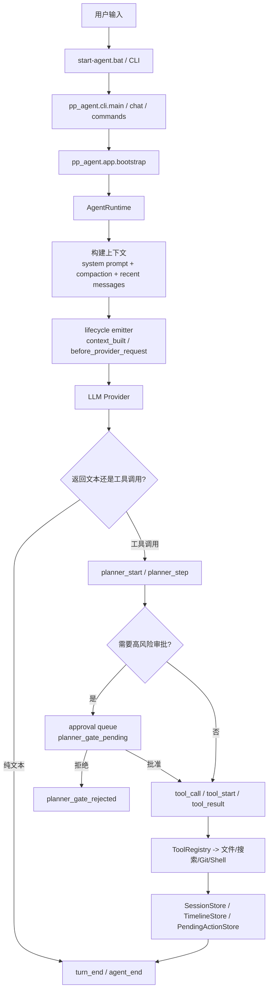

# pp-Echo 项目学习指南

## 1. 项目是做什么的

`pp-Echo` 是一个以 Windows 命令行为主入口的个人 coding agent。

它的核心目标不是做网页聊天，而是把下面这些能力串成一个稳定的本地开发工作流：

- 接收自然语言任务
- 用 LLM 生成回答或工具调用计划
- 在执行高风险动作前暂停审批
- 对文件、Shell、Git、搜索等工具做统一调度
- 以 session tree 的方式保存历史、分支、rewind、resume
- 记录 runtime timeline，便于后续做 JSON / RPC / SDK / extensions

你可以把它理解成：

- 一个 `chat-first` 的本地 coding agent
- 一个带 planner / executor / approval gate 的命令行工作流引擎
- 一个正在向 `pi-mono` 架构方向演进的 Python 版本实现

## 2. 现在怎么启动

最简单的启动方式是直接双击：

- [start-agent.bat](/E:/Pycharm%20Project/pp-Echo/start-agent.bat)

它当前会做这些事：

1. 切到仓库根目录
2. 检查 `python` 是否可用
3. 设置 `PYTHONPATH=src`
4. 检查 `PP_AGENT_API_KEY` 是否存在
5. 启动 `python -m agent_cli.main chat`

虽然 bat 里还是旧入口名 `agent_cli.main`，但现在它只是兼容 shim，实际已经会进入新架构：

- `agent_cli.main`
- `pp_agent.cli.main`
- `pp_agent.cli.chat`
- `pp_agent.app.bootstrap`
- `pp_agent.runtime.runtime.AgentRuntime`

所以结论是：

- `start-agent.bat` 现在仍然可用
- 启动后走的是新架构路径
- 不再依赖 `_legacy_main_impl.py` 承载真实 CLI 逻辑

## 3. 怎么做自然语言测试

### 3.1 启动前准备

如果你想测真实模型调用，先在当前终端或系统环境变量中设置：

```powershell
set PP_AGENT_API_KEY=你的密钥
```

如果不设，也能进 CLI，但真正发模型请求会失败。

### 3.2 最简单的手工测试路径

双击 [start-agent.bat](/E:/Pycharm%20Project/pp-Echo/start-agent.bat) 后，在打开的终端里按下面顺序测试。

#### 第一组：确认 CLI 和会话启动正常

输入：

```text
你好，请先介绍一下你自己现在具备哪些能力
```

你希望看到：

- 终端进入 chat 交互，而不是直接退出
- agent 能返回一段正常文本
- 不出现 Python traceback

#### 第二组：确认只读类任务正常

输入：

```text
请阅读这个仓库并用几句话总结它的作用
```

你希望看到：

- agent 先思考，再可能调用读取/搜索类工具
- 最后返回总结
- 不应该要求审批高风险计划

#### 第三组：确认高风险计划会暂停审批

输入：

```text
请在当前仓库里创建一个 test-demo.txt，内容写 hello lifecycle
```

你希望看到：

- planner 先给出计划
- 因为会涉及 `write_file`，应出现 approval gate
- 终端里能看到 `/approve <token>` 或 `/reject <token>` 方向的提示

然后你可以继续输入：

```text
/approve 这里替换成真实 token
```

你希望看到：

- planner gate 被批准
- tool 真正执行
- 文件被写入

如果你想测试拒绝路径，就改成：

```text
/reject 这里替换成真实 token
```

你希望看到：

- 计划被拒绝
- 不执行写入

#### 第四组：确认 session tree / resume / branch 正常

先输入：

```text
/session
```

记下当前 session id，然后继续输入：

```text
/tree
```

你希望看到：

- 当前 session tree
- 当前节点、父节点、可能的子节点
- branch / resume / rewind 提示

然后可以试：

```text
/new
```

再问一句新问题：

```text
这是一个新会话吗？
```

然后试：

```text
/resume 刚才记下的旧 session id
```

你希望看到：

- 会成功切回旧会话

#### 第五组：确认 queue / timeline / approvals 正常

如果 agent 正在执行中，你可以输入：

```text
/queue follow-up 等当前任务结束后提醒我检查 README
```

或者：

```text
/queue steering 优先先解释你刚才的计划
```

你希望看到：

- queue 被记录
- 当前任务后按顺序注入

再输入：

```text
/timeline
```

你希望看到：

- turn / planner / tool / queue / compaction 相关 timeline 事件

最后输入：

```text
/approvals
```

你希望看到：

- 当前待审批项面板

### 3.3 一组推荐的自然语言验收句子

如果你想快速验证一遍，可以直接按下面顺序说：

1. `请介绍一下这个项目是做什么的`
2. `请只读地总结 README 和主要目录结构`
3. `请创建一个 demo.txt，内容是 hello world`
4. `/approve <token>`
5. `/tree`
6. `/timeline`
7. `/approvals`
8. `/new`
9. `这是新会话吗`
10. `/resume <旧 session id>`

## 4. 项目总流程

下面这张图是当前最接近实际代码的工作流。



## 5. 重要模块说明

### 5.1 CLI 层

入口文件：

- [src/pp_agent/cli/main.py](/E:/Pycharm%20Project/pp-Echo/src/pp_agent/cli/main.py)
- [src/pp_agent/cli/chat.py](/E:/Pycharm%20Project/pp-Echo/src/pp_agent/cli/chat.py)

职责：

- 定义命令行入口
- 解析 `chat` / `run` / `sessions` / `approvals` / `workflow` / `config` / `timeline`
- 把命令分发给各个 `commands/*`
- chat 模式下处理 slash command 和 runtime 渲染

重点理解：

- CLI 现在只负责入口、命令分发、渲染
- 真正的运行逻辑已经尽量下沉到 `app` 和 `runtime`

### 5.2 app 装配层

核心文件：

- [src/pp_agent/app/bootstrap.py](/E:/Pycharm%20Project/pp-Echo/src/pp_agent/app/bootstrap.py)

职责：

- 读取 `Settings`
- 创建 `SessionStore` / `TimelineStore` / `ToolRegistry`
- 创建 `LLMClient`
- 组装 `AgentRuntime`
- 提供 session tree/fork/rewind 的事件 façade

重点理解：

- `bootstrap` 是整个系统的装配中心
- 它不做复杂业务决策，主要负责“把各层接起来”

### 5.3 runtime 层

最关键的目录：

- [src/pp_agent/runtime](/E:/Pycharm%20Project/pp-Echo/src/pp_agent/runtime)

建议重点看这些文件：

- [runtime.py](/E:/Pycharm%20Project/pp-Echo/src/pp_agent/runtime/runtime.py)
- [hooks.py](/E:/Pycharm%20Project/pp-Echo/src/pp_agent/runtime/hooks.py)
- [emitter.py](/E:/Pycharm%20Project/pp-Echo/src/pp_agent/runtime/emitter.py)
- [lifecycle.py](/E:/Pycharm%20Project/pp-Echo/src/pp_agent/runtime/lifecycle.py)
- [events.py](/E:/Pycharm%20Project/pp-Echo/src/pp_agent/runtime/events.py)
- [turn_loop.py](/E:/Pycharm%20Project/pp-Echo/src/pp_agent/runtime/turn_loop.py)
- [state.py](/E:/Pycharm%20Project/pp-Echo/src/pp_agent/runtime/state.py)

职责：

- 管理一次 session 内的运行状态
- 驱动 prompt / continue / approve / reject / compact
- 维护 turn phase
- 发出 lifecycle events
- 在 provider、planner、tool、queue、compaction 各阶段发标准事件

重点理解：

- `AgentRuntime` 是现在最重要的运行中枢
- 新的 lifecycle system 就挂在这里
- 后续 JSON / RPC / SDK / extensions 都会依赖它的事件 contract

### 5.4 storage 层

核心目录：

- [src/pp_agent/storage](/E:/Pycharm%20Project/pp-Echo/src/pp_agent/storage)

建议重点看：

- [sessions.py](/E:/Pycharm%20Project/pp-Echo/src/pp_agent/storage/sessions.py)
- [timeline.py](/E:/Pycharm%20Project/pp-Echo/src/pp_agent/storage/timeline.py)
- [approvals.py](/E:/Pycharm%20Project/pp-Echo/src/pp_agent/storage/approvals.py)
- [settings.py](/E:/Pycharm%20Project/pp-Echo/src/pp_agent/storage/settings.py)

职责：

- 保存 session tree
- 保存 timeline
- 保存审批队列
- 读取环境变量和 `.pp-agent/config.json`

重点理解：

- storage 负责持久化
- 本项目强调“不要随意改 session 持久化格式”
- 所以很多重构会通过 façade 或 adapter 完成，而不是直接动 storage 语义

### 5.5 llm 层

核心目录：

- [src/pp_agent/llm](/E:/Pycharm%20Project/pp-Echo/src/pp_agent/llm)

建议重点看：

- [registry.py](/E:/Pycharm%20Project/pp-Echo/src/pp_agent/llm/registry.py)
- [models.py](/E:/Pycharm%20Project/pp-Echo/src/pp_agent/llm/models.py)
- [provider/openai_compatible.py](/E:/Pycharm%20Project/pp-Echo/src/pp_agent/llm/provider/openai_compatible.py)
- [provider/bailian.py](/E:/Pycharm%20Project/pp-Echo/src/pp_agent/llm/provider/bailian.py)

职责：

- 提供 provider config / model config
- 构造 LLM client
- 对接 Bailian / OpenAI-compatible 接口

重点理解：

- runtime 不负责 HTTP 细节
- llm 层负责 provider 相关配置和 transport

### 5.6 tools 层

核心目录：

- [src/pp_agent/tools](/E:/Pycharm%20Project/pp-Echo/src/pp_agent/tools)

建议重点看：

- [registry.py](/E:/Pycharm%20Project/pp-Echo/src/pp_agent/tools/registry.py)
- [base.py](/E:/Pycharm%20Project/pp-Echo/src/pp_agent/tools/base.py)
- [file_tools.py](/E:/Pycharm%20Project/pp-Echo/src/pp_agent/tools/file_tools.py)
- [repo_tools.py](/E:/Pycharm%20Project/pp-Echo/src/pp_agent/tools/repo_tools.py)
- [shell_tool.py](/E:/Pycharm%20Project/pp-Echo/src/pp_agent/tools/shell_tool.py)

职责：

- 注册所有工具
- 定义工具 spec
- 执行文件、搜索、Git、Shell、审批相关动作

重点理解：

- `ToolRegistry` 是 runtime 与外部动作之间的统一边界
- tool metadata 和 tool spec 是后续做结构化接口的重要基础

### 5.7 domain 层

核心目录：

- [src/pp_agent/domain](/E:/Pycharm%20Project/pp-Echo/src/pp_agent/domain)

职责：

- 放 provider-agnostic 的核心数据模型
- 比如消息、工具调用、session 相关纯领域对象

重点理解：

- domain 是最底层的数据模型层
- 这里不应该知道 CLI、provider、storage 实现细节

### 5.8 extensions 层

核心目录：

- [src/pp_agent/extensions](/E:/Pycharm%20Project/pp-Echo/src/pp_agent/extensions)

职责：

- 现在还很薄
- 主要作为后续 lifecycle subscriber 的公共边界

重点理解：

- runtime 不直接依赖 loader/discovery
- extensions 的发现与注册应由 app/bootstrap 负责

## 6. 源码阅读建议

如果你第一次认真读这个项目，建议按下面顺序。

### 第一步：先看入口，建立全局感

按这个顺序看：

1. [start-agent.bat](/E:/Pycharm%20Project/pp-Echo/start-agent.bat)
2. [src/agent_cli/main.py](/E:/Pycharm%20Project/pp-Echo/src/agent_cli/main.py)
3. [src/pp_agent/cli/main.py](/E:/Pycharm%20Project/pp-Echo/src/pp_agent/cli/main.py)

目标：

- 搞清楚用户是怎么进入系统的
- 理解旧入口和新入口的兼容关系

### 第二步：看 chat 主流程

按这个顺序看：

1. [src/pp_agent/cli/chat.py](/E:/Pycharm%20Project/pp-Echo/src/pp_agent/cli/chat.py)
2. [src/pp_agent/cli/dispatcher.py](/E:/Pycharm%20Project/pp-Echo/src/pp_agent/cli/dispatcher.py)
3. [src/pp_agent/app/bootstrap.py](/E:/Pycharm%20Project/pp-Echo/src/pp_agent/app/bootstrap.py)

目标：

- 看清 chat loop 怎么启动 runtime
- 看清 slash command 怎么进入 commands 层

### 第三步：重点啃 runtime

按这个顺序看：

1. [src/pp_agent/runtime/runtime.py](/E:/Pycharm%20Project/pp-Echo/src/pp_agent/runtime/runtime.py)
2. [src/pp_agent/runtime/turn_loop.py](/E:/Pycharm%20Project/pp-Echo/src/pp_agent/runtime/turn_loop.py)
3. [src/pp_agent/runtime/state.py](/E:/Pycharm%20Project/pp-Echo/src/pp_agent/runtime/state.py)
4. [src/pp_agent/runtime/lifecycle.py](/E:/Pycharm%20Project/pp-Echo/src/pp_agent/runtime/lifecycle.py)
5. [src/pp_agent/runtime/emitter.py](/E:/Pycharm%20Project/pp-Echo/src/pp_agent/runtime/emitter.py)
6. [src/pp_agent/runtime/hooks.py](/E:/Pycharm%20Project/pp-Echo/src/pp_agent/runtime/hooks.py)

目标：

- 理解一次 prompt 是怎么变成一个 turn 的
- 理解 planner / approval / tool / queue / compaction 是怎么协作的
- 理解 lifecycle event 是在哪里发的

### 第四步：看 storage 和 tools

按这个顺序看：

1. [src/pp_agent/storage/sessions.py](/E:/Pycharm%20Project/pp-Echo/src/pp_agent/storage/sessions.py)
2. [src/pp_agent/storage/timeline.py](/E:/Pycharm%20Project/pp-Echo/src/pp_agent/storage/timeline.py)
3. [src/pp_agent/storage/approvals.py](/E:/Pycharm%20Project/pp-Echo/src/pp_agent/storage/approvals.py)
4. [src/pp_agent/tools/registry.py](/E:/Pycharm%20Project/pp-Echo/src/pp_agent/tools/registry.py)
5. 具体工具文件

目标：

- 搞清楚 state 落盘在哪里
- 搞清楚 tool 怎么被执行和审批

### 第五步：最后看 tests

建议重点看：

- [tests/runtime/test_runtime.py](/E:/Pycharm%20Project/pp-Echo/tests/runtime/test_runtime.py)
- [tests/runtime/test_lifecycle.py](/E:/Pycharm%20Project/pp-Echo/tests/runtime/test_lifecycle.py)
- [tests/runtime/test_session_events.py](/E:/Pycharm%20Project/pp-Echo/tests/runtime/test_session_events.py)
- [tests/runtime/test_compaction_events.py](/E:/Pycharm%20Project/pp-Echo/tests/runtime/test_compaction_events.py)
- [tests/storage/test_session_store.py](/E:/Pycharm%20Project/pp-Echo/tests/storage/test_session_store.py)
- [tests/architecture/test_import_directions.py](/E:/Pycharm%20Project/pp-Echo/tests/architecture/test_import_directions.py)

目标：

- 用测试反向理解系统保证了什么
- 读懂当前项目最重要的行为契约

## 7. 读源码时最值得先抓住的几个问题

建议你边读边回答这几个问题：

1. 一个自然语言 prompt 是怎么进入 `AgentRuntime` 的？
2. 哪些地方会触发 approval gate？
3. session tree 是怎么保存和切换 active head 的？
4. lifecycle event 是在哪里定义、在哪里发、在哪里消费的？
5. `RuntimeHooks` 和 lifecycle emitter 的兼容关系是什么？
6. 为什么 storage 语义尽量不动，而很多新能力通过 façade 接入？

## 8. 一句话的阅读策略

如果你时间很少，就只抓三件事：

- 入口在 CLI
- 中枢在 `AgentRuntime`
- 状态持久化在 `storage`

只要先读通这三层，这个项目后面的 planner、approval、timeline、extensions 演进方向就会比较自然。
## Learning Index

Use this file as the study entry for the repository.

The recommended document split is now:

- `README.md`: public project positioning, Windows-first scope, and current status
- `docs/agent-learning-en.md`: main English learning guide
- `docs/agent-learning-zh.md`: main Chinese learning guide
- `docs/source-map.md`: compact module and call-chain map
- `PROJECT_LEARNING.md`: study index and reading entry

Before reading deeply, keep these points in mind:

- `pp-Echo` is currently Windows-first.
- The runtime, approvals, rewind, and session model are already real and worth studying.
- Subagent support exists, but it is still MVP-level.
- “Agent team” should be treated as a direction, not a completed subsystem.

### Best first files

1. `src/pp_agent/runtime/runtime.py`
2. `src/pp_agent/tools/registry.py`
3. `src/pp_agent/runtime/session_host.py`
4. `src/pp_agent/app/bootstrap.py`
5. `src/pp_agent/storage/settings.py`

### Suggested study tasks

1. Trace one prompt from CLI/TUI input to runtime persistence.
2. Explain the difference between planner approval and execution approval.
3. Explain how session tree, checkpoint, and safe rewind fit together.
4. Explain the current real scope of `@subagent`.
