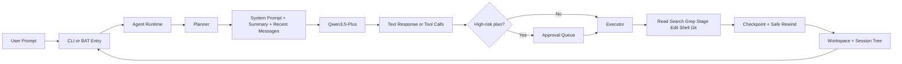

# pp-agent

A Windows-first personal coding agent with planner/executor separation, approval gates, session branching, and git-backed safe rewind.

`pp-agent` is built for people who want an agent that feels practical inside a real repository:

- it explains what it plans to do before it does it
- it stages risky actions behind approvals
- it keeps session history navigable as a tree
- it can restore conversation state, workspace state, or both

## Why pp-agent

Most coding agents are good at generating output but weak at helping you stay in control once a task gets messy.

`pp-agent` focuses on the parts that matter during day-to-day development:

- Visible planning
  The runtime shows intended steps before execution, so you can review direction before tools mutate the workspace.
- Approval-first safety
  High-risk actions like file edits and shell commands can pause for explicit approval.
- Session tree navigation
  Conversations are stored as a navigable tree, making branch, resume, and rewind workflows much easier.
- Git-backed safe rewind
  Rewind is no longer conversation-only. You can restore the workspace, the conversation branch, or both together.
- Repository-aware workflow
  Search, grep, diff inspection, staged edits, approvals, and checkpoint recovery fit into one loop.

## What Makes It Different

### Planner before executor

`pp-agent` separates planning from execution.

Instead of jumping straight into tool calls, it can first show:

- what it wants to do
- which tools it intends to use
- whether the plan should pause for approval

That makes the agent feel more trustworthy and easier to supervise.

### Safe rewind that includes the workspace

Traditional rewind only moves conversation history.
That creates a mismatch: the chat says you are back in time, but the files on disk are still in the later state.

`pp-agent` solves that with git-backed checkpoints and safe rewind modes:

- `conversation_only`
- `workspace_only`
- `conversation_and_workspace`

This is especially useful when:

- an edit round went in the wrong direction
- you want to undo a risky experiment without losing the rest of the session graph
- you need to recover a clean workspace while preserving a branch of thought

## Architecture



## Features

### Planner and approval flow

- Planner/executor split for clearer intent before execution
- Approval gates for high-risk tool calls
- Persistent approval queue for staged actions and planner pauses

### Session management

- Session tree storage
- Branch and resume workflows
- Turn-based rewind
- Timeline inspection

### Checkpoint and rewind

- `head_snapshot` for clean-worktree recovery
- `stash_snapshot` for explicit dirty-workspace protection
- Restore preview before rewind or checkpoint restore
- Safe rewind orchestration across session state and workspace state

### Repository workflow

- staged file writes and edits
- shell command approval
- repo-aware search and grep
- git status and diff inspection

### Capability sources

- builtin tools stay in the runtime core
- skills are lightweight prompt packs discovered from project, user, builtin, or custom roots
- extensions are first-class capability sources with explicit descriptors, lifecycle status, and executable runtime hooks
- MCP is treated as an optional extension-backed adapter instead of a default runtime subsystem

## Quick Start

### Fastest path on Windows

1. Set `PP_AGENT_API_KEY` in your terminal or system environment.
2. Double-click `start-agent.bat`.
3. Start chatting with the agent in the opened terminal.

### CLI usage

```powershell
set PYTHONPATH=src
python -m pp_agent.cli.main chat
python -m pp_agent.cli.main run "Give me a quick overview of this repo"
python -m pp_agent.cli.main sessions list
python -m pp_agent.cli.main sessions tree
python -m pp_agent.cli.main checkpoint list
python -m pp_agent.cli.main config show
python -m pp_agent.cli.main capabilities list
python -m pp_agent.cli.main skills list
```

## Checkpoint and Safe Rewind

Checkpoint data is stored independently from the session tree.
This keeps rewind logic extensible and lets the runtime reason about git state directly.

### Snapshot types

- `head_snapshot`
  Records the current `HEAD` commit and branch position without changing the workspace.
- `stash_snapshot`
  Used only for explicit dirty-workspace protection after preview and confirmation.

### Rewind modes

- `conversation_only`
  Move the conversation branch only.
- `workspace_only`
  Restore the workspace only.
- `conversation_and_workspace`
  Restore both and keep the result as a new session branch.

### CLI examples

```powershell
set PYTHONPATH=src
python -m pp_agent.cli.main checkpoint create --session <session_id>
python -m pp_agent.cli.main checkpoint list
python -m pp_agent.cli.main checkpoint restore <checkpoint_id>
python -m pp_agent.cli.main rewind-safe --session <session_id> --turns 2
python -m pp_agent.cli.main rewind-safe --session <session_id> --checkpoint <checkpoint_id>
python -m pp_agent.cli.main rewind-safe --session <session_id> --workspace-only --checkpoint <checkpoint_id>
python -m pp_agent.cli.main rewind-safe --session <session_id> --conversation-only --checkpoint <checkpoint_id>
```

## Chat Commands

- `/settings` show runtime settings
- `/status` show runtime phase, queue, and planner state
- `/session` show the current session id
- `/approvals` open the approval queue view
- `/approve <token>` approve a pending planner gate or staged action
- `/reject <token>` reject a pending planner gate or staged action
- `/model <name>` switch model
- `/new` start a new session
- `/resume <id>` resume a session
- `/tree` inspect the session tree
- `/timeline` inspect the current session timeline
- `/queue` inspect queued messages
- `/quit` exit

## Configuration

### Environment variables

- `PP_AGENT_API_KEY`
- `PP_AGENT_BASE_URL`
- `PP_AGENT_MODEL`
- `PP_AGENT_ENABLE_THINKING`
- `PP_AGENT_HOME`

### Project-level config

Create `.pp-agent/config.json` for per-project overrides:

```json
{
  "model": "qwen3.5-plus",
  "base_url": "https://dashscope.aliyuncs.com/compatible-mode/v1",
  "enable_thinking": false,
  "shell_timeout_seconds": 30,
  "capabilities": {
    "builtin_tools": {
      "enable": true
    },
    "skills": {
      "enable_project": true,
      "enable_user": true,
      "enable_builtin": true,
      "custom_directories": [],
      "ignored": [],
      "include": []
    },
    "extensions": {
      "enable_project": true,
      "enable_user": true,
      "enable_builtin": false,
      "custom_directories": [],
      "ignored": [],
      "include": []
    },
    "mcp": {
      "enable": false,
      "config_paths": [],
      "server_filters": []
    }
  },
  "tool_confirmation": {
    "write_file": true,
    "edit_file": true,
    "run_shell": true,
    "high_risk_plan": true
  }
}
```

### Resource manifests

Project resources can be declared explicitly in `.pp-agent/resources.json` or `.pp-agent/package.json`.
If no manifest is present, `pp-agent` falls back to conventional directories such as `.pp-agent/skills` and `.pp-agent/extensions`.

```json
{
  "skills": ["skills"],
  "extensions": ["extensions"],
  "prompts": []
}
```

In `.pp-agent/package.json`, the same payload can live under `pp-agent`, `pp_agent`, or `pi`.

### MCP config

`.pp-agent/mcp.json` supports both the legacy `servers` form and the newer extension-oriented document shape:

```json
{
  "settings": {
    "tool_prefix": "mcp",
    "idle_timeout": 300
  },
  "servers": [
    {
      "name": "docs",
      "transport": {
        "type": "stdio",
        "command": "python",
        "args": ["server.py"]
      }
    }
  ]
}
```

`settings` is intentionally lightweight in this phase. It exists to keep the file forward-compatible while the runtime continues to treat MCP as an optional adapter layer.

## Capabilities, Skills, and Extensions

The capability catalog now exposes both discovery metadata and runtime-facing status:

- `builtin_tool` capabilities are part of the core runtime and typically show `status: "loaded"`
- `skill` capabilities are discovered lazily and keep origin metadata such as `origin_type`, `precedence`, and `declared_by_manifest`
- `extension` capabilities describe discovered extension packages, and executable extensions can now register tools, slash commands, and runtime hooks
- `mcp_tool`, `mcp_resource`, and `mcp_prompt` are emitted through the built-in `mcp_adapter` extension when MCP is enabled

This keeps the core small while making capability sources observable and reloadable.

### CLI examples

```powershell
set PYTHONPATH=src
python -m pp_agent.cli.main capabilities list
python -m pp_agent.cli.main capabilities list --kind extension
python -m pp_agent.cli.main capabilities show skill repo_overview
python -m pp_agent.cli.main capabilities reload --include-mcp
python -m pp_agent.cli.main skills list
python -m pp_agent.cli.main skills show repo_overview`r`n# extension-provided slash commands are available inside interactive chat once loaded`r`n# use /reload in chat to hot-reload executable extensions and MCP-backed runtime tools
```

`capabilities` returns structured JSON with `kind`, `name`, `source`, `status`, `origin_type`, `path`, and capability-specific metadata.

### Chat Runtime Commands

Inside interactive chat, runtime-managed capabilities can now be inspected and refreshed directly:

- `/reload`
- `/skills list`
- `/skills active`
- `/skill use <name>`
- `/skill clear`
- `/skills reload`
- `/mcp status`
- `/mcp list`
- `/mcp reload`

Skills are injected lazily into the turn context when they are activated or matched. MCP servers stay undiscovered until runtime management or the first discovery path asks for them.

## Example Workflows

### Review a risky file change before it lands

1. Ask the agent to update code.
2. Let the planner pause at a risky step.
3. Review the staged diff.
4. Approve only when the change looks right.

### Recover from a bad edit round

1. Let the agent modify several files.
2. Preview a rewind to the earlier checkpoint.
3. Restore the workspace and conversation together.
4. Continue from the restored branch instead of manually reconstructing the state.

### Keep the workspace but rethink the conversation

1. Make manual local edits you want to keep.
2. Use `conversation_only`.
3. Rewind the session branch without touching the files.

## Validation

```powershell
set PYTHONPATH=src
python -m pytest -q
python -m pp_agent.cli.main --help
python -m pp_agent.cli.main sessions tree
python -m pp_agent.cli.main approvals summary
python -m pp_agent.cli.main checkpoint list
python -m pp_agent.cli.main rewind-safe --help
python -m pp_agent.cli.main capabilities list
python -m pp_agent.cli.main skills list
python -m pp_agent.cli.main workflow repo --query "AgentSession"
python -m pp_agent.cli.main config show
```

If `PP_AGENT_API_KEY` is missing or the network is blocked, the CLI should fail clearly instead of dumping an unhelpful stack trace.

## Project Status

The active implementation lives under `src/pp_agent`.
Legacy import paths such as `agent_cli`, `agent_core`, `storage`, and `tools` are still present as compatibility shims during migration.

## License

Add your preferred license here.


