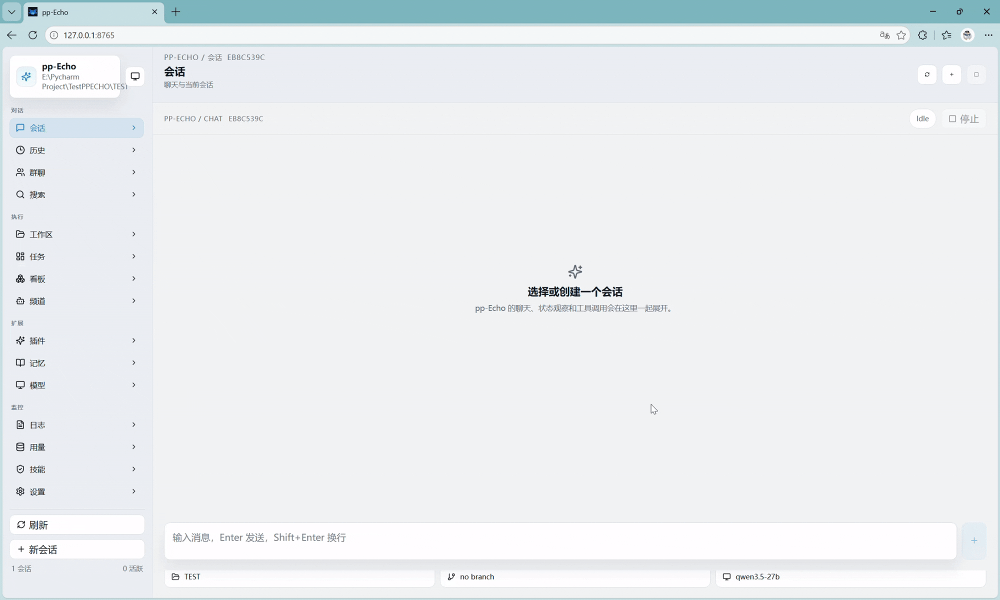
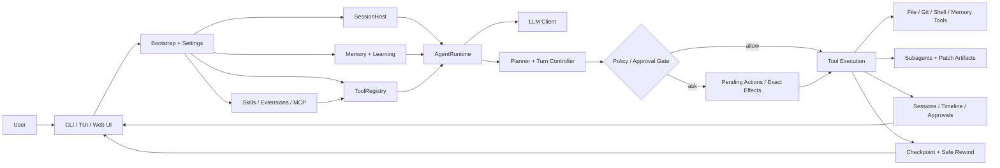

# pp-Echo

<p align="center">
  
</p>

<p align="center">
  <b>一个 Windows-first 的本地编程 Agent：先规划、再执行；危险操作先审批；代码和会话都能安全回退。</b>
</p>

<p align="center">
  
  
  
</p>



`可见规划` · `审批优先` · `Git 安全回退` · `分层记忆` · `受控子 Agent` · `CLI / TUI / Web UI`

pp-Echo 是一个面向真实仓库工作的本地编程 Agent，也是一个适合学习 Agent 工程的参考项目。它不是只会聊天的 Demo，而是围绕“可信执行”做了完整工程闭环：运行时循环、工具注册、策略审批、会话持久化、Checkpoint、安全回退、记忆检索、能力扩展、多界面交互和受控子 Agent 协作。

> 当前定位：pp-Echo 目前是 **Windows-first**。Windows 是最清晰、最推荐的使用路径；Linux 和 macOS 可以作为后续兼容方向，但暂时不要描述成同等支持。

## 为什么值得关注

- **先想清楚再动手**：Agent 会先规划任务，再进入工具执行流程。
- **危险操作不静默执行**：写文件、改代码、运行 shell 等操作会进入审批流程。
- **能回退的不只是代码**：支持 Git-backed checkpoint，可以回退仓库状态，也可以回退会话上下文。
- **不是黑盒玩具**：核心架构集中在 `AgentRuntime`、`ToolRegistry`、`SessionHost`，适合阅读、学习和二次开发。
- **可扩展能力明确**：支持内置工具、Skills、Extensions、MCP、浏览器/网页工具和受控子 Agent。
- **适合中文开发者学习 Agent 工程**：项目文档和评测用例中包含中文技术表达场景。

## 当前状态

- Runtime、工具注册、审批、会话树、checkpoint、safe rewind、file memory 和 Web UI 已经可用。
- `@subagent` 与 `orchestrate_agents` 已实现，但定位是受控的本地协作，不是完全自治的多 Agent 团队平台。
- 安全模型以“策略门 + 精确效果审批”为核心，但目前还不是完整 shell sandbox。
- 项目适合学习、演示和继续扩展，也可以在本地仓库中谨慎使用。

## 功能亮点

| 模块 | 当前能力 | 主要路径 |
| --- | --- | --- |
| Runtime 核心 | Turn-based agent loop、上下文构建、工具调用、事件流、压缩与持久化 | `src/pp_agent/runtime/runtime.py` |
| 会话管理 | 会话创建、恢复、分支、树形导航、checkpoint 与 safe rewind 协调 | `src/pp_agent/runtime/session_host.py` |
| 工具边界 | 工具注册、元数据、策略判断、动态工具、子 Agent 工具白名单 | `src/pp_agent/tools/registry.py` |
| 审批与安全 | 计划审批、执行时策略门、受保护路径、精确效果审批、shell 风险摘要 | `src/pp_agent/tools/policy.py`、`src/pp_agent/tools/effects.py` |
| 文件 / Git / Shell 工具 | 读写文件、搜索、Git 状态与 diff、PowerShell 执行、敏感操作预览 | `src/pp_agent/tools/*` |
| 浏览器与网页工具 | 统一 `browser` 工具、页面快照、标签页控制、静态 `web.search` / `web.fetch` | `src/pp_agent/browser/*`、`src/pp_agent/web_tools/*` |
| 记忆系统 | Markdown 记忆、SQLite 历史、BM25、可选向量召回、reranking、自动索引 | `src/pp_agent/memory/*`、`src/pp_agent/learning/*` |
| 能力扩展 | Skills、Extensions、MCP、资源 manifest 与能力发现 | `src/pp_agent/skills/*`、`src/pp_agent/extensions/*`、`src/pp_agent/mcp/*` |
| 子 Agent | 显式 handoff、受控 fan-out、子会话、工具限制、patch artifact | `src/pp_agent/subagents/*` |
| 多界面 | CLI、Textual TUI、FastAPI + React Web UI | `src/pp_agent/cli/*`、`src/pp_agent/tui/*`、`web/*` |
| 评测与诊断 | 行为评测、确定性 benchmark、doctor/report 命令、release readiness 检查 | `evals/*`、`tests/*`、`docs/benchmarks/*` |

## 架构概览



这张图比传统的“CLI → Runtime → Tools”更接近当前项目真实形态：pp-Echo 已经包含能力发现、分层记忆、审批流、Web UI 状态、checkpoint 和受控子 Agent 编排。

## 快速开始

pp-Echo 需要 Python `3.9+`。推荐先在 Windows 上运行。

### 最快启动 CLI

```powershell
set PP_AGENT_API_KEY=your_api_key
.\start-agent.bat
```

### 启动 Web UI

```powershell
set PP_AGENT_API_KEY=your_api_key
.\start-web.bat
```

默认打开：

```text
http://127.0.0.1:8765
```

Web UI 支持项目切换、运行时状态、审批、checkpoint 和 patch artifact 工作流。

### 启动 TUI

```powershell
set PP_AGENT_API_KEY=your_api_key
.\echo-cli.bat
```

### 从源码运行

```powershell
git clone https://github.com/CHEN2003-CHIP/pp-Echo.git
cd pp-Echo
set PP_AGENT_API_KEY=your_api_key
set PYTHONPATH=src
python -m pp_agent.cli.main chat
```

## 常用命令

```powershell
python -m pp_agent.cli.main chat
python -m pp_agent.cli.main run "Audit this repo and summarize risky commands"
python -m pp_agent.cli.main web
python -m pp_agent.cli.main sessions tree
python -m pp_agent.cli.main approvals summary
python -m pp_agent.cli.main checkpoint list
python -m pp_agent.cli.main rewind-safe --session <session_id> --turns 2
python -m pp_agent.cli.main capabilities legacy-hints --json --workspace .
```

## 诊断命令

```powershell
set PYTHONPATH=src
python -m pp_agent.cli.main workflow doctor --json
python -m pp_agent.cli.main memory search "project conventions" --scope workspace
python -m pp_agent.cli.main config show --workspace .
```

## Demo / 截图


| 交互式聊天 | Checkpoint + Rewind |
| --- | --- |
|  |  |


## 评测快照

pp-Echo 不只看 prompt 效果，也会测试工程行为。

| 评测层 | 规模 | 说明 | 入口 |
| --- | ---: | --- | --- |
| Live interview demo | 12 cases | 直接回答、仓库理解、工具调用、安全审批、子 Agent handoff | `docs/evaluation-demo.md` |
| Main agent eval | 60 cases | 工具、安全、协作、记忆、中文技术表达 | `docs/evaluation-demo.md` |
| Deterministic benchmark | 15 tasks | planner gating、rewind、MCP lazy activation、context compaction | `docs/benchmarks/latest.md` |
| Stress eval | 10 cases | 更长、更高风险的 shell 审批与子 Agent 委派场景 | `docs/evaluation-demo.md` |

最近记录的本地 live demo：

| Run | Cases | Pass rate | Tool calls | Approval gates | Expected policy blocks |
| --- | ---: | ---: | ---: | ---: | ---: |
| `20260512-234612-6fb26ca4` | 12 | 100% | 14 | 2 | 1 |

## 文档导航

### 想理解运行主链路

先看：

- `docs/source-map.md`
- `docs/agent-learning-zh.md`
- `docs/agent-learning-en.md`
- `src/pp_agent/runtime/runtime.py`
- `src/pp_agent/tools/registry.py`
- `src/pp_agent/runtime/session_host.py`

### 想理解审批与安全

阅读：

- `docs/safety.md`
- `docs/effect-analysis.md`
- `docs/dynamic-tool-declarations.md`

重点是：pp-Echo 的安全不是只靠模型“承诺不乱做”，而是把敏感文件、shell 命令和动态工具调用放到策略与审批边界内。

### 想理解子 Agent

阅读：

- `docs/multi_agent_demo.md`
- `docs/subagent-validation.md`
- `src/pp_agent/tools/subagent_tool.py`
- `src/pp_agent/subagents/*`

当前子 Agent 的定位是受控协作：明确 handoff、限制工具、限制轮次、生成可审查 artifact。

### 想理解记忆系统

阅读：

- `MEMORY.md`
- `docs/source-map.md`
- `src/pp_agent/memory/*`
- `src/pp_agent/learning/*`

记忆系统不是一个单一数据库，而是由 bootstrap memory、daily notes、workspace memory、SQLite 历史、BM25 与可选向量召回组成的分层系统。

### 想配置模型、工具、MCP、浏览器

阅读：

- `docs/configuration.md`
- `example-config.json`
- `example-config.jsonc`
- `example-mcp.json`
- `example-mcp.jsonc`

## 项目边界说明

- pp-Echo 当前是 **Windows-first**，不是跨平台完全等价支持。
- 它有审批、策略门和精确效果绑定，但还不是完整 shell sandbox。
- 子 Agent 是受控本地 worker，不是无限自治的多 Agent 团队。
- 动态工具声明已经形式化，但遇到语义不稳定或无法 staged 的行为时应 fail closed。

## 贡献指南

欢迎贡献以下方向：

- 更清晰的 Quick Start 和安装体验
- 更可靠的审批 UX 与会话可见性
- checkpoint / rewind 的稳定性提升
- Skills、Extensions、MCP 的发现与管理体验
- Web UI、配置 UI 和 Demo 素材
- 测试、benchmark、release gate 和文档同步

开始前请阅读：

- `CONTRIBUTING.md`
- `.github/release-template.md`

建议保持 PR 聚焦：一个 PR 解决一个用户可感知问题，或者一个明确的内部重构点。

## Release

当前 release notes：

- `releases/v0.2.0.md`

准备 release 前建议运行：

```powershell
python -m pp_agent.cli.main capabilities legacy-hints --strict --workspace .
python -m pp_agent.cli.main workflow doctor --json --workspace .
python -m pytest tests/benchmarks/test_runner.py
```

## License

本项目基于 MIT License 发布。详见 `LICENSE`。
