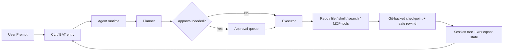

# pp-Echo

<p align="center">
  <strong>pp-Echo is a Windows-first coding agent that shows its plan, asks before risky actions, and can rewind both your repo and your conversation.</strong><br />
  面向真实仓库工作的 CLI 编码代理：先给计划，再做动作；高风险操作先审批；代码和会话都能安全回退。
</p>

<p align="center">
  <a href="#quick-start"></a>
  <a href="#demo--screenshots"></a>
  <a href="https://github.com/CHEN2003-CHIP/pp-Echo/releases"></a>
</p>


<p align="center">
  <code>Plan before act</code> | <code>Approve risky actions</code> | <code>Rewind code + conversation safely</code>
</p>

## Quick Start

pp-Echo currently targets Windows-first CLI workflows and expects Python 3.9+.

Before you start:

- Set `PP_AGENT_API_KEY` in your environment.
- Prefer Windows PowerShell or `start-agent.bat` for the smoothest first run.
- If you run the module directly from a cloned repo, you must set `PYTHONPATH=src`.

### One-click on Windows

```powershell
set PP_AGENT_API_KEY=your_api_key
.\start-agent.bat
```

This is the fastest path for people who want to clone the repo and see the agent immediately.

### From cloned repo

Run directly from source without packaging:

```powershell
git clone https://github.com/CHEN2003-CHIP/pp-Echo.git
cd pp-Echo
set PP_AGENT_API_KEY=your_api_key
set PYTHONPATH=src
python -m pp_agent.cli.main chat
```

Minimal non-interactive demo:

```powershell
set PP_AGENT_API_KEY=your_api_key
set PYTHONPATH=src
python -m pp_agent.cli.main run "Give me a quick overview of this repo"
```

### Installed CLI

If you want the `pp-agent` command on your machine:

```powershell
python -m pip install --upgrade pip setuptools wheel
python -m pip install -e .
pp-agent chat
```

Notes:

- In this local environment, editable install depends on a modern `pip` / `setuptools` toolchain.
- If `pip install -e .` fails on an older Python setup, use the source-run path above first, then upgrade your packaging tools.

## Demo / Screenshots


- Launch with `start-agent.bat` or the source CLI entrypoint.
- Ask the agent to inspect a repo task and preview risky work before execution.
- Review approvals, create checkpoints, and use safe rewind to recover both code and conversation state.

| Interactive chat | Checkpoint + rewind |
| --- | --- |
|  |  |

## Why pp-Echo

Most coding agents are good at producing output. Fewer are good at making their behavior visible and reversible once a repository gets messy. pp-Echo is built for that real-world gap.

- Planning stays visible before execution, so you can supervise direction instead of reacting after changes land.
- High-risk operations can pause behind approvals instead of mutating the workspace immediately.
- Sessions are stored as a tree, making branch, resume, compare, and rewind workflows easier to reason about.
- Safe rewind is git-backed, so you can restore the conversation, the workspace, or both together.
- Skills, extensions, and MCP-backed capabilities fit into the same repo-aware runtime rather than feeling bolted on.

## Core Workflows

### 1. Chat and run

```powershell
set PYTHONPATH=src
python -m pp_agent.cli.main chat
python -m pp_agent.cli.main run "Audit this repo and summarize risky commands"
```

### 2. Sessions and tree navigation

```powershell
set PYTHONPATH=src
python -m pp_agent.cli.main sessions list
python -m pp_agent.cli.main sessions tree
```

### 3. Approvals and staged actions

```powershell
set PYTHONPATH=src
python -m pp_agent.cli.main approvals list
python -m pp_agent.cli.main approvals summary
```

### 4. Checkpoints and safe rewind

```powershell
set PYTHONPATH=src
python -m pp_agent.cli.main checkpoint list
python -m pp_agent.cli.main rewind-safe --session <session_id> --turns 2
```

### 5. Capabilities, skills, and MCP

```powershell
set PYTHONPATH=src
python -m pp_agent.cli.main capabilities list
python -m pp_agent.cli.main skills list
```

## Architecture



## Configuration

### Environment variables

- `PP_AGENT_API_KEY`
- `PP_AGENT_BASE_URL`
- `PP_AGENT_MODEL`
- `PP_AGENT_ENABLE_THINKING`
- `PP_AGENT_HOME`

### Project config

Create `.pp-agent/config.json` for per-project overrides:

```json
{
  "model": "qwen3.5-plus",
  "base_url": "https://dashscope.aliyuncs.com/compatible-mode/v1",
  "enable_thinking": false,
  "shell_timeout_seconds": 30,
  "capabilities": {
    "builtin_tools": { "enable": true },
    "skills": {
      "enable_project": true,
      "enable_user": true,
      "enable_builtin": true,
      "custom_directories": [],
      "ignored": [],
      "include": []
    },
    "extensions": {
      "enable_project": true,
      "enable_user": true,
      "enable_builtin": false,
      "custom_directories": [],
      "ignored": [],
      "include": []
    },
    "mcp": {
      "enable": false,
      "config_paths": [],
      "server_filters": []
    }
  },
  "tool_confirmation": {
    "write_file": true,
    "edit_file": true,
    "run_shell": true,
    "high_risk_plan": true
  }
}
```

### Resources and manifests

Project resources can be declared in `.pp-agent/resources.json` or `.pp-agent/package.json`. If no manifest is present, pp-Echo falls back to conventional directories like `.pp-agent/skills` and `.pp-agent/extensions`, and also supports pi-compatible discovery from `.pi/skills` and `.agents/skills`.

## Releases

- Release notes for the first formal release live in [releases/v0.2.0.md](releases/v0.2.0.md).
- A reusable template for future releases lives in [.github/release-template.md](.github/release-template.md).
- GitHub Releases page: [github.com/CHEN2003-CHIP/pp-Echo/releases](https://github.com/CHEN2003-CHIP/pp-Echo/releases)

## Contributing

Contributions are welcome across CLI behavior, docs polish, demo assets, tests, extensions, and release packaging.

Start here:

- Read [CONTRIBUTING.md](CONTRIBUTING.md)
- Run tests with `python -m pytest`
- Keep documentation and demo assets in sync when user-facing behavior changes

## License

This project is licensed under the MIT License. See [LICENSE](LICENSE).
