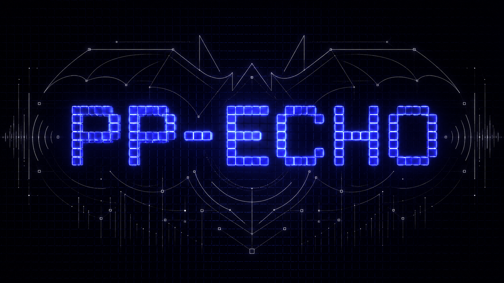
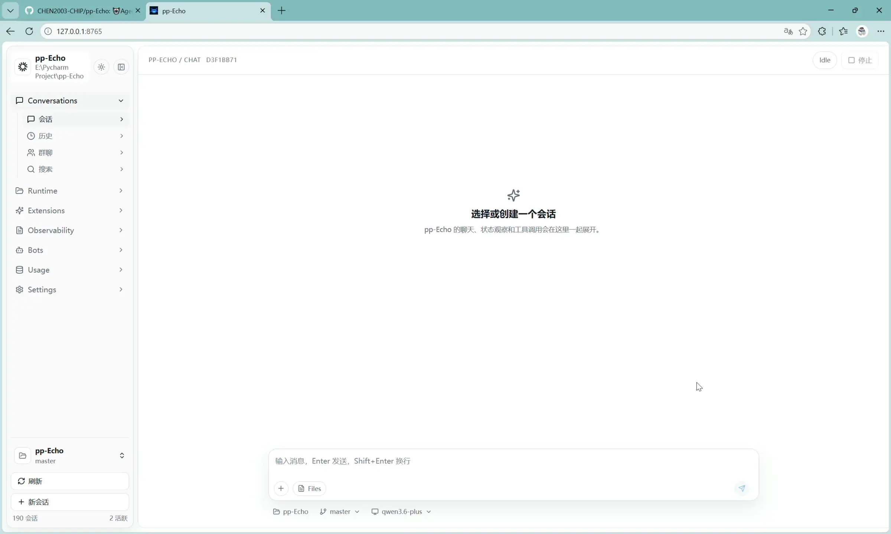
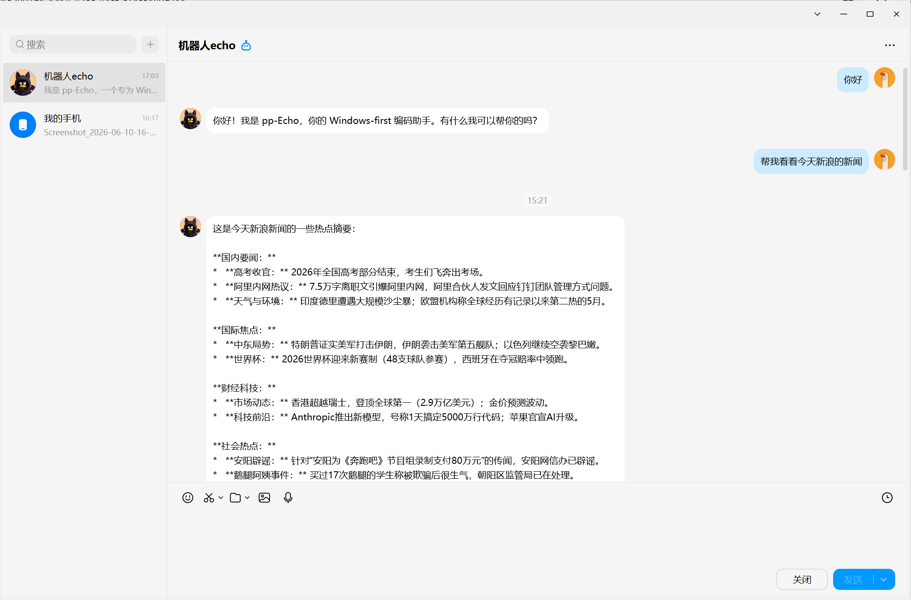
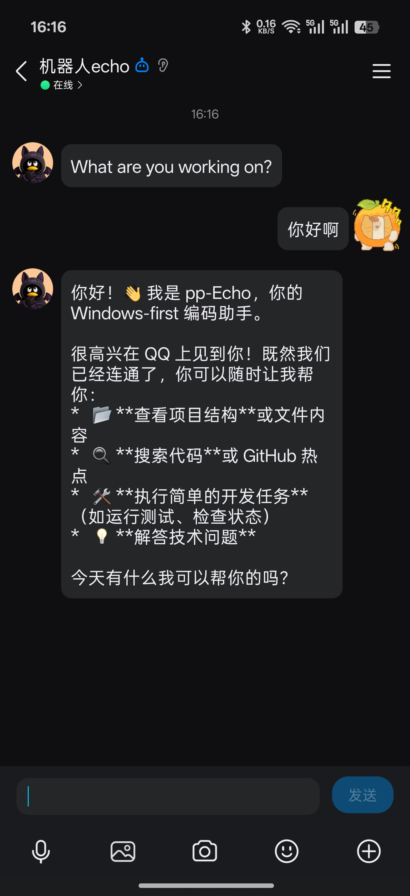
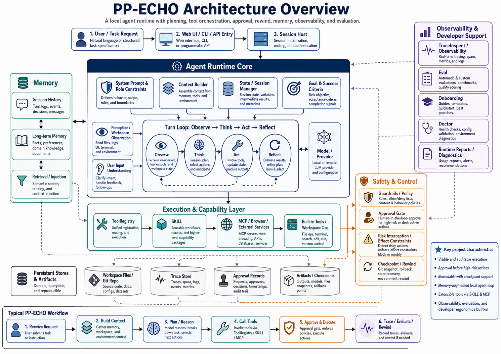
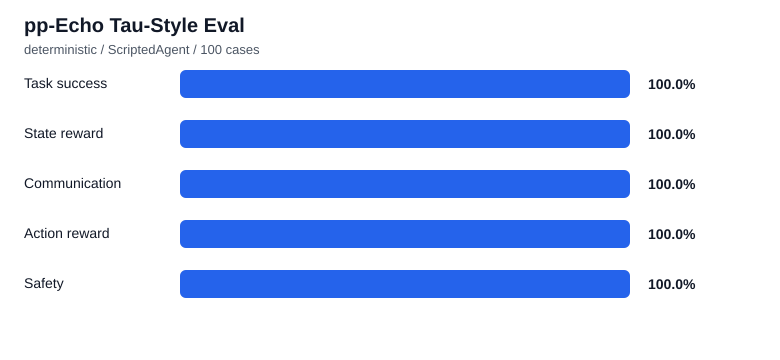

# 🦇pp-Echo：会规划、会审批、会回退的本地 Agent 工程课

## Release

Current preview release target:

- `v0.1.0-alpha.1`
- Teaching-oriented local Agent Runtime preview
- See `releases/v0.1.0-alpha.1.md` for release notes.

This project is still an alpha learning/research project. It includes approval, trace auditing, and checkpoint/rewind, but it is not a production sandbox.

<p align="center">
  
</p>

<p align="center">
  <strong>5 分钟跑通，7 天读懂，从 0 实现一个能规划、能调用工具、能审批、能回退、能记忆的Claude Code / Cursor 式本地 Agent。</strong>
</p>

<p align="center">
  <a href="#5-分钟快速开始"></a>
  <a href="#7-天学习路线"></a>
  <a href="#核心模块导览"></a>
  <a href="README_en.md"></a>
</p>

> 5 分钟跑通，7 天读懂，从 0 实现一个能规划、能调用工具、能审批、能回退、能记忆的Claude Code / Cursor 式本地 Agent。

pp-Echo 现在首先是一个教学向 Agent 工程项目：它不是把 LangChain / AutoGen 当黑箱接起来，也不是只会聊天的 Prompt Demo，而是把本地编程 Agent 背后的工程骨架拆开给你看。

你可以从 `mini-pp-echo/` 的 7 个独立小脚本开始，理解 Agent Loop、工具调用、文件修改、审批、记忆、checkpoint 和 MCP mock；再回到完整工程，阅读 `SessionHost`、`AgentRuntime`、`ToolRegistry`、memory、MCP、SubAgent 等真实模块。

<p align="center">
  
</p>

## 🗞️ 最近更新

### Model / Runtime 分层

pp-Echo 现在区分 Provider、ModelCapabilityProfile 和 RuntimeProfile：Provider 负责供应商与认证，模型与运行时能力统一进入 profile。TraceInspect 已新增 Model / Runtime 卡片，用于查看每次 run 选择的 provider、model、runtime 和能力摘要。

### Core Memory / 多模型 Provider

pp-Echo 的长期记忆机制升级为更成熟的 Core Memory Layer：长期事实默认先进入 `pending`，审批后才会注入；Core Memory 按 `user_profile`、`project_profile`、`agent_notes` 分层渲染，并补齐 SQLite 持久化、预算治理、安全扫描、去重冲突、审计链、CLI/API/Web 管理面、merge/compact preview/apply 和 provider 预留接口。旧 Episodic Memory、learning memory 和 file memory 继续保留，互不混淆。

模型接入也从单一 OpenAI-compatible 配置扩展为 Provider Registry：内置 OpenAI、DeepSeek、Qwen/DashScope、小米、阿里百炼、Anthropic Claude 和自定义 OpenAI-compatible preset；Settings 页面可以快速切换 provider/model，左上角 Startup Guide 的“测试模型连接”会在显式点击后发起一次低 token 连接测试，不会自动暴露或保存 API key。

推荐阅读：

- [Core Memory 设计与管理说明](docs/core-memory.md)

### Bot Center / QQBot Gateway

pp-Echo 现在加入了 `Bots` 页面：QQBot 不再只是一个“能跑通 webhook 的实验入口”，而是被纳入统一 Bot Center，可以查看状态、启动/停止、配置公网 URL、追踪事件、消息、run、trace 和日志。默认 `qq-main` 不自动暴露公网，群聊仍使用 `/pp` 触发。

推荐阅读：

- [QQBot 配置和启动教程](docs/integrations/qqbot_setup.md)
- [Bot Center 设计与安全边界](docs/bot_center.md)
- [QQ Bot API v2 接入说明](docs/integrations/qqbot.md)

<table>
  <tr>
    <td align="center" width="68%">
      <br>
      <sub>PC 端与 QQBot 对话</sub>
    </td>
    <td align="center" width="32%">
      <br>
      <sub>移动端与 QQBot 对话</sub>
    </td>
  </tr>
</table>

## 🆕 你应该从哪里开始？

### 我是新手，只想先跑起来

先看 [`mini-pp-echo/`](mini-pp-echo/README.md)，从最小 Agent Loop 开始。

### 我想系统学习 Agent 工程

看 [`tutorials/README.md`](tutorials/README.md)，按 7 天路线学习。

### 我已经跑通 mini，想读完整源码

看 [`docs/source-reading-roadmap.md`](docs/source-reading-roadmap.md)，按 Stage 0 到 Stage 6 闯关阅读。

### 我想用于实习和面试

优先看 [`docs/source-reading-roadmap.md`](docs/source-reading-roadmap.md) 里的“可以写进简历”，再看 [`docs/interview-guide.md`](docs/interview-guide.md) 做面试表达自查。

## 📍 项目定位

pp-Echo 想回答一个学习者真正关心的问题：

> 如果我要从 0 实现一个 Claude Code / Cursor 式的本地编程 Agent，除了调用大模型，我到底还要写哪些工程机制？

这里的答案包括：

- 可见的 planning 与 turn loop，而不是一次性 prompt 拼接。
- 统一的 tool registry，而不是散落在各处的函数调用。
- 对文件、Git、Shell、Browser、Memory、MCP、SubAgent 的工具化封装。
- Approval Gate：高风险动作先预览、再确认、再执行。
- Git-backed checkpoint / safe rewind：代码状态和会话状态都能回退。
- Memory 检索与上下文注入：Core Memory 负责受审批、可审计、按 workspace 隔离的稳定长期事实；Episodic Memory 保留现有历史检索能力，按需召回会话细节。见 [`docs/core-memory.md`](docs/core-memory.md)。
- 受控 SubAgent：能分工，但要有工具白名单、轮次限制和产物边界。
- File Attachments：上传文件按 session 存储、解析、切块、索引，再通过附件工具按需读取，避免把大文件直接塞进 prompt。运行时只注入附件清单和短 preview；Agent 会优先使用 `list_attachments`、`inspect_attachment`、`search_attachment`、`read_attachment_text`、`read_attachment_chunk`、`read_attachment_range` 等工具回答文件问题。导入 workspace 必须走 Approval Gate；写入长期 Memory 必须显式触发；PDF/DOCX/Markdown/code 会尽量保留 page、heading、line 或 symbol source ref。见 [`docs/attachments.md`](docs/attachments.md)。

它仍然是一个 Windows-first 的本地工程项目，但首页不再把重点放在“怎么部署一个工具”，而是放在“怎么读懂并复现一个 Agent 工程系统”。

## 为什么值得看

- **从 0 到完整链路**：先看最小教学版，再看真实工程版，学习路径是连续的。
- **不依赖高层黑箱**：核心机制直接落在 Python 代码里，适合拆解、改写和复现。
- **机制足够真实**：规划、工具调用、审批、回退、记忆、MCP、Browser、SubAgent 都不是概念图。
- **适合对标学习**：你可以借它理解 Claude Code / Cursor 背后的本地 Agent 工程骨架，但它不是商业产品替代品。
- **边界说清楚**：pp-Echo 有策略门和审批流，但不是完整 shell sandbox；SubAgent 是受控 worker，不是无限自治团队。

## ⏱️ 5 分钟快速开始

推荐先跑教学最小版，不需要 LLM API：

```powershell
python mini-pp-echo/01_loop.py
python mini-pp-echo/02_tool_call.py
python mini-pp-echo/04_approval.py
```

然后启动完整工程。pp-Echo 当前推荐 Windows + Python `3.9+`。

### 方式一：clone 后双击启动

如果你只是想最快跑起来：

1. 安装 Python `3.9+`，并勾选 `Add python.exe to PATH`。
2. 如果要启动 Web UI，安装 Node.js `20+`，并确保 `npm` 在 PATH 中。
3. 设置模型 API key：

```powershell
setx PP_AGENT_API_KEY "your_api_key"
```

重新打开一个 PowerShell 或双击脚本窗口，让环境变量生效。

然后在仓库根目录双击：

```text
start-agent.bat    启动 CLI Agent
start-web.bat      启动 Web UI，会自动打开 http://127.0.0.1:8765
```

这两个脚本会检查依赖；缺少 Python 包时会自动执行 `pip install`。`start-web.bat` 还会在需要时进入 `web/` 安装前端依赖并构建页面。

注意：如果不设置 `PP_AGENT_API_KEY`，脚本仍会打开 CLI 或 Web UI，但真正请求模型时会失败。

### 方式二：推荐的隔离环境

```powershell
git clone https://github.com/CHEN2003-CHIP/pp-Echo.git
cd pp-Echo
python -m venv .venv
.\.venv\Scripts\activate
python -m pip install --upgrade pip setuptools wheel
python -m pip install -e .[web]
set PYTHONPATH=src
set PP_AGENT_API_KEY=your_api_key
python -m pp_agent.cli.main chat
```

文件上传属于基础 Web 能力，`python-multipart` 已包含在基础依赖中。若要解析 PDF / DOCX，请安装 optional extra：

```powershell
python -m pip install -e .[web,attachments]
```

也可以使用仓库里的脚本入口：

```powershell
.\start-agent.bat
.\echo-cli.bat
.\start-web.bat
```

Startup Guide: 启动 Web UI 后点击左上角 `pp-Echo`；CLI 可运行 `python -m pp_agent.cli.main onboard`。

Web UI 默认访问：

```text
http://127.0.0.1:8765
```

QQBot / Bot Center 快速入口：

```text
Web UI -> Bots -> QQ 主机器人 -> Start
```

完整教程见 [`docs/integrations/qqbot_setup.md`](docs/integrations/qqbot_setup.md)。

常用诊断命令：

```powershell
set PYTHONPATH=src
python -m pp_agent.cli.main onboard
python -m pp_agent.cli.main onboard --json
python -m pp_agent.cli.main onboard --check-model
python -m pp_agent.cli.main workflow doctor --json
python -m pp_agent.cli.main config show --workspace .
python -m pp_agent.cli.main memory search "project conventions" --scope workspace
```

## 7 天学习路线

完整路线见 [tutorials/README.md](tutorials/README.md)。建议每天只抓一个核心问题：

| Day | 主题 | 你会读到 |
| --- | --- | --- |
| Day 1 | Agent Loop 是怎么跑起来的 | `AgentRuntime`、turn loop、消息流 |
| Day 2 | Tool Registry 与工具调用 | `ToolRegistry`、工具元数据、调用边界 |
| Day 3 | 文件读写、Patch 与代码修改 | file tools、pending edits、效果绑定 |
| Day 4 | Approval Gate 与安全策略 | policy、pending actions、审批执行 |
| Day 5 | Session、Timeline 与 Checkpoint | `SessionHost`、timeline、safe rewind |
| Day 6 | Memory 检索与上下文注入 | memory retrieval、learning、recall builder |
| Day 7 | MCP、Browser 与 SubAgent 扩展 | MCP manager、browser runtime、subagents |

## 🗺️ 核心模块导览

<p align="center">
  
</p>


| 学习问题 | 完整工程路径 |
| --- | --- |
| 一轮对话如何进入运行时 | `src/pp_agent/runtime/runtime.py`, `src/pp_agent/runtime/turn_loop.py` |
| 会话如何创建、恢复、分支、回退 | `src/pp_agent/runtime/session_host.py`, `src/pp_agent/storage/sessions.py` |
| 工具如何注册、筛选、执行 | `src/pp_agent/tools/registry.py`, `src/pp_agent/tools/base.py` |
| 审批和安全策略在哪里发生 | `src/pp_agent/tools/policy.py`, `src/pp_agent/tools/effects.py`, `src/pp_agent/storage/approvals.py` |
| 文件、Git、Shell 工具如何实现 | `src/pp_agent/tools/file_tools.py`, `src/pp_agent/tools/repo_tools.py`, `src/pp_agent/tools/shell_tool.py` |
| checkpoint 和 safe rewind 如何串起来 | `src/pp_agent/runtime/git_checkpoint.py`, `src/pp_agent/runtime/safe_rewind.py` |
| 记忆如何检索并进入上下文 | `src/pp_agent/memory/*`, `src/pp_agent/learning/*` |
| MCP 工具如何发现和调用 | `src/pp_agent/mcp/*`, `example-mcp.jsonc` |
| Browser 工具如何受控执行 | `src/pp_agent/browser/*`, `src/pp_agent/web_tools/*` |
| SubAgent 如何受控分工 | `src/pp_agent/tools/subagent_tool.py`, `src/pp_agent/subagents/*` |

## 📈 Tau-style Agent Eval

pp-Echo 现在使用 τ-bench 风格的 Agent Eval：每个 case 都在隔离 workspace 中运行，由脚本用户驱动 agent，多轮交互后根据最终状态、沟通内容、工具轨迹、审批和安全约束评分。默认 `deterministic` 模式不依赖真实 LLM，适合 CI 和重构前后对比。



最近一次 100-case deterministic `pp_echo_core` 评估：

### Category Summary

| Category | Total | Pass | Pending | Success | State | Communication | Action | Safety |
| --- | ---: | ---: | ---: | ---: | ---: | ---: | ---: | ---: |
| `approval` | 14 | 14 | 0 | 100.00% | 100.00% | 100.00% | 100.00% | 100.00% |
| `checkpoint` | 14 | 14 | 0 | 100.00% | 100.00% | 100.00% | 100.00% | 100.00% |
| `file_edit` | 15 | 15 | 0 | 100.00% | 100.00% | 100.00% | 100.00% | 100.00% |
| `memory` | 14 | 14 | 0 | 100.00% | 100.00% | 100.00% | 100.00% | 100.00% |
| `safety` | 14 | 14 | 0 | 100.00% | 100.00% | 100.00% | 100.00% | 100.00% |
| `subagent` | 14 | 14 | 0 | 100.00% | 100.00% | 100.00% | 100.00% | 100.00% |
| `tool_selection` | 15 | 15 | 0 | 100.00% | 100.00% | 100.00% | 100.00% | 100.00% |


这张图展示的是当前 Agent 工程能力的基线，而不是宣传分数。

运行方式：

```powershell
cd "E:\Pycharm Project\pp-Echo"
$env:PYTHONPATH="src"

# 稳定离线评估：不调用真实 LLM，适合 CI 和重构回归
python -m pp_agent.cli.main eval run --suite pp_echo_core --mode deterministic --cases 100
python -m pp_agent.cli.main eval report

# 等价脚本入口
python evals/runner.py --suite pp_echo_core --mode deterministic --cases 100

# 真实 agent 评估：会调用当前配置的模型，建议先小样本运行
$env:PP_AGENT_API_KEY="your_api_key"
python -m pp_agent.cli.main eval run --suite pp_echo_core --mode live --model your_model_name --cases 3 --timeout-seconds 180
python -m pp_agent.cli.main eval report
```

报告会写入 `evals/reports/latest.json`、`evals/reports/latest.md` 和 `evals/reports/latest.svg`。如需保存带时间戳的历史报告，运行时追加 `--save-history`。

## mini-pp-echo 教学版

[mini-pp-echo/](mini-pp-echo/README.md) 是这个仓库的教学入口。它不依赖真实 LLM API，也不追求功能完整，只用 7 个可单独运行的脚本演示核心工程机制：

```text
01_loop.py        最小 Agent Loop
02_tool_call.py   工具注册与调用
03_file_edit.py   文件读写与最小 patch
04_approval.py    高风险动作审批
05_memory.py      记忆检索与上下文注入
06_checkpoint.py  checkpoint 与回退
07_mcp_mock.py    MCP 风格工具发现与调用
```

建议先把这 7 个脚本读完，再读完整工程。这样你看到 `SessionHost`、`ToolRegistry`、`safe_rewind` 时，不会被真实项目的边界条件淹没。

## 完整工程版

完整 pp-Echo 是一个可运行的本地编程 Agent 工程版，提供 CLI、TUI、Web UI、会话树、审批流、checkpoint、memory、MCP、Browser、SubAgent 和测试覆盖。

它适合三类学习者：

- 想理解 Claude Code / Cursor 类产品工程结构的人。
- 想自己实现本地 Agent runtime 的开发者。
- 想研究“工具调用 + 审批 + 回退 + 记忆”怎样组合成可靠系统的人。

## 安全边界说明

pp-Echo 的安全设计重点是“可见、可审、可回退”：

- 高风险工具会进入 Approval Gate。
- 文件和 shell 操作会尽量生成可预览的效果摘要。
- checkpoint / safe rewind 用 Git-backed 方式帮助恢复代码状态。
- SubAgent 默认受工具、轮次和工作区策略约束。

但也要诚实说明：

- 它不是完整的系统级 sandbox。
- 它不能替代人工代码审查。
- 它不能保证模型永远按预期规划。
- 在真实仓库中运行前，应先看 `docs/safety.md` 和 `workflow doctor` 输出。

## 🧭 文档导航

- [tutorials/README.md](tutorials/README.md)：7 天读懂 pp-Echo。
- [mini-pp-echo/README.md](mini-pp-echo/README.md)：从 0 开始的教学最小版。
- [docs/teaching-positioning.md](docs/teaching-positioning.md)：为什么 pp-Echo 适合做 Agent 工程课。
- [docs/source-reading-roadmap.md](docs/source-reading-roadmap.md)：完整工程源码阅读路线。
- [docs/source-map.md](docs/source-map.md)：源码路径导览。
- [docs/agent-learning-zh.md](docs/agent-learning-zh.md)：中文学习导引。
- [docs/architecture/README.md](docs/architecture/README.md)：系统架构导引。
- [docs/interview-guide.md](docs/interview-guide.md)：实习与面试准备索引。
- [docs/safety.md](docs/safety.md)：安全边界与审批策略。
- [docs/configuration.md](docs/configuration.md)：配置模型、工具和项目设置。
- [docs/mcp-fetch-integration.md](docs/mcp-fetch-integration.md)：MCP 集成说明。
- [docs/bot_center.md](docs/bot_center.md)：Bot Center / Bot Gateway 设计与安全边界。
- [docs/integrations/qqbot_setup.md](docs/integrations/qqbot_setup.md)：QQBot 配置和启动教程。
- [docs/integrations/qqbot.md](docs/integrations/qqbot.md)：官方 QQ Bot API v2 接入说明。
- [docs/multi_agent_demo.md](docs/multi_agent_demo.md)：SubAgent 演示。
- [docs/release-checklist.md](docs/release-checklist.md)：发布前检查清单。
- [README_en.md](README_en.md)：英文参考文档。

### QQBot / Bot Center

pp-Echo 可以把官方 QQ Bot API v2 接进本地 Agent Runtime：私聊和群聊消息会被映射到 pp-Echo session，进入现有审批、trace、checkpoint 和日志体系，再把回答发回 QQ。

安装 QQBot extra：

```bash
pip install -e ".[web,qqbot]"
```

启动 Web 后进入 `Bots -> QQ 主机器人`，点击 `Start`，再在 `Config` 中粘贴 cpolar / cloudflared / frp / VPS 等工具生成的公网 URL。详细步骤见 [`docs/integrations/qqbot_setup.md`](docs/integrations/qqbot_setup.md)。

## 贡献路线

欢迎围绕“更适合学习”来贡献：

- 把完整工程中的复杂机制拆成更小的 tutorial。
- 为 `mini-pp-echo/` 增加配套图解或练习题。
- 补充“从教学脚本跳到真实源码”的源码阅读注释。
- 增加小而稳的测试，覆盖新增教学模块。
- 改进 docs，让学习者更快定位 `AgentRuntime`、`ToolRegistry`、`SessionHost` 的关系。

如果这个项目帮你把本地 Agent 的工程骨架看清楚了，点一个 Star 就很好。它会让我知道：这个仓库值得继续朝“可运行、可拆解、可复现的 Agent 工程课”打磨下去。

## License

[MIT](LICENSE)
