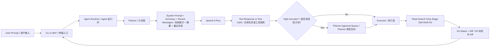

# pp-agent

`pp-agent` is a Windows-first personal coding agent inspired by `pi-mono`.
`pp-agent` 是一个优先面向 Windows 的个人 coding agent，整体设计思路参考 `pi-mono`。
Migration status: the codebase now lives under src/pp_agent, while legacy imports like gent_cli, gent_core, storage, and 	ools remain as compatibility shims.
迁移状态：当前实现已迁到 src/pp_agent，同时保留 gent_cli、gent_core、storage、	ools 兼容 shim。


## Overview | 项目概览

- Model | 模型: `qwen3.5-plus`
- Transport | 接口: Alibaba Bailian OpenAI-compatible `chat/completions`
- Thinking | 思考模式: disabled by default, `enable_thinking=false`
- Runtime style | 运行时风格: session-based runtime, single-file session tree, staged approvals, repo-aware workflow, planner -> executor split
- Safety style | 安全风格: high-risk plans pause for approval before executor continues
- CLI style | 命令行风格: chat-first, approval-first, Windows-friendly

## Architecture | 架构



## Planner -> Executor | 计划层与执行层

`pp-agent` now separates planning from execution in a way that is closer to `pi-mono`:
`pp-agent` 现在把计划和执行分层显示，更接近 `pi-mono` 的交互节奏：

- Planner: shows the intended steps before tools run.
- 计划层：先展示准备做什么。
- Executor: shows actual tool starts, results, and failures.
- 执行层：再展示工具真正开始执行、成功或失败。
- High-risk plans can now pause at the planner layer and wait for approval.
- 高风险计划现在可以在 planner 层暂停，等待批准后再进入 executor。

### Planner Approval Gate | Planner 审批门

When the model proposes a high-risk tool call such as `write_file`, `edit_file`, `run_shell`, or `approve_pending_action`, the planner can pause first.
当模型提出高风险工具调用，比如 `write_file`、`edit_file`、`run_shell` 或 `approve_pending_action` 时，planner 会先暂停。

In chat mode, you will see a planner token and can explicitly continue or stop:
在 chat 模式里，你会看到 planner token，可以显式继续或终止：

```text
=== Planner ===
Planned steps:
  [ ] Stage or execute write_file [write_file]
Planner update: [?] Stage or execute write_file [write_file]
Planner paused. Approve with /approve 1234... or reject with /reject 1234...
```

After approval, the same session resumes and the executor runs the pending tool calls.
批准后，会由同一个 session 恢复，并继续执行挂起的工具调用。

## Quick Start | 快速开始

### Fastest Way on Windows | Windows 最快启动方式

1. Set `PP_AGENT_API_KEY` in your terminal or system environment.
   在终端或系统环境变量中设置 `PP_AGENT_API_KEY`。
2. Double-click [start-agent.bat](/E:/Pycharm%20Project/pp-Echo/start-agent.bat).
   双击 [start-agent.bat](/E:/Pycharm%20Project/pp-Echo/start-agent.bat)。
3. Chat with the agent in the opened terminal.
   在打开的终端里直接和 agent 对话。

### Command Line | 命令行方式

```powershell
set PYTHONPATH=src
python -m pp_agent.cli.main chat
python -m pp_agent.cli.main run "请简要介绍你自己"
python -m pp_agent.cli.main sessions list
python -m pp_agent.cli.main sessions tree
python -m pp_agent.cli.main config show
```

## Environment Variables | 环境变量

- `PP_AGENT_API_KEY`: Alibaba Bailian API key / 阿里百炼 API Key
- `PP_AGENT_BASE_URL`: optional base URL override / 可选接口地址覆盖
- `PP_AGENT_MODEL`: optional model override / 可选模型覆盖
- `PP_AGENT_ENABLE_THINKING`: optional thinking override / 可选 thinking 开关覆盖
- `PP_AGENT_HOME`: optional state directory override / 可选状态目录覆盖

## Project Config | 项目级配置

Create `.pp-agent/config.json` if you want project-level overrides.
如果你希望做项目级覆盖配置，可以创建 `.pp-agent/config.json`。

```json
{
  "model": "qwen3.5-plus",
  "base_url": "https://dashscope.aliyuncs.com/compatible-mode/v1",
  "enable_thinking": false,
  "shell_timeout_seconds": 30,
  "tool_confirmation": {
    "write_file": true,
    "edit_file": true,
    "run_shell": true,
    "high_risk_plan": true
  }
}
```

## Chat Commands | Chat 模式命令

- `/settings`: show active runtime settings / 查看当前运行配置
- `/session`: show current session id / 查看当前 session id
- `/approvals`: show a friendly approval queue panel / 查看友好的审批面板
- `/approve <token>`: approve a pending planner gate or staged action / 批准 planner gate 或 staged action
- `/reject <token>`: reject a pending planner gate or staged action / 拒绝 planner gate 或 staged action
- `/model <name>`: switch model / 切换模型
- `/new`: start a new session / 新建会话
- `/resume <id>`: resume a session / 恢复会话
- `/quit`: exit / 退出

## Approval Queue | 审批队列

The approval queue supports summary view, preview, planner gates, and batch actions.
审批队列支持摘要、预览、planner gate 和批量处理。

```powershell
set PYTHONPATH=src
python -m pp_agent.cli.main approvals summary
python -m pp_agent.cli.main approvals list
python -m pp_agent.cli.main approvals show <token>
python -m pp_agent.cli.main approvals approve <token>
python -m pp_agent.cli.main approvals reject <token>
python -m pp_agent.cli.main approvals approve-all
python -m pp_agent.cli.main approvals reject-all
```

### What Goes Into the Queue | 哪些动作会进入审批队列

- planner approvals for high-risk plans / 高风险计划的 planner 审批
- staged file writes / staged 文件写入
- staged file edits / staged 文件编辑
- staged shell commands / staged shell 命令

### Approval Behavior | 审批行为

- Approving a `planner_approval` token resumes the original session and then runs the pending tool calls.
- 批准 `planner_approval` token 会恢复原始 session，并继续执行挂起的工具调用。
- Rejecting a `planner_approval` token clears the pending plan without executing it.
- 拒绝 `planner_approval` token 会清空挂起计划，不执行任何工具。
- Approving a staged file or shell token behaves the same as before.
- 批准普通 staged 文件或 shell token 的行为和之前一致。

## Repo-aware Workflow | 面向仓库的工作流

This command is designed to feel closer to a real coding-agent loop.
这个命令的目标是更接近真实 coding-agent 的工作闭环。

```powershell
set PYTHONPATH=src
python -m pp_agent.cli.main workflow repo --query "AgentSession"
python -m pp_agent.cli.main workflow repo --query "AgentSession" --path-filter src\agent_core
python -m pp_agent.cli.main workflow repo --token <token>
python -m pp_agent.cli.main workflow repo --token <token> --staged-only
python -m pp_agent.cli.main workflow repo --token <token> --auto-apply --staged-only
```

### Repo Workflow Shape | 仓库工作流结构

The workflow output is split into three sections:
工作流输出分成三部分：

- `planner`: what the agent intends to do next
- `planner`：接下来准备做什么
- `executor`: what commands and tools actually ran
- `executor`：实际执行了哪些工具和命令
- `next_actions`: what a human should review or trigger next
- `next_actions`：接下来建议你审查或触发什么

### Filters | 过滤能力

- `--path-filter`: limit grep and git diff to a file or directory.
- `--path-filter`: 把 grep 和 git diff 限制到指定文件或目录。
- `--staged-only`: when a token points to a file action, show only the related file diff.
- `--staged-only`: 当 token 对应文件动作时，只看相关文件的 diff。

## Editing And Compaction | 编辑流与上下文压缩

- Old conversation turns are compacted into a summary plus recent raw messages.
  较老的对话会被压缩成摘要，最近消息保留原文。
- `write_file` and `edit_file` stage by default.
  `write_file` 和 `edit_file` 默认先进入 staged 状态。
- `preview_pending_action` lets you inspect the staged diff, shell command, or planner summary.
  `preview_pending_action` 用于预览 staged diff、shell 命令或 planner 摘要。
- `approve_pending_action` still applies file changes or shell commands after approval.
  `approve_pending_action` 仍负责在审批后真正应用文件修改或执行 shell 命令。

### Diff Format | Diff 编辑格式

```text
<<<<<<< SEARCH
old text
=======
new text
>>>>>>> REPLACE
```

## Validation Checklist | 首次验证清单

1. Run `python -m pp_agent.cli.main config show`.
   运行 `python -m pp_agent.cli.main config show`。
2. Confirm the model is `qwen3.5-plus` and `high_risk_plan` is enabled.
   确认模型是 `qwen3.5-plus`，并且 `high_risk_plan` 已启用。
3. Open chat and trigger a high-risk request.
   进入 chat 后触发一次高风险请求。
4. Confirm the planner pauses and shows `/approve <token>` or `/reject <token>`.
   确认 planner 会暂停，并显示 `/approve <token>` 或 `/reject <token>`。
5. Approve the token and verify the executor runs afterwards.
   批准 token，确认 executor 会在之后继续执行。
6. Run `workflow repo` with a query or token.
   用 query 或 token 跑一次 `workflow repo`。

## Test | 测试

### Quick Self-check | 快速自检

Double-click [run-tests.bat](/E:/Pycharm%20Project/pp-Echo/run-tests.bat).
双击 [run-tests.bat](/E:/Pycharm%20Project/pp-Echo/run-tests.bat)。

### Command Line Test | 命令行测试

```powershell
set PYTHONPATH=src
python -m pytest -q
python -m pp_agent.cli.main --help
python -m pp_agent.cli.main sessions tree
python -m pp_agent.cli.main approvals summary
python -m pp_agent.cli.main workflow repo --query "AgentSession"
python -m pp_agent.cli.main config show
```

If `PP_AGENT_API_KEY` is missing or the network is blocked, the CLI should show a clear error instead of a Python stack trace.
如果缺少 `PP_AGENT_API_KEY` 或网络不可用，CLI 应输出清晰错误，而不是直接抛 Python 堆栈。

## Session Tree | ???

`pp-agent` stores sessions in a single tree file instead of one file per session.
`pp-agent` ????????????? tree ???????? session ?????

This is closer to `pi-mono` and makes branch, rewind, and history navigation easier.
???? `pi-mono` ?????? branch?rewind ?????????

```powershell
set PYTHONPATH=src
python -m pp_agent.cli.main sessions tree
python -m pp_agent.cli.main sessions tree --sort updated
python -m pp_agent.cli.main sessions branch <session_id>
python -m pp_agent.cli.main sessions rewind-turn <session_id> 2
```

In chat mode you can use:
? chat ???????????

- `/tree`: show the branch view for the current session tree.
- `/tree`??????????????
- `/tree updated`: switch to the last-updated view.
- `/tree updated`?????????????????
- `/tree focus <session_id>`: move the tree focus without changing the active chat session.
- `/tree focus <session_id>`??? tree ???????????? chat ???
- `/branch <session_id>`: fork that node and continue from the new branch.
- `/branch <session_id>`?????????????
- `/resume <session_id>`: move chat to an existing node.
- `/resume <session_id>`?????????????
- `/rewind-turn <count>`: create a new branch by rewinding complete turns.
- `/rewind-turn <count>`???????????????

## Tree Panel | ????

`/tree` now behaves more like a small history panel than a raw tree dump.
`/tree` ???????????????????????

It includes:
??????

- a recent node list for quick navigation
- ?????????????
- a branch view and an updated-first view
- ???????????????
- active branch markers and turn ids such as `turn-3`
- active branch ?????? `turn-3` ??? turn id
- current node, parent node, and up to 3 child previews
- ??????????? 3 ?????????
- explicit branch navigation hints for focus, resume, branch, and rewind
- ???? focus?resume?branch?rewind ????

When `rich` output is available, the active branch is shown in green and the current node is highlighted more strongly.
? `rich` ????????????????????????????????

## Startup Notes | ????

`start-agent.bat` no longer forces a fixed console size.
`start-agent.bat` ??????????????

That restores more natural scrolling behavior in the Windows terminal window.
???? Windows ????????????????


## Message Queue | ????

The chat runtime now has a small message queue inspired by `pi-mono`.
?? chat runtime ??????? `pi-mono` ??????????

It supports two delivery styles:
??????????

- `steering`: higher-priority guidance that should be delivered before regular follow-ups
- `steering`????????????????? follow-up ??
- `follow_up`: normal queued requests that should run after the current work finishes
- `follow_up`???????????????????

In chat mode:
? chat ????

- plain text while the agent is busy becomes a queued `follow_up`
- ? agent ???????????????????? `follow_up`
- `/queue`: inspect the queue
- `/queue`???????
- `/queue steering <message>`: enqueue higher-priority guidance
- `/queue steering <message>`???????????
- `/queue follow-up <message>`: enqueue a regular follow-up message
- `/queue follow-up <message>`????? follow-up ??

Queued messages are persisted with the session, so they survive `resume` and session reloads.
?????? session ???????? `resume` ????? session ??????

## Turn Controller | Turn ???

Chat mode now prints a lightweight runtime status line so you can see the active phase, queued message count, and planner/tool state while the agent works.
chat ??????????? runtime ?????????????????? phase?queue ??? planner/tool ???

The turn controller is now backed by an explicit turn state machine.
?? turn controller ?????????? turn state machine?

Current phases:
???????

- `idle`
- `planning`
- `awaiting_approval`
- `executing`
- `draining_queue`

This makes queue, planner, and turn continuation behavior easier to reason about and test.
?? queue?planner ? turn continuation ????????????????

The runtime now has a small turn controller inspired by `pi-mono`-style turn-based coordination.
?? runtime ??????? `pi-mono` turn-based coordination ????? turn controller?

It decides whether the current loop should:
??????? turn ??????

- continue the current loop
- ???? loop
- inject a queued `steering` or `follow_up` message into the next reasoning turn
- ???? `steering` ? `follow_up` ???????
- stop and wait because planner approval is still pending
- ? planner ??????????
- stop cleanly after the turn is finished
- ??? turn ???????

This keeps queue, planner, and turn continuation logic in one place instead of scattering it across the main runtime loop.
?? queue?planner ? turn continuation ???????????????????? runtime loop ???

## Agent Timeline Store | Agent ?????

The runtime monitor now feeds a persistent timeline store.
?? runtime monitor ??????????????? timeline store?

It records a structured event history for each session, including:
????? session ????????????????

- turn phase changes
- turn phase ??
- planner start, step, and end events
- planner ? start?step?end ??
- tool start and tool end events
- tool ? start ? end ??
- queue enqueue/dequeue events
- queue ? enqueue/dequeue ??

Query it with:
???????

```powershell
set PYTHONPATH=src
python -m pp_agent.cli.main timeline show --limit 30
python -m pp_agent.cli.main timeline show --session <session_id> --limit 50
```

In chat mode, use `/timeline` to inspect the current session timeline.
? chat ????????? `/timeline` ???? session ? timeline?

## Runtime Monitor | Runtime ???

The runtime now exposes a shared monitor snapshot instead of letting each surface invent its own status view.
?? runtime ???????? monitor snapshot????????????????????

That means:
?????

- CLI status lines use the same runtime snapshot as tests
- CLI ??????????? runtime snapshot
- runtime events include a reusable monitor payload
- runtime ?????????? monitor payload
- a future TUI can subscribe to the same monitor without re-deriving queue/planner/phase state
- ????? TUI?????????? monitor???????? queue/planner/phase ??

This is closer to the `pi-mono` idea of keeping runtime state observable and reusable across interfaces.
???? `pi-mono` ???runtime ??????????????????????

## Runtime Coordination | Runtime ??

`transform_context`, message queue, and planner approval now work together.
`transform_context`?????? planner ???????????

That means:
?????

- queued `steering` can influence the very next reasoning turn after a tool round finishes
- ??? `steering` ??????????????????????
- queued `follow_up` still waits until the current work is complete
- ??? `follow_up` ????????????????
- `transform_context` injects runtime notes so the model knows whether planner approval or queued guidance is still waiting
- `transform_context` ??? runtime notes???????????? planner ??????????
- planner approval still gates execution safely before queued work continues
- planner ?????????????????????????

This is closer to the way `pi-mono` treats steering, follow-ups, and turn-based control.
???? `pi-mono` ?? steering?follow-up ? turn-based control ????

## Runtime Hooks | ?????


The runtime now has a small hook pipeline inspired by `pi-agent-core`.
?? runtime ??????? `pi-agent-core` ????? hook ???

It separates:
????????????

- `transform_context`: adjust the model input before each LLM call
- `transform_context`?????????????
- `before_tool_call`: approve, reject, or gate a tool call before execution
- `before_tool_call`????????????????
- `after_tool_call`: decide whether the runtime should keep looping after a tool result
- `after_tool_call`????????? runtime ???????
- `tool_error`: control stop/continue policy when a tool fails
- `tool_error`???????????????

This makes the runtime easier to evolve toward `pi-agent-core` without rewriting the whole agent loop.
?? runtime ???????? `pi-agent-core` ????????????? agent loop?


