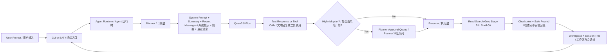

# pp-agent

`pp-agent` is a Windows-first personal coding agent inspired by `pi-mono`.
`pp-agent` 是一个优先面向 Windows 的个人 coding agent，整体设计思路参考 `pi-mono`。

The active implementation lives under `src/pp_agent`.
Current legacy import paths such as `agent_cli`, `agent_core`, `storage`, and `tools` are kept as compatibility shims.
当前实现位于 `src/pp_agent`。
历史导入路径如 `agent_cli`、`agent_core`、`storage`、`tools` 目前仍保留为兼容层。

## Overview | 项目概览

- Model | 模型: `qwen3.5-plus`
- Transport | 接口: Alibaba Bailian OpenAI-compatible `chat/completions`
- Thinking | 思考模式: disabled by default, `enable_thinking=false`
- Runtime style | 运行时风格: session-based runtime, session tree, planner -> executor split, staged approvals, repo-aware workflow
- Safety style | 安全风格: high-risk plans pause before execution, git-backed checkpoint preview and safe rewind
- CLI style | 命令行风格: chat-first, approval-first, Windows-friendly

## Key Features | 核心能力

- Planner / Executor split
  Shows intended steps first, then shows actual tool execution.
  先展示计划，再展示真实执行过程。
- Approval gate for high-risk work
  File edits, shell commands, and other risky actions can pause for approval.
  文件修改、Shell 命令和其他高风险动作可以先暂停等待批准。
- Session tree and branch navigation
  Sessions are stored as a tree so you can branch, resume, and rewind more naturally.
  会话以树结构存储，更方便分支、恢复和回退。
- Checkpoint and safe rewind
  Rewind can restore conversation state, workspace state, or both.
  rewind 现在可以恢复对话状态、工作区状态，或两者一起恢复。
- Repo-aware workflow
  Search, grep, git status, git diff, staged changes, and approvals fit into one loop.
  搜索、grep、git 状态、git diff、暂存修改和审批流程可以组成一条完整工作流。

## Architecture | 架构



## Quick Start | 快速开始

### Fastest Way on Windows | Windows 最快启动方式

1. Set `PP_AGENT_API_KEY` in your terminal or system environment.
   在终端或系统环境变量中设置 `PP_AGENT_API_KEY`。
2. Double-click `start-agent.bat`.
   双击 `start-agent.bat`。
3. Chat with the agent in the opened terminal.
   在打开的终端里直接和 agent 对话。

### Command Line | 命令行方式

```powershell
set PYTHONPATH=src
python -m pp_agent.cli.main chat
python -m pp_agent.cli.main run "请简要介绍你自己"
python -m pp_agent.cli.main sessions list
python -m pp_agent.cli.main sessions tree
python -m pp_agent.cli.main checkpoint list
python -m pp_agent.cli.main config show
```

## Environment Variables | 环境变量

- `PP_AGENT_API_KEY`: Alibaba Bailian API key / 阿里百炼 API Key
- `PP_AGENT_BASE_URL`: optional base URL override / 可选接口地址覆盖
- `PP_AGENT_MODEL`: optional model override / 可选模型覆盖
- `PP_AGENT_ENABLE_THINKING`: optional thinking override / 可选 thinking 开关覆盖
- `PP_AGENT_HOME`: optional state directory override / 可选状态目录覆盖

## Project Config | 项目级配置

Create `.pp-agent/config.json` if you want project-level overrides.
如果你希望做项目级覆盖配置，可以创建 `.pp-agent/config.json`。

```json
{
  "model": "qwen3.5-plus",
  "base_url": "https://dashscope.aliyuncs.com/compatible-mode/v1",
  "enable_thinking": false,
  "shell_timeout_seconds": 30,
  "tool_confirmation": {
    "write_file": true,
    "edit_file": true,
    "run_shell": true,
    "high_risk_plan": true
  }
}
```

## Planner And Approval Flow | 计划层与审批流

`pp-agent` separates planning from execution so the runtime can explain intent before mutating the workspace.
`pp-agent` 会把计划和执行拆开，让运行时能在真正修改工作区之前先解释准备做什么。

- Planner: shows intended steps before tools run.
  计划层：先展示准备做什么。
- Executor: shows actual tool starts, results, and failures.
  执行层：再展示工具真正开始执行、成功或失败。
- High-risk plans can pause at the planner layer and wait for approval.
  高风险计划可以在 planner 层暂停，等待批准后再进入 executor。

### Planner Approval Gate | Planner 审批门

When the model proposes a high-risk tool call such as `write_file`, `edit_file`, `run_shell`, or `approve_pending_action`, the planner can pause first.
当模型提出高风险工具调用，比如 `write_file`、`edit_file`、`run_shell` 或 `approve_pending_action` 时，planner 会先暂停。

Example:

```text
=== Planner ===
Planned steps:
  [ ] Stage or execute write_file [write_file]
Planner update: [?] Stage or execute write_file [write_file]
Planner paused. Approve with /approve 1234... or reject with /reject 1234...
```

After approval, the same session resumes and the executor runs the pending tool calls.
批准后，会由同一个 session 恢复，并继续执行挂起的工具调用。

## Chat Commands | Chat 模式命令

- `/settings`: show active runtime settings / 查看当前运行配置
- `/status`: show runtime phase, queue, and planner state / 查看当前运行阶段、队列和 planner 状态
- `/session`: show current session id / 查看当前 session id
- `/approvals`: show the approval queue panel / 查看审批面板
- `/approve <token>`: approve a pending planner gate or staged action / 批准 planner gate 或 staged action
- `/reject <token>`: reject a pending planner gate or staged action / 拒绝 planner gate 或 staged action
- `/model <name>`: switch model / 切换模型
- `/new`: start a new session / 新建会话
- `/resume <id>`: resume a session / 恢复会话
- `/tree`: inspect the session tree / 查看 session tree
- `/timeline`: inspect the current session timeline / 查看当前 session timeline
- `/queue`: inspect queued messages / 查看排队消息
- `/quit`: exit / 退出

## Session Tree And Rewind | 会话树与回退

`pp-agent` stores sessions in a shared tree file instead of one file per session.
`pp-agent` 使用共享树文件存储会话，而不是每个 session 一个独立文件。

This makes branch, resume, rewind, and history navigation feel closer to a real coding workflow.
这样更适合真实 coding workflow 中的分支、恢复、回退和历史浏览。

```powershell
set PYTHONPATH=src
python -m pp_agent.cli.main sessions tree
python -m pp_agent.cli.main sessions tree --sort updated
python -m pp_agent.cli.main sessions branch <session_id>
python -m pp_agent.cli.main sessions rewind-turn <session_id> 2
```

In chat mode you can use:
在 chat 模式下你可以使用：

- `/tree`: show the branch view for the current session tree / 查看当前 session tree 的分支视图
- `/tree updated`: switch to the updated-first view / 切换到最近更新优先视图
- `/tree focus <session_id>`: move tree focus without changing the active chat session / 移动 tree 焦点但不切换当前聊天会话
- `/branch <session_id>`: fork that node and continue from a new branch / 从该节点分叉并继续
- `/resume <session_id>`: move chat to an existing node / 切换到已有节点继续聊天
- `/rewind-turn <count>`: create a new branch by rewinding complete turns / 按完整 turn 回退并创建新分支

## Checkpoint And Safe Rewind | 检查点与安全回退

Checkpoint is independent from `session-tree.jsonl`.
It is designed to support safe rewind across both conversation state and workspace state.
checkpoint 独立于 `session-tree.jsonl`。
它的目标是让 safe rewind 同时覆盖对话状态和工作区状态。

### Snapshot Types | 快照类型

- `head_snapshot`
  Records `HEAD` commit and branch position without changing the current workspace.
  记录 `HEAD` 提交和分支位置，不改当前工作区。
- `stash_snapshot`
  Used only for dirty workspace protection after preview and explicit confirmation.
  仅用于 dirty workspace 保护，需要先 preview，再显式确认。

### Safe Rewind Modes | 安全回退模式

- `conversation_only`
  Rewind session history only.
  只回退会话历史。
- `workspace_only`
  Restore workspace only.
  只恢复工作区。
- `conversation_and_workspace`
  Restore both workspace and conversation branch.
  同时恢复工作区和对话分支。

### CLI Examples | CLI 示例

```powershell
set PYTHONPATH=src
python -m pp_agent.cli.main checkpoint create --session <session_id>
python -m pp_agent.cli.main checkpoint list
python -m pp_agent.cli.main checkpoint restore <checkpoint_id>
python -m pp_agent.cli.main rewind-safe --session <session_id> --turns 2
python -m pp_agent.cli.main rewind-safe --session <session_id> --checkpoint <checkpoint_id>
python -m pp_agent.cli.main rewind-safe --session <session_id> --workspace-only --checkpoint <checkpoint_id>
python -m pp_agent.cli.main rewind-safe --session <session_id> --conversation-only --checkpoint <checkpoint_id>
```

### Why It Matters | 为什么重要

Old rewind only moved the conversation branch.
The workspace could still stay in the later, already-mutated state.
旧 rewind 只能移动对话分支。
工作区仍可能停留在更靠后的、已经被修改过的状态。

Safe rewind fixes that mismatch.
You can now preview risk first, then restore conversation, workspace, or both with explicit intent.
safe rewind 解决了这种对话与文件状态不一致的问题。
现在你可以先预览风险，再明确地恢复对话、工作区，或两者一起恢复。

## Approval Queue | 审批队列

The approval queue supports summary view, preview, planner gates, and batch actions.
审批队列支持摘要、预览、planner gate 和批量处理。

```powershell
set PYTHONPATH=src
python -m pp_agent.cli.main approvals summary
python -m pp_agent.cli.main approvals list
python -m pp_agent.cli.main approvals show <token>
python -m pp_agent.cli.main approvals approve <token>
python -m pp_agent.cli.main approvals reject <token>
python -m pp_agent.cli.main approvals approve-all
python -m pp_agent.cli.main approvals reject-all
```

### What Goes Into the Queue | 哪些动作会进入审批队列

- planner approvals for high-risk plans / 高风险计划的 planner 审批
- staged file writes / staged 文件写入
- staged file edits / staged 文件编辑
- staged shell commands / staged shell 命令

### Approval Behavior | 审批行为

- Approving a `planner_approval` token resumes the original session and then runs the pending tool calls.
  批准 `planner_approval` token 会恢复原始 session，并继续执行挂起的工具调用。
- Rejecting a `planner_approval` token clears the pending plan without executing it.
  拒绝 `planner_approval` token 会清空挂起计划，不执行任何工具。
- Approving a staged file or shell token behaves the same as before.
  批准普通 staged 文件或 shell token 的行为和之前一致。

## Repo-aware Workflow | 面向仓库的工作流

This command is designed to feel closer to a real coding-agent loop.
这个命令的目标是更接近真实 coding-agent 的工作闭环。

```powershell
set PYTHONPATH=src
python -m pp_agent.cli.main workflow repo --query "AgentSession"
python -m pp_agent.cli.main workflow repo --query "AgentSession" --path-filter src\agent_core
python -m pp_agent.cli.main workflow repo --token <token>
python -m pp_agent.cli.main workflow repo --token <token> --staged-only
python -m pp_agent.cli.main workflow repo --token <token> --auto-apply --staged-only
```

### Workflow Output | 工作流输出

The workflow output is split into three sections:
工作流输出分成三部分：

- `planner`: what the agent intends to do next / 接下来准备做什么
- `executor`: what commands and tools actually ran / 实际执行了哪些工具和命令
- `next_actions`: what a human should review or trigger next / 接下来建议你审查或触发什么

### Filters | 过滤能力

- `--path-filter`: limit grep and git diff to a file or directory / 把 grep 和 git diff 限制到指定文件或目录
- `--staged-only`: when a token points to a file action, show only the related file diff / 当 token 对应文件动作时，只看相关文件的 diff

## Editing, Queue, And Runtime Hooks | 编辑流、消息队列与运行时钩子

### Editing And Compaction | 编辑流与上下文压缩

- Old conversation turns are compacted into a summary plus recent raw messages.
  较老的对话会被压缩成摘要，最近消息保留原文。
- `write_file` and `edit_file` stage by default.
  `write_file` 和 `edit_file` 默认先进入 staged 状态。
- `preview_pending_action` lets you inspect the staged diff, shell command, or planner summary.
  `preview_pending_action` 用于预览 staged diff、shell 命令或 planner 摘要。
- `approve_pending_action` still applies file changes or shell commands after approval.
  `approve_pending_action` 仍负责在审批后真正应用文件修改或执行 shell 命令。

### Diff Format | Diff 编辑格式

```text
<<<<<<< SEARCH
old text
=======
new text
>>>>>>> REPLACE
```

### Message Queue | 消息队列

The chat runtime supports two delivery styles:
chat runtime 支持两种排队消息样式：

- `steering`: higher-priority guidance delivered before regular follow-ups
  `steering`：优先级更高，会先于普通 follow-up 送达
- `follow_up`: normal queued requests delivered after current work completes
  `follow_up`：普通排队请求，会在当前工作完成后送达

Examples:

- `/queue`: inspect the queue / 查看队列
- `/queue steering <message>`: enqueue higher-priority guidance / 追加高优先级指导
- `/queue follow-up <message>`: enqueue a normal follow-up / 追加普通 follow-up

Queued messages are persisted with the session, so they survive `resume` and reload.
排队消息会和 session 一起持久化，因此在 `resume` 或重载后仍然存在。

### Turn Controller And Runtime Hooks | Turn 控制器与运行时钩子

The runtime uses an explicit turn state machine.
运行时使用显式 turn 状态机。

Current phases:
当前阶段包括：

- `idle`
- `planning`
- `awaiting_approval`
- `executing`
- `draining_queue`

The runtime hook pipeline separates:
运行时 hook 管线分离了以下能力：

- `transform_context`: adjust model input before each LLM call / 在每次 LLM 调用前调整输入
- `before_tool_call`: approve, reject, or gate a tool call before execution / 在工具执行前批准、拒绝或拦截
- `after_tool_call`: decide whether the runtime should keep looping after a tool result / 在工具结果返回后决定是否继续循环
- `tool_error`: control stop/continue policy when a tool fails / 在工具失败时控制停止或继续策略

## Timeline And Monitoring | 时间线与运行时观测

The runtime monitor feeds a persistent timeline store.
运行时监视器会把事件写入持久化 timeline store。

It records structured event history for each session, including:
它会为每个 session 记录结构化事件历史，包括：

- turn phase changes / turn 阶段变化
- planner start, step, and end events / planner 的 start、step、end 事件
- tool start and tool end events / tool 的 start 和 end 事件
- queue enqueue and dequeue events / queue 的 enqueue 和 dequeue 事件

```powershell
set PYTHONPATH=src
python -m pp_agent.cli.main timeline show --limit 30
python -m pp_agent.cli.main timeline show --session <session_id> --limit 50
```

In chat mode, use `/timeline` to inspect the current session timeline.
在 chat 模式下，可以使用 `/timeline` 查看当前 session 的时间线。

## Validation Checklist | 首次验证清单

1. Run `python -m pp_agent.cli.main config show`.
   运行 `python -m pp_agent.cli.main config show`。
2. Confirm the model is `qwen3.5-plus` and `high_risk_plan` is enabled.
   确认模型是 `qwen3.5-plus`，并且 `high_risk_plan` 已启用。
3. Open chat and trigger a high-risk request.
   进入 chat 后触发一次高风险请求。
4. Confirm the planner pauses and shows `/approve <token>` or `/reject <token>`.
   确认 planner 会暂停，并显示 `/approve <token>` 或 `/reject <token>`。
5. Create or inspect a checkpoint with `checkpoint list`.
   使用 `checkpoint list` 创建或查看 checkpoint。
6. Preview a safe rewind and confirm the reported risk matches the current workspace state.
   预览一次 safe rewind，并确认风险提示与当前工作区状态一致。

## Test | 测试

### Quick Self-check | 快速自检

Double-click `run-tests.bat`.
双击 `run-tests.bat`。

### Command Line Test | 命令行测试

```powershell
set PYTHONPATH=src
python -m pytest -q
python -m pp_agent.cli.main --help
python -m pp_agent.cli.main sessions tree
python -m pp_agent.cli.main approvals summary
python -m pp_agent.cli.main checkpoint list
python -m pp_agent.cli.main rewind-safe --help
python -m pp_agent.cli.main workflow repo --query "AgentSession"
python -m pp_agent.cli.main config show
```

If `PP_AGENT_API_KEY` is missing or the network is blocked, the CLI should show a clear error instead of a Python stack trace.
如果缺少 `PP_AGENT_API_KEY` 或网络不可用，CLI 应输出清晰错误，而不是直接抛 Python 堆栈。
