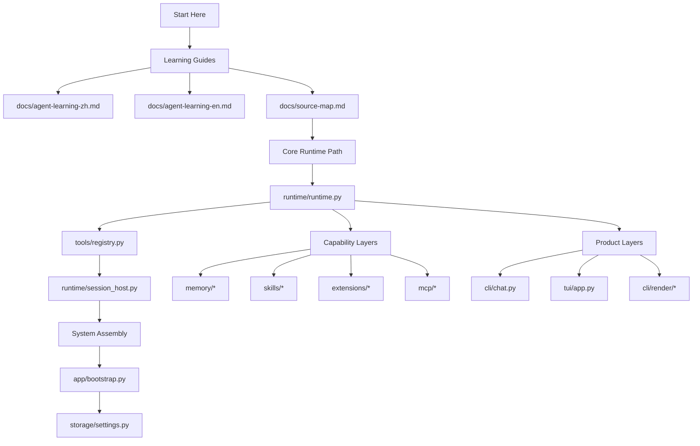
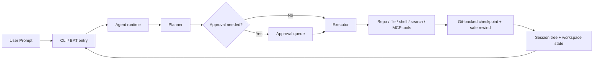

# pp-Echo

<p align="center">
  <strong>A beginner-friendly, CLI-first coding agent you can actually study, run locally, and extend.</strong><br />
  It shows plans before execution, asks before risky actions, and can rewind both repository state and conversation history.
</p>

<p align="center">
  <a href="#quick-start"></a>
  <a href="#why-this-repo-is-worth-studying"></a>
  <a href="#quick-learning-path"></a>
  <a href="#demo--screenshots"></a>
  <a href="https://github.com/CHEN2003-CHIP/pp-Echo/releases"></a>
</p>


<p align="center">
  <code>Plan before act</code> | <code>Approve risky actions</code> | <code>Rewind code + conversation safely</code> | <code>CLI + TUI</code>
</p>

pp-Echo is both a practical local coding agent and a learn-by-reading reference project for agent engineering. If you are new to agents, this repo gives you something many projects do not: a real runtime, visible planning, approval gates, memory, session recovery, and a codebase you can follow without needing a giant platform behind it.

## Why This Repo Is Worth Studying

- It is not just a toy chatbot. It contains a real runtime loop, tool registry, session host, memory layer, approvals, rewind, and multiple user interfaces.
- It is beginner-friendly. The repo includes Chinese and English learning guides plus a source map for reading the code in a sensible order.
- It is practical. You can run it locally, inspect its behavior, and use it as a reference when building your own agent system.
- It is opinionated in the right places. Planning is visible, risky actions are reviewable, and the system is designed around repo work instead of generic chat.
- It is a good bridge project. Beginners can learn architecture here, and experienced builders can borrow patterns for runtime orchestration, tool calling, and safety boundaries.

## Best For

- Beginners who want to understand how an agent project is organized end to end.
- Developers who want a local coding agent with visible planning and approval flow.
- Builders who want to learn how runtime, tools, memory, sessions, CLI, and TUI fit together.
- People comparing agent repos and looking for one that is easier to read, extend, and trust.

## What You Will Learn

- How an agent runtime manages turns, planning, tools, and execution.
- How tool registration and dispatch work in a repo-aware coding assistant.
- How session hosting, rewind, and checkpoint ideas can improve agent usability.
- How memory and vector retrieval integrate into an agent workflow.
- How one backend can drive both a CLI chat experience and a richer TUI.
- How to structure a project so it is usable as both product and learning material.

## Quick Start

pp-Echo targets Python 3.9+ and is easiest to try on Windows first.

Before you start:

- Set `PP_AGENT_API_KEY` in your environment.
- Use `start-agent.bat` for the fastest first run.
- If you run from source, set `PYTHONPATH=src`.

### Fastest Windows path

```powershell
set PP_AGENT_API_KEY=your_api_key
.\start-agent.bat
```

This is the shortest path from clone to first conversation.

### TUI on Windows

```powershell
set PP_AGENT_API_KEY=your_api_key
.\echo-cli.bat
```

Use this when you want the richer terminal UI instead of plain chat output.

### Run from source

```powershell
git clone https://github.com/CHEN2003-CHIP/pp-Echo.git
cd pp-Echo
set PP_AGENT_API_KEY=your_api_key
set PYTHONPATH=src
python -m pp_agent.cli.main chat
```

Minimal non-interactive demo:

```powershell
set PP_AGENT_API_KEY=your_api_key
set PYTHONPATH=src
python -m pp_agent.cli.main run "Give me a quick overview of this repo"
```

### Installed CLI

```powershell
python -m pip install --upgrade pip setuptools wheel
python -m pip install -e .
pp-agent chat
```

If `pip install -e .` fails on an older environment, use the source-run path first.

## Quick Learning Path

If you are new to this repo, read in this order:

1. Start with the learning docs:
   [docs/agent-learning-zh.md](docs/agent-learning-zh.md),
   [docs/agent-learning-en.md](docs/agent-learning-en.md),
   [docs/source-map.md](docs/source-map.md)
2. Then read the three core backend files:
   [src/pp_agent/runtime/runtime.py](src/pp_agent/runtime/runtime.py),
   [src/pp_agent/tools/registry.py](src/pp_agent/tools/registry.py),
   [src/pp_agent/runtime/session_host.py](src/pp_agent/runtime/session_host.py)
3. Then move to the product layers:
   [src/pp_agent/cli/chat.py](src/pp_agent/cli/chat.py),
   [src/pp_agent/tui/app.py](src/pp_agent/tui/app.py),
   [src/pp_agent/app/bootstrap.py](src/pp_agent/app/bootstrap.py)



## Demo / Screenshots


- Launch with `start-agent.bat` for chat or `echo-cli.bat` for the TUI.
- Ask the agent to inspect a repo task and preview risky work before execution.
- Review approvals, create checkpoints, and use safe rewind to recover both code and conversation state.

| Interactive chat | Checkpoint + rewind |
| --- | --- |
|  |  |

## Why pp-Echo

Most coding agents are good at producing output. Fewer are good at making their behavior visible, reviewable, and reversible once a real repository gets messy. pp-Echo is built for that gap.

- Planning stays visible before execution, so you can supervise direction instead of reacting after changes land.
- High-risk operations can pause behind approvals instead of mutating the workspace immediately.
- Sessions are stored as a tree, making branch, resume, compare, and rewind workflows easier to reason about.
- Safe rewind is git-backed, so you can restore the conversation, the workspace, or both together.
- Skills, extensions, and MCP-backed capabilities fit into the same repo-aware runtime rather than feeling bolted on.

If this repo helps you learn agents faster or gives you a useful starting point for your own system, a Star helps more people discover it.

## Safety Boundary

Phase 1 now uses a mandatory policy gate for sensitive execution. This gate is checked at execution time, not only at planner time.

- The policy gate returns `allow`, `ask`, or `deny`.
- `ask` means the model can stage a proposed effect, but only the host/user side may approve it.
- Protected paths are enforced through path protection and policy gating.
- This phase is not a true shell sandbox. The existing shell runner remains in place behind the policy gate and host approval flow.

Protected paths in Phase 1:

- `.pp-agent/**`
- `.git/**`
- `.env`
- `.env.*`
- `*.pem`
- `*.key`

Important Phase 1 limit:

- `.pp-agent/**` is logically isolated from model-facing tools, but it is not physically separated from the repository yet.

## Exact-Effect Approvals

Phase 2A upgrades sensitive approval binding so host approval applies to an exact staged effect, not just a token.

- Sensitive file and shell proposals now produce an effect record before execution.
- `payload_digest` is the primary approval binding.
- Human-readable summaries are review output and a secondary consistency check, not the primary security anchor.
- File effects distinguish whether the target was absent or present at staging time.
- Shell effects use narrow normalization: whitespace-only differences normalize, but command content, separators, redirection, quotes, parameter order, and timeout changes remain material.
- Planner approval is still not execution approval.

## Shell Effect Classification

Phase 2B keeps exact-effect approval binding, but makes staged shell effects easier to review and reason about.

- Shell effects now include structured fields such as `normalized_command`, `command_head`, `risk_class`, `writes_workspace_files`, `touches_external_paths`, `requests_network`, and `destructive_hint`.
- Current shell classes are `inspect`, `workspace_mutation`, `external_mutation`, `networked`, and `destructive`.
- Human-readable shell summaries are stable review output such as `Inspect repository status with git status` or `Fetch remote content with curl`.
- Classification enriches policy decisions and previews, but it does not bypass host-side approval and it is not a shell sandbox.
- Normalization remains intentionally narrow: whitespace-only differences normalize to the same effect, while command, parameter, separator, redirection, quote, and timeout changes remain material.

Current Phase 2B limits:

- Shell classification is still conservative heuristic matching, not a full shell parser or AST.
- The existing shell runner is still used; this phase does not add sandbox infrastructure.
- Policy still keeps shell execution behind host-side approval even for `inspect` commands.

Planned Phase 2C direction:

- Finer-grained shell semantics and better effect summaries.
- Broader effect classification across more tool families.
- Stronger policy differentiation once classification confidence is high enough.

## Shared Effect Analysis

Phase 2C generalizes effect semantics across built-in file tools, shell tools, and dynamic extension or MCP tools.

- Shared analysis records now expose `family`, `risk_class`, `summary`, `confidence_band`, `touches_workspace`, `touches_external`, `requests_network`, `destructive_hint`, and `protected_path_hint`.
- Policy uses stable confidence bands such as `high`, `medium`, `low`, and `unknown` instead of relying on raw float thresholds in behavior rules.
- Built-in file reads can still be allowed when the target is a normal workspace path and analysis is high confidence.
- Shell policy differentiation stays narrow: only a known-safe inspect subset such as `git status`, `git diff`, `rg`, `grep`, `ls`, `dir`, and `Get-ChildItem` may be allowed automatically.
- Extension and MCP tools now receive shared analysis too, but this does not mean they have shared exact-effect approvals. Without staged exact-effect support, they remain policy-level `ask` or `deny`.

Current Phase 2C limits:

- Shared analysis is still heuristic and conservative.
- Unknown or weakly understood extension or MCP semantics fail closed.
- Only security-relevant, stably recomputable analysis fields are included in effect identity.

## Dynamic Tool Declarations

Phase 4A completes the public cutover: explicit declarations are now the only author-facing semantics contract for dynamic extension and MCP tools.

- Dynamic tools declare `exact_effect_mode` as `none`, `auto`, or `required`.
- `exact_effect_mode` is the primary exact-effect capability declaration. Authors do not set a free `supports_exact_effect_staging` boolean directly.
- Registration acceptance is intentionally looser than execution eligibility: weakly declared tools may still register, but they fail closed at policy or execution time.
- `required` never falls back to direct execution. If a call cannot be represented stably enough for exact approval, it fails closed with `approval_unavailable`.
- `known_safe_inspect` only makes a tool eligible for safe-inspect policy consideration. It never implies `allow` by itself.
- Runtime/shared analysis now tightens fields conservatively instead of replacing declared semantics wholesale.
- Author-facing `analysis_hints` are no longer accepted by public registration APIs.
- A private runtime-internal override path remains available only for conservative risk tightening inside framework code.

Primary declarations:

- `exact_effect_mode`
- `non_side_effectful`
- `known_safe_inspect`
- `requests_network_hint`
- `touches_external_hint`

Private runtime-only risk overrides may only tighten risk with these keys:

- `requests_network`
- `touches_external`
- `destructive_hint`
- `protected_path_hint`
- `touches_workspace`

Only the tightening-direction value `True` is accepted for these internal overrides. Safe or widening values such as `False`, `safe`, `allow`, `read_only`, or `inspect_only` are rejected.

Disallowed legacy keys:

- `risk_class`
- `summary`
- `confidence_score`
- `confidence_band`
- `known_safe_inspect`
- `exact_effect_mode`
- `supports_exact_effect_staging`

Representative alias examples that are also rejected as primary-semantics hints:

- `safe`
- `allow`
- `read_only`
- `inspect_only`
- `stageable`
- `approval_supported`
- `exact_effect_supported`
- `confidence`
- `safety_score`
- `display_summary`

Author guidance:

- Prefer `exact_effect_mode="auto"` when unsure.
- Use `required` only for tools that should enter exact-effect approval whenever the call is policy-sensitive and stably representable.
- Leave `known_safe_inspect=False` unless the tool is clearly read-only and non-side-effectful.
- Runtime risk signals win conservatively on a field-by-field basis. A declared safe inspect tool can still be tightened back to `ask`, `approval_unavailable`, or `deny`.
- See `docs/dynamic-tool-declarations.md` for the versioned deprecation timeline, an old-to-new migration table, and examples of a safe inspect tool, a staged side-effectful tool, an unstable fail-closed tool, and an MCP registration.

## Legacy Hint Doctor

The legacy-hints doctor now doubles as a release gate for the public cutover.

- Use `pp-agent capabilities legacy-hints --workspace <path>` for a human-readable report.
- Use `pp-agent capabilities legacy-hints --json --workspace <path>` for machine-readable output.
- Use `pp-agent capabilities legacy-hints --strict --workspace <path>` to fail the command when author-facing legacy usage remains.
- Runtime metadata is the authoritative readiness source.
- Static source scanning is advisory only and does not decide readiness by itself.
- Author-facing legacy `analysis_hints` count as removal blockers. Runtime-internal risk overrides are reported separately.
- Removal readiness for `v0.4.0` requires zero author-facing legacy `analysis_hints` in runtime metadata.

Current limits:

- Dynamic tool defaults remain tighter than built-in file and shell flows.
- Direct execution on policy `allow` stays limited to a narrow high-confidence, non-side-effectful inspect subset.
- Unknown, weakly understood, networked, destructive, or externally touching dynamic calls still fail closed to `ask` or `deny`.
- This phase still does not add sandboxing, a grant history ledger, or physical control-plane separation.

## Core Workflows

### 1. Chat and run

```powershell
set PYTHONPATH=src
python -m pp_agent.cli.main chat
python -m pp_agent.cli.main run "Audit this repo and summarize risky commands"
```

### 2. Sessions and tree navigation

```powershell
set PYTHONPATH=src
python -m pp_agent.cli.main sessions list
python -m pp_agent.cli.main sessions tree
```

### 3. Approvals and staged actions

```powershell
set PYTHONPATH=src
python -m pp_agent.cli.main approvals list
python -m pp_agent.cli.main approvals summary
```

### 4. Checkpoints and safe rewind

```powershell
set PYTHONPATH=src
python -m pp_agent.cli.main checkpoint list
python -m pp_agent.cli.main rewind-safe --session <session_id> --turns 2
```

### 5. Capabilities, skills, and MCP

```powershell
set PYTHONPATH=src
python -m pp_agent.cli.main capabilities list
python -m pp_agent.cli.main skills list
```

## Architecture



## Learning Docs

If you are new to agent engineering or want a guided tour of this codebase:

- Chinese learning guide: [docs/agent-learning-zh.md](docs/agent-learning-zh.md)
- English learning guide: [docs/agent-learning-en.md](docs/agent-learning-en.md)
- Source map / module call graph: [docs/source-map.md](docs/source-map.md)

## Configuration

### Environment variables

- `PP_AGENT_API_KEY`
- `PP_AGENT_BASE_URL`
- `PP_AGENT_MODEL`
- `PP_AGENT_ENABLE_THINKING`
- `PP_AGENT_HOME`

### Project config

Create `.pp-agent/config.json` for per-project overrides:

```json
{
  "model": "qwen3.5-plus",
  "base_url": "https://dashscope.aliyuncs.com/compatible-mode/v1",
  "enable_thinking": false,
  "shell_timeout_seconds": 30,
  "capabilities": {
    "builtin_tools": { "enable": true },
    "skills": {
      "enable_project": true,
      "enable_user": true,
      "enable_builtin": true,
      "custom_directories": [],
      "ignored": [],
      "include": []
    },
    "extensions": {
      "enable_project": true,
      "enable_user": true,
      "enable_builtin": false,
      "custom_directories": [],
      "ignored": [],
      "include": []
    },
    "mcp": {
      "enable": false,
      "config_paths": [],
      "server_filters": []
    }
  },
  "tool_confirmation": {
    "write_file": true,
    "edit_file": true,
    "run_shell": true,
    "high_risk_plan": true
  }
}
```

`tool_confirmation` still exists for planner-era compatibility, but it is no longer the complete safety model on its own. Sensitive execution now also passes through a mandatory execution-time policy gate.

### Resources and manifests

Project resources can be declared in `.pp-agent/resources.json` or `.pp-agent/package.json`. If no manifest is present, pp-Echo falls back to conventional directories like `.pp-agent/skills` and `.pp-agent/extensions`, and also supports pi-compatible discovery from `.pi/skills` and `.agents/skills`.

## Releases

- Release notes for the first formal release live in [releases/v0.2.0.md](releases/v0.2.0.md).
- A reusable template for future releases lives in [.github/release-template.md](.github/release-template.md).
- GitHub Releases page: [github.com/CHEN2003-CHIP/pp-Echo/releases](https://github.com/CHEN2003-CHIP/pp-Echo/releases)

## Benchmarks

- Latest benchmark report: [docs/benchmarks/latest.md](docs/benchmarks/latest.md)
- Generated benchmark artifacts: [artifacts/benchmarks](artifacts/benchmarks)
- The suite is deterministic, offline, and focuses on planner gating, safe rewind, MCP lazy activation, session branching, and long-context compaction.

## Contributing

Contributions are welcome across CLI behavior, docs polish, demo assets, tests, extensions, and release packaging.

Start here:

- Read [CONTRIBUTING.md](CONTRIBUTING.md)
- Run tests with `python -m pytest`
- Keep documentation and demo assets in sync when user-facing behavior changes

## License

This project is licensed under the MIT License. See [LICENSE](LICENSE).
