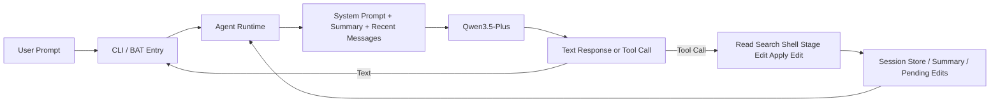

# pp-agent

Python personal coding agent inspired by `pi-mono`, designed for Windows 10 and Qwen on Alibaba Bailian.

## Default Model

- Model: `qwen3.5-plus`
- Transport: Alibaba Bailian OpenAI-compatible `chat/completions`
- Thinking: disabled by default with `enable_thinking=false`

## Workflow



## Quick Start

### Fastest way on Windows

1. Set `PP_AGENT_API_KEY` in your current terminal or system environment.
2. Double-click `start-agent.bat`.
3. Chat with the agent in the opened terminal.

### Command line

```powershell
set PYTHONPATH=src
python -m agent_cli.main chat
python -m agent_cli.main run "请简要介绍你自己"
python -m agent_cli.main sessions list
python -m agent_cli.main config show
```

## Environment Variables

- `PP_AGENT_API_KEY`: Alibaba Bailian API key
- `PP_AGENT_BASE_URL`: Optional API base URL override
- `PP_AGENT_MODEL`: Optional model override
- `PP_AGENT_ENABLE_THINKING`: Optional thinking override, default is `false`
- `PP_AGENT_HOME`: Optional override for the agent state directory

## Project Config

Create `.pp-agent/config.json` in your workspace if you want project-level overrides.

```json
{
  "model": "qwen3.5-plus",
  "base_url": "https://dashscope.aliyuncs.com/compatible-mode/v1",
  "enable_thinking": false,
  "shell_timeout_seconds": 30,
  "tool_confirmation": {
    "write_file": true,
    "edit_file": true,
    "run_shell": true
  }
}
```

## First Validation Checklist

1. Run `start-agent.bat` or `python -m agent_cli.main chat`.
2. Run `python -m agent_cli.main config show` and confirm the model is `qwen3.5-plus`.
3. Ask the agent to list files in the current directory.
4. Ask the agent to stage a file edit and then apply it.
5. Run `python -m agent_cli.main run "请简要介绍你自己"` and confirm you get a real Qwen response.

## Test

### Quick self-check

Double-click `run-tests.bat`.

### Command line test

```powershell
set PYTHONPATH=src
python -m pytest -q
python -m agent_cli.main --help
python -m agent_cli.main config show
```

If `PP_AGENT_API_KEY` is not set or the network is blocked, the CLI should show a clear error instead of a Python stack trace.

## Editing And Compaction Notes

- The runtime keeps a compacted conversation summary plus recent raw messages.
- `config show` and `/settings` can help you inspect the active model and current summary state.
- `write_file` and `edit_file` now support a staged workflow closer to `pi-mono`: stage first, review diff, then apply with `apply_pending_edit`.
- `list_pending_edits` shows staged edits that have not been applied yet.
- You can still force immediate execution by passing `apply=true`, which is useful for tests and controlled flows.
- `edit_file` supports diff-style SEARCH/REPLACE blocks like this:

```text
<<<<<<< SEARCH
old text
=======
new text
>>>>>>> REPLACE
```
## Approval Queue And Repo Tools

- `list_pending_actions`: view staged file edits and shell commands waiting for approval.
- `approve_pending_action`: apply a staged file change.
- `approve_pending_shell`: run a staged shell command.
- `reject_pending_action`: remove a staged action from the queue.
- `grep_code`: code-oriented search helper.
- `git_status`: inspect current worktree status.
- `git_diff_worktree`: inspect current git diff.

### CLI approval panel

```powershell
set PYTHONPATH=src
python -m agent_cli.main approvals list
python -m agent_cli.main approvals approve <token>
python -m agent_cli.main approvals reject <token>
```
### Approval panel

```powershell
set PYTHONPATH=src
python -m agent_cli.main approvals summary
python -m agent_cli.main approvals show <token>
python -m agent_cli.main approvals approve-all
python -m agent_cli.main approvals reject-all
```

### Repo-aware workflow

```powershell
set PYTHONPATH=src
python -m agent_cli.main workflow repo --query "AgentSession"
python -m agent_cli.main workflow repo --token <token>
python -m agent_cli.main workflow repo --token <token> --auto-apply
```

This workflow is designed to mirror a coding-agent loop more closely:
1. grep for the relevant code.
2. stage file edits or shell actions.
3. preview the staged action.
4. approve and apply it.
5. inspect `git diff` and `git status` immediately after.