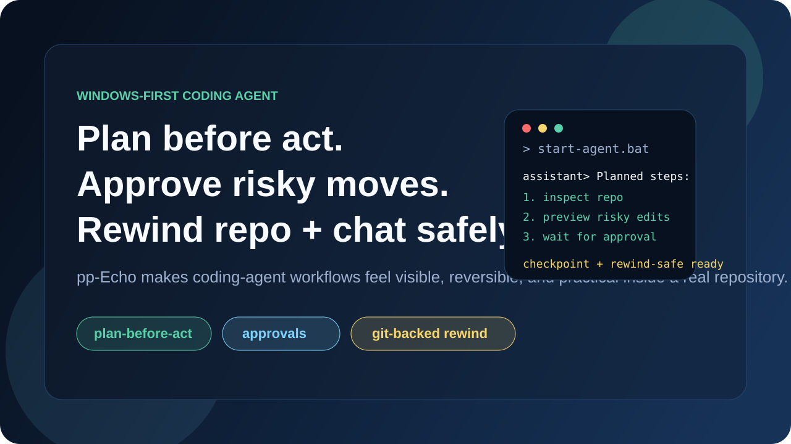
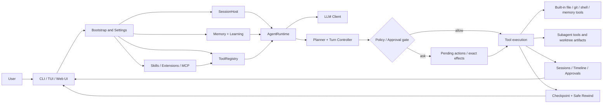
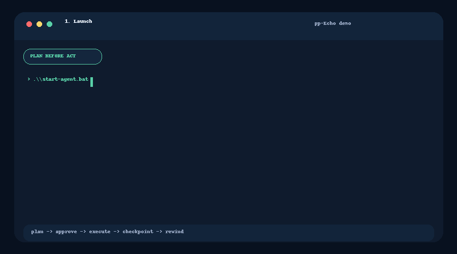
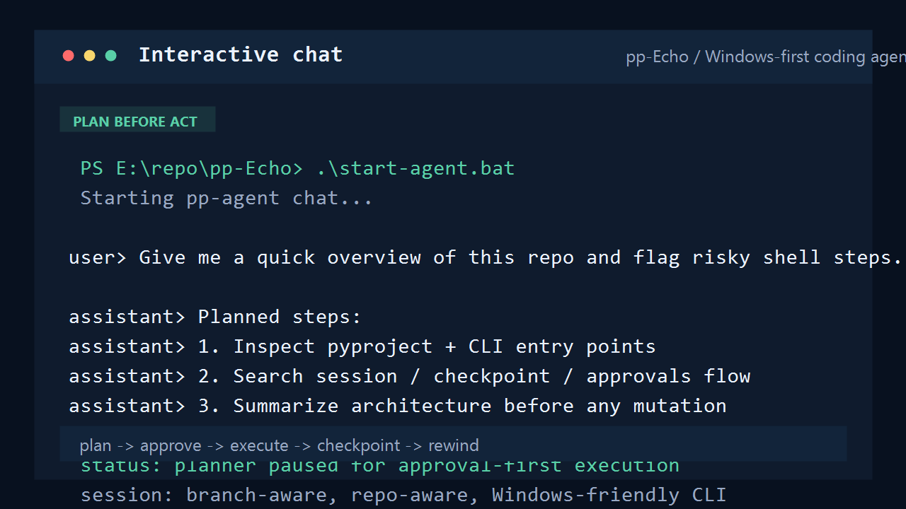
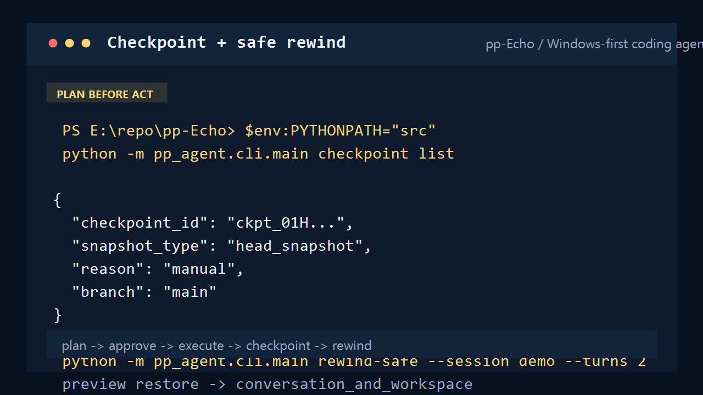
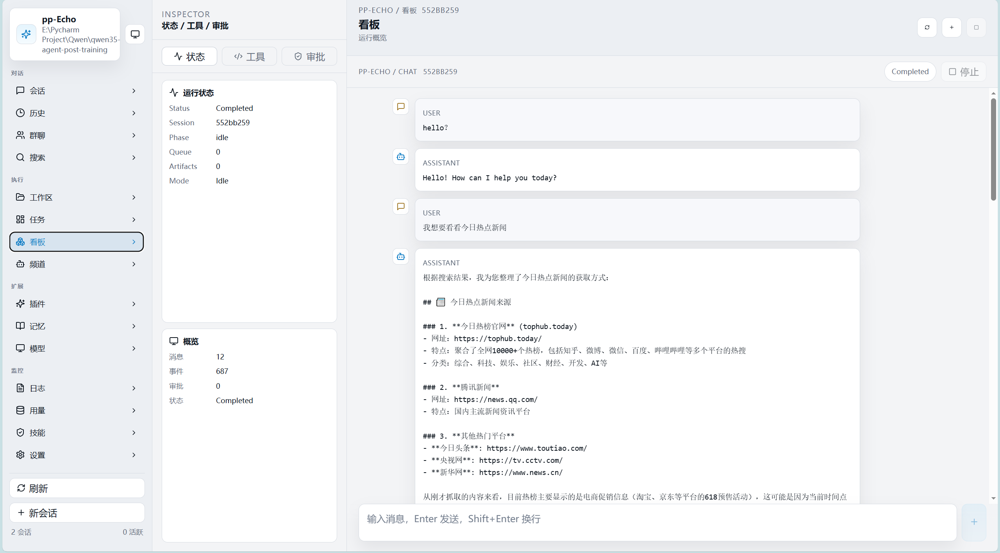

# pp-Echo

<p align="center">
  
</p>

<p align="center">
  <strong>A Windows-first, CLI-first coding agent you can study, run locally, and extend.</strong><br />
  It plans before acting, asks before risky execution, and can rewind both repository state and conversation history.
</p>

<p align="center">
  <a href="#quick-start"></a>
  <a href="#technical-highlights"></a>
  <a href="#architecture-overview"></a>
  <a href="#documentation-guide"></a>
  <a href="https://github.com/CHEN2003-CHIP/pp-Echo/releases"></a>
</p>



<p align="center">
  <code>Plan before act</code> | <code>Approve risky actions</code> | <code>Git-backed rewind</code> | <code>Layered memory</code> | <code>Bounded subagents</code> | <code>CLI + TUI + Web UI</code>
</p>

pp-Echo is a practical local coding agent and a readable reference project for agent engineering. It already includes a real runtime loop, a tool and policy layer, session persistence, checkpoints, safe rewind, memory retrieval, bounded subagent orchestration, and multiple user interfaces. The project is best understood today as `Windows-first`: Windows is the clearest supported path, while Linux and macOS should be treated as future compatibility work rather than current parity.

## Current Status

- `Windows-first` is the accurate description today.
- The runtime, approvals, session tree, checkpoint/rewind flow, file memory, and Web UI are real and actively usable.
- `@subagent` and `orchestrate_agents` are implemented, but the model is still a bounded local orchestration layer rather than a mature autonomous agent team platform.
- The repo is stable enough to study and extend, but it is still evolving and should be described honestly.

## Why pp-Echo

- It is not just a demo chatbot. The runtime, tool registry, approvals, rewind, and persistence paths are implemented in code and covered by tests.
- It is easy to read. Core architecture centers on `AgentRuntime`, `ToolRegistry`, and `SessionHost`, with supporting docs that map those paths directly.
- It is practical. You can run it locally as CLI, TUI, or Web UI, inspect behavior, and reuse design patterns in your own system.
- It is opinionated where that helps trust: visible planning, approval-first execution, and Git-backed recovery instead of silent mutation.

## Technical Highlights

| Area | Current implementation | Key technologies / patterns | Primary code path |
| --- | --- | --- | --- |
| Runtime core | Turn-based runtime with context building, tool execution, lifecycle events, queued messages, compaction, and persistence | Python, Pydantic models, runtime hooks, event emitter | `src/pp_agent/runtime/runtime.py` |
| Session orchestration | Session creation, restore, branch, tree navigation, checkpoint integration, and safe rewind coordination | `SessionHost`, session tree store, Git-backed checkpoint manager | `src/pp_agent/runtime/session_host.py` |
| Tool execution boundary | Unified registration, metadata, policy evaluation, built-in tools, dynamic tools, and subagent tool allowlists | `ToolRegistry`, permission domains, exact-effect staging | `src/pp_agent/tools/registry.py` |
| Safety and approvals | Planner approval, execution-time policy gate, protected paths, exact-effect approvals, and shell effect review metadata | Policy evaluator, pending-action store, effect digest binding | `src/pp_agent/tools/policy.py`, `src/pp_agent/tools/effects.py` |
| File and shell tooling | Read/write/edit, search, Git status/diff, and PowerShell execution with staged approvals for risky actions | Built-in repo/file tools, PowerShell wrapper, pending action preview/apply | `src/pp_agent/tools/file_tools.py`, `src/pp_agent/tools/repo_tools.py`, `src/pp_agent/tools/shell_tool.py` |
| Browser and web tools | Unified `browser` tool with action-based automation, snapshot refs, tab/profile control, conservative browser policy, plus separate static `web.search` / `web.fetch` | CDP controller interface, ref-based UI tree, SSRF/high-risk gates, HTTP fetch/search providers | `src/pp_agent/browser/*`, `src/pp_agent/web_tools/*` |
| Checkpoint and rewind | Snapshot creation, restore preview, workspace restore, conversation rewind, and combined safe rewind | Git stash/snapshot workflow, checkpoint store, rewind orchestrator | `src/pp_agent/runtime/git_checkpoint.py`, `src/pp_agent/runtime/safe_rewind.py` |
| Memory system | Bootstrap memory, file memory retrieval, SQLite history, optional vector recall, reranking, and auto-index scheduling | SQLite, ChromaDB, BM25, retrieval hook, layered Markdown memory | `src/pp_agent/memory/*`, `src/pp_agent/learning/*` |
| Capability expansion | Skills, executable extensions, MCP server integration, resource manifests, and capability discovery catalog | Skills loader, extension runtime, MCP manager, manifest discovery | `src/pp_agent/app/bootstrap.py`, `src/pp_agent/mcp/*`, `src/pp_agent/extensions/*`, `src/pp_agent/skills/*` |
| Subagent orchestration | Explicit `@subagent` handoff, bounded orchestration fan-out, child capability profiles, and patch artifact staging | `spawn_subagent`, `orchestrate_agents`, isolated child sessions/worktrees | `src/pp_agent/tools/subagent_tool.py`, `src/pp_agent/subagents/*` |
| Interfaces | Plain CLI chat, Textual TUI, and Web UI with approvals, session tree, project switching, and runtime status | Typer, Rich, Textual, FastAPI, React, TypeScript, Vite | `src/pp_agent/cli/*`, `src/pp_agent/tui/*`, `src/pp_agent/web/*`, `web/*` |
| Evaluation and diagnostics | Live eval cases, deterministic benchmarks, runtime doctor/report, legacy-hint doctor, and capability inspection | Pytest, CLI eval runner, doctor/report commands | `evals/*`, `tests/benchmarks/*`, `src/pp_agent/cli/commands/*` |
| Configuration and storage | Environment overrides, project config, resource manifests, global state dir, and per-project storage roots | `.pp-agent/config.json`, settings loader, manifest fallback rules | `src/pp_agent/storage/settings.py`, `src/pp_agent/app/resources.py` |

## Architecture Overview



This is the current high-level system shape. The old "CLI -> Runtime -> Tools -> Checkpoint" view is no longer enough because the real runtime now also includes capability discovery, layered memory, exact-effect approvals, Web UI state, and bounded subagent orchestration.

## Evaluation Snapshot

pp-Echo is evaluated as an engineering agent, not only as a prompt demo.

| Evaluation layer | Size | What it proves | Entry |
| --- | ---: | --- | --- |
| Live interview demo | 12 cases | Direct answers, repo awareness, tool use, safety, approvals, and explicit subagent handoff | [docs/evaluation-demo.md](docs/evaluation-demo.md) |
| Main agent eval | 60 cases | Broader evidence across tooling, safety, collaboration, memory, and Chinese technical expression | [docs/evaluation-demo.md](docs/evaluation-demo.md) |
| Deterministic benchmark | 15 tasks | Planner gating, rewind, lazy MCP activation, and compaction without model randomness | [docs/benchmarks/latest.md](docs/benchmarks/latest.md) |
| Stress eval | 10 cases | Longer and higher-risk scenarios including shell approval and subagent delegation | [docs/evaluation-demo.md](docs/evaluation-demo.md) |

Most recent recorded local live demo result in the repo docs:

| Run | Cases | Pass rate | Tool calls | Approval gates | Expected policy blocks |
| --- | ---: | ---: | ---: | ---: | ---: |
| `20260512-234612-6fb26ca4` | 12 | 100% | 14 | 2 | 1 |

## Quick Start

pp-Echo targets Python `3.9+` and is easiest to try on Windows first.

### Fastest Windows path

```powershell
set PP_AGENT_API_KEY=your_api_key
.\start-agent.bat
```

### Web UI on Windows

```powershell
set PP_AGENT_API_KEY=your_api_key
.\start-web.bat
```

This opens `http://127.0.0.1:8765` and supports project switching, runtime status, approvals, checkpoints, and patch-artifact workflows.

### TUI on Windows

```powershell
set PP_AGENT_API_KEY=your_api_key
.\echo-cli.bat
```

### Run from source

```powershell
git clone https://github.com/CHEN2003-CHIP/pp-Echo.git
cd pp-Echo
set PP_AGENT_API_KEY=your_api_key
set PYTHONPATH=src
python -m pp_agent.cli.main chat
```

Useful diagnostics:

```powershell
set PYTHONPATH=src
python -m pp_agent.cli.main workflow doctor --json
python -m pp_agent.cli.main memory search "project conventions" --scope workspace
python -m pp_agent.cli.main config show --workspace .
```

## Demo / Screenshots



| Interactive chat | Checkpoint + rewind |
| --- | --- |
|  |  |



## Documentation Guide

### Runtime and architecture

If you want to understand the real execution path, start with `AgentRuntime`, `ToolRegistry`, and `SessionHost`. These files explain how a prompt becomes a planned turn, how tools are gated and executed, and how session state is restored or rewound. The source map and learning guides are the quickest way to build a correct mental model before reading code in depth.
Docs: [docs/source-map.md](docs/source-map.md), [docs/agent-learning-en.md](docs/agent-learning-en.md), [docs/agent-learning-zh.md](docs/agent-learning-zh.md)

### Safety and approvals

The safety story now spans multiple phases: protected-path gating, exact-effect approvals, shell effect classification, and shared effect analysis for dynamic tools. The README home page now keeps only the overview, while the details live in dedicated docs so the main entry stays readable. This is the best place to understand what is enforced today versus what is still future work.
Docs: [docs/safety.md](docs/safety.md), [docs/effect-analysis.md](docs/effect-analysis.md), [docs/dynamic-tool-declarations.md](docs/dynamic-tool-declarations.md)

### Subagents and orchestration

`@subagent` is real, but intentionally narrow: explicit handoff, bounded child profiles, restricted tool allowlists, and staged edit artifacts for code-change workflows. The current design is meant for supervised repo analysis and constrained implementation fan-out, not open-ended autonomous agent teams. Use the demo and validation docs to see the current boundary clearly.
Docs: [docs/multi_agent_demo.md](docs/multi_agent_demo.md), [docs/subagent-validation.md](docs/subagent-validation.md)

### Memory and learning

The memory stack is layered rather than monolithic. Bootstrap memory lives in `MEMORY.md`, short-lived notes can stay in daily files, and retrievable project knowledge is searched through file-memory tools and optional vector recall. Learning runtime modules extract durable conventions and feed them back into workspace or global memory.
Docs: [MEMORY.md](MEMORY.md), [docs/source-map.md](docs/source-map.md)

### Configuration and capability loading

Project behavior is controlled by environment variables, `.pp-agent/config.json`, resource manifests, and capability discovery rules for skills, extensions, and MCP. The full sample config and manifest notes have moved out of the README so the homepage stays focused, but they are still documented in one place. This is the right entry if you want to customize runtime behavior or ship extensions.
Docs: [docs/configuration.md](docs/configuration.md), [docs/dynamic-tool-declarations.md](docs/dynamic-tool-declarations.md), [docs/mcp-fetch-integration.md](docs/mcp-fetch-integration.md)

### Evaluation and release readiness

The repo includes both behavior evals and deterministic runtime checks. It also includes doctor-style commands for runtime status and for migration readiness around legacy tool declaration hints. If you want to verify current health before a release or a public demo, start here rather than scanning the whole README.
Docs: [docs/evaluation-demo.md](docs/evaluation-demo.md), [docs/benchmarks/latest.md](docs/benchmarks/latest.md), [docs/release-readiness.md](docs/release-readiness.md)

## Core Commands

```powershell
python -m pp_agent.cli.main chat
python -m pp_agent.cli.main run "Audit this repo and summarize risky commands"
python -m pp_agent.cli.main web
python -m pp_agent.cli.main sessions tree
python -m pp_agent.cli.main approvals summary
python -m pp_agent.cli.main checkpoint list
python -m pp_agent.cli.main rewind-safe --session <session_id> --turns 2
python -m pp_agent.cli.main capabilities legacy-hints --json --workspace .
```

## Honest Scope Notes

- Windows is the intended first-class platform today.
- Safe execution is approval-first, but it is not a full shell sandbox.
- Subagents are bounded local workers, not an unconstrained agent-team runtime.
- Dynamic tool declarations are already formalized, but execution still fails closed when semantics are unstable or not stageable.

## Learning Docs

- Chinese learning guide: [docs/agent-learning-zh.md](docs/agent-learning-zh.md)
- English learning guide: [docs/agent-learning-en.md](docs/agent-learning-en.md)
- Source map / module call graph: [docs/source-map.md](docs/source-map.md)

## Releases

- Release notes for the first formal release live in [releases/v0.2.0.md](releases/v0.2.0.md)
- GitHub Releases page: [github.com/CHEN2003-CHIP/pp-Echo/releases](https://github.com/CHEN2003-CHIP/pp-Echo/releases)

## Contributing

Contributions are welcome across runtime behavior, docs polish, demo assets, tests, extensions, and release packaging.

- Read [CONTRIBUTING.md](CONTRIBUTING.md)
- Prefer focused changes that fit the existing architecture
- Keep docs and demo assets in sync when user-facing behavior changes

## License

This project is licensed under the MIT License. See [LICENSE](LICENSE).
