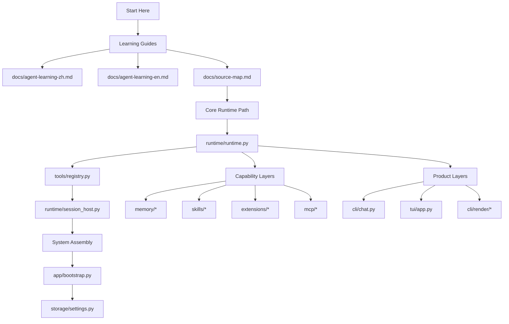
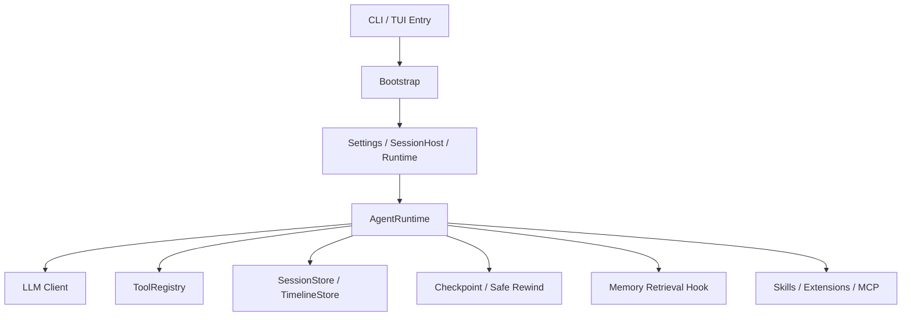

# pp-Echo Learning Guide (English)

This guide should be read with one important framing in mind: `pp-Echo` is currently a Windows-first project. The runtime, approval model, rewind flow, session architecture, layered memory, and bounded orchestration flow are real and worth studying now, but the repo should not be described as a finished cross-platform agent platform or a fully autonomous agent-team framework.

## 0. Read This First

Before going deep into the modules, keep these project truths in mind:

- Windows is the clearest and most supported path today.
- The core runtime and safety architecture are already substantial and studyable.
- Subagent support and orchestration are real, but they are still bounded and approval-first.
- “Agent team” should be treated as a direction, not as a completed subsystem.

## 0A. What Subagent Means Here Today

The repository already contains explicit subagent handoff support plus a bounded orchestration path, but its scope is intentionally narrow.

Current reality:

- users can explicitly request `@subagent`
- runtime routes that request through `spawn_subagent`
- bounded fan-out can run through `orchestrate_agents`
- the built-in child specs include repository research, change review, test investigation, API tracing, memory lookup, implementation planning, and bounded code work
- the child path is still constrained: fork session, restricted tools, constrained execution, structured summary return
- bounded edit orchestration stages an isolated patch artifact first and still requires host approval before the main workspace changes

This is useful and real, but it is not the same thing as a broad autonomous multi-agent planner or a mature agent-team system.

This guide is for developers who are new to agent systems. The goal is not to explain every implementation detail, but to help you quickly build a strong mental model of:

1. how the project starts,
2. how the runtime is organized,
3. where planning, tools, approvals, sessions, memory, and UI live,
4. and how to approach the codebase for learning or extension work.

## 1. What This Project Is

`pp-Echo` is a CLI-first coding agent. Its core value is not just “generate code,” but:

- plan before acting,
- ask for approval before risky work,
- persist sessions and runtime events,
- support Git-backed checkpoints and safe rewind,
- integrate skills, extensions, MCP, and memory retrieval,
- and provide both a classic CLI and a richer TUI.

At a system level, you can think of it as:

`CLI/TUI shell + runtime loop + tool/policy safety layer + session/timeline/checkpoint storage + skills/extensions/MCP capability layer + memory retrieval augmentation`

## 2. Quick Start

From the project root:

```powershell
set PP_AGENT_API_KEY=your_api_key
set PYTHONPATH=src
python -m pp_agent.cli.main chat
```

To start the TUI:

```powershell
python -m pp_agent.cli.main tui
```

Windows helper scripts:

- `start-agent.bat` for text chat mode
- `echo-cli.bat` for quick TUI launch

## 3. Recommended Reading Order

If you are learning the architecture, this order works well:

1. CLI entry
   [src/pp_agent/cli/main.py](/E:/Pycharm%20Project/pp-Echo/src/pp_agent/cli/main.py)
2. bootstrap / assembly
   [src/pp_agent/app/bootstrap.py](/E:/Pycharm%20Project/pp-Echo/src/pp_agent/app/bootstrap.py)
3. runtime core
   [src/pp_agent/runtime/runtime.py](/E:/Pycharm%20Project/pp-Echo/src/pp_agent/runtime/runtime.py)
4. tool registry and safety
   [src/pp_agent/tools/registry.py](/E:/Pycharm%20Project/pp-Echo/src/pp_agent/tools/registry.py)
   [src/pp_agent/tools/policy.py](/E:/Pycharm%20Project/pp-Echo/src/pp_agent/tools/policy.py)
5. session tree / rewind / checkpoint
   [src/pp_agent/runtime/session_host.py](/E:/Pycharm%20Project/pp-Echo/src/pp_agent/runtime/session_host.py)
   [src/pp_agent/runtime/git_checkpoint.py](/E:/Pycharm%20Project/pp-Echo/src/pp_agent/runtime/git_checkpoint.py)
   [src/pp_agent/runtime/safe_rewind.py](/E:/Pycharm%20Project/pp-Echo/src/pp_agent/runtime/safe_rewind.py)
6. settings and storage
   [src/pp_agent/storage/settings.py](/E:/Pycharm%20Project/pp-Echo/src/pp_agent/storage/settings.py)
   [src/pp_agent/storage/sessions.py](/E:/Pycharm%20Project/pp-Echo/src/pp_agent/storage/sessions.py)
   [src/pp_agent/storage/timeline.py](/E:/Pycharm%20Project/pp-Echo/src/pp_agent/storage/timeline.py)
7. memory augmentation
   [src/pp_agent/memory/retrieval_hook.py](/E:/Pycharm%20Project/pp-Echo/src/pp_agent/memory/retrieval_hook.py)
8. UI layers
   [src/pp_agent/cli/chat.py](/E:/Pycharm%20Project/pp-Echo/src/pp_agent/cli/chat.py)
   [src/pp_agent/tui/app.py](/E:/Pycharm%20Project/pp-Echo/src/pp_agent/tui/app.py)

## 4. Learning Path Diagram

If you prefer to see the structure first and then read the code, start with this map:



## 5. Architecture Overview



## 6. Important Modules

### 6.1 CLI Entry Layer

Core file:
[src/pp_agent/cli/main.py](/E:/Pycharm%20Project/pp-Echo/src/pp_agent/cli/main.py)

This file is the public entry surface of the application. It:

- parses CLI commands,
- routes subcommands to the right modules,
- and falls back from `typer` to `argparse` when needed.

It is a great starting point because it tells you what the system exposes:

- `chat`
- `run`
- `tui`
- `sessions`
- `approvals`
- `workflow`
- `config`
- `timeline`
- `checkpoint`
- `capabilities`
- `skills`
- `rewind-safe`

### 6.2 Bootstrap / Assembly Layer

Core file:
[src/pp_agent/app/bootstrap.py](/E:/Pycharm%20Project/pp-Echo/src/pp_agent/app/bootstrap.py)

This is one of the most important modules in the codebase. It wires the system together:

- loads settings,
- creates stores,
- builds the tool registry,
- creates the LLM client,
- creates the runtime,
- installs hooks,
- and wires in skills, extensions, MCP, and memory.

Conceptually, this is the dependency assembly layer.  
It is where the system stops being a set of modules and becomes a working agent.

### 6.3 Runtime Core

Core file:
[src/pp_agent/runtime/runtime.py](/E:/Pycharm%20Project/pp-Echo/src/pp_agent/runtime/runtime.py)

This file defines `AgentRuntime`, the core runtime loop of the agent.

It is responsible for:

- accepting user prompts,
- building context,
- calling the LLM,
- receiving assistant text and tool calls,
- pausing for planner approval when needed,
- running tools,
- handling errors,
- compacting context,
- persisting state,
- and emitting runtime events.

For learning purposes, the key path is:

1. `prompt()` receives user input
2. `_run_loop()` drives the turn
3. context is built
4. the model responds with text and/or tool calls
5. risky plans may pause for approval
6. tools execute through the registry
7. results are persisted and emitted as events

This is the heart of the project.

### 6.4 ToolRegistry

Core file:
[src/pp_agent/tools/registry.py](/E:/Pycharm%20Project/pp-Echo/src/pp_agent/tools/registry.py)

`ToolRegistry` is the unified entry point for tools.

It answers questions like:

- what tools exist,
- what schema they expose,
- whether the model can call them,
- whether they require approval,
- how they are executed,
- and how dynamic extension or MCP tools plug in.

Built-in tool groups include:

- file tools
- search and repo tools
- shell tools
- approval tools
- safe rewind tools

This is a great module to study because it shows that agent tools are not “just functions.”  
They also need:

- structured specs,
- metadata,
- permission domains,
- safety policy,
- effect modeling,
- and approval behavior.

### 6.5 Safety and Approval Layer

Recommended modules:

- [src/pp_agent/tools/policy.py](/E:/Pycharm%20Project/pp-Echo/src/pp_agent/tools/policy.py)
- [src/pp_agent/tools/effects.py](/E:/Pycharm%20Project/pp-Echo/src/pp_agent/tools/effects.py)
- [src/pp_agent/storage/approvals.py](/E:/Pycharm%20Project/pp-Echo/src/pp_agent/storage/approvals.py)

One of the strongest engineering lessons in this repo is the distinction between:

- planner approval,
- execution-time policy,
- and exact-effect approval.

In other words:

- a plan being acceptable does not automatically mean execution is safe,
- and an action being staged does not automatically mean it should be executed.

This is a very important concept in agent engineering.

### 6.6 SessionHost and Session Tree

Core file:
[src/pp_agent/runtime/session_host.py](/E:/Pycharm%20Project/pp-Echo/src/pp_agent/runtime/session_host.py)

This module manages:

- creating sessions,
- restoring sessions,
- switching sessions,
- forking sessions,
- viewing the session tree,
- rewinding sessions,
- and coordinating safe rewind and checkpoints.

This is not a simple “chat history manager.”  
It is closer to version control for conversation state.

That makes it especially useful for coding agents, where you often need to:

- branch an idea,
- revisit an earlier turn,
- recover from a bad change,
- or sync workspace rollback with conversation rollback.

### 6.7 Settings and Persistence

Important files:

- [src/pp_agent/storage/settings.py](/E:/Pycharm%20Project/pp-Echo/src/pp_agent/storage/settings.py)
- [src/pp_agent/storage/sessions.py](/E:/Pycharm%20Project/pp-Echo/src/pp_agent/storage/sessions.py)
- [src/pp_agent/storage/timeline.py](/E:/Pycharm%20Project/pp-Echo/src/pp_agent/storage/timeline.py)
- [src/pp_agent/storage/checkpoints.py](/E:/Pycharm%20Project/pp-Echo/src/pp_agent/storage/checkpoints.py)

This layer answers:

- where configuration comes from,
- where sessions are stored,
- where runtime events go,
- and where checkpoint metadata lives.

`Settings` is especially important because it merges configuration from:

1. defaults,
2. environment variables,
3. `.pp-agent/config.json`,
4. and prompt files like `SYSTEM.md` / `AGENTS.md`.

### 6.8 Git Checkpoints and Safe Rewind

Important files:

- [src/pp_agent/runtime/git_checkpoint.py](/E:/Pycharm%20Project/pp-Echo/src/pp_agent/runtime/git_checkpoint.py)
- [src/pp_agent/runtime/safe_rewind.py](/E:/Pycharm%20Project/pp-Echo/src/pp_agent/runtime/safe_rewind.py)

This is one of the most distinctive parts of the project.

The system does not only persist conversation state. It also connects workspace state and conversation state so they can be rewound safely.

That means:

- checkpoints can be created before risky work,
- rewind can be previewed,
- and users can rewind workspace only, conversation only, or both.

This is a very useful lesson for agent beginners:

real coding agents need reversibility, not just forward execution.

### 6.9 Memory Retrieval

Good starting files:

- [src/pp_agent/memory/retrieval_hook.py](/E:/Pycharm%20Project/pp-Echo/src/pp_agent/memory/retrieval_hook.py)
- [src/pp_agent/memory/retrieval.py](/E:/Pycharm%20Project/pp-Echo/src/pp_agent/memory/retrieval.py)
- [src/pp_agent/memory/index_pipeline.py](/E:/Pycharm%20Project/pp-Echo/src/pp_agent/memory/index_pipeline.py)

The memory subsystem lets the agent retrieve relevant historical context instead of relying only on the current prompt window.

`MemoryRetrievalHook` does roughly this:

- extract the latest user query,
- retrieve relevant historical chunks,
- build a recall snippet,
- insert that snippet back into the current context as a system message.

This is a clean example of retrieval-augmented context injection.

### 6.10 Skills, Extensions, and MCP

Relevant directories:

- `src/pp_agent/skills/*`
- `src/pp_agent/extensions/*`
- `src/pp_agent/mcp/*`

These three all extend the agent, but in different ways:

- Skills
  add knowledge or workflow patterns to the agent context
- Extensions
  add local plugin-like functionality to the system
- MCP
  connects external tool/resource/prompt ecosystems through a protocol layer

For beginners, a useful simplification is:

- Skill = helps the agent work better
- Extension = gives the system more local capabilities
- MCP = connects the system to outside capability providers

### 6.11 LLM Layer

Relevant modules:

- [src/pp_agent/llm/models.py](/E:/Pycharm%20Project/pp-Echo/src/pp_agent/llm/models.py)
- [src/pp_agent/llm/registry.py](/E:/Pycharm%20Project/pp-Echo/src/pp_agent/llm/registry.py)
- `src/pp_agent/llm/provider/*`

This layer handles:

- provider config,
- model config,
- client creation,
- and provider-specific adapters.

One useful design lesson here is that the runtime does not depend directly on one vendor SDK.  
Instead, it depends on a registry and provider abstraction.

### 6.12 UI Layer: CLI and TUI

Text chat:
[src/pp_agent/cli/chat.py](/E:/Pycharm%20Project/pp-Echo/src/pp_agent/cli/chat.py)

TUI:

- [src/pp_agent/tui/main.py](/E:/Pycharm%20Project/pp-Echo/src/pp_agent/tui/main.py)
- [src/pp_agent/tui/app.py](/E:/Pycharm%20Project/pp-Echo/src/pp_agent/tui/app.py)
- [src/pp_agent/tui/reducer.py](/E:/Pycharm%20Project/pp-Echo/src/pp_agent/tui/reducer.py)
- [src/pp_agent/tui/state.py](/E:/Pycharm%20Project/pp-Echo/src/pp_agent/tui/state.py)
- [src/pp_agent/tui/view_model.py](/E:/Pycharm%20Project/pp-Echo/src/pp_agent/tui/view_model.py)

The CLI is:

- simpler,
- closer to raw runtime output,
- and easier to automate.

The TUI is:

- richer in state visualization,
- better for long-running agent interaction,
- and organized around transcript blocks like planning, tool execution, output, diffs, and approvals.

## 7. How a Request Flows Through the System

A useful way to understand the project is to trace one request:

1. the user enters input from CLI or TUI
2. the entrypoint asks bootstrap to create or restore a runtime
3. the runtime receives the message and starts a turn loop
4. context is built, including system prompt, memory snippets, and skill context
5. the LLM returns assistant text and/or tool calls
6. risky plans may pause for approval
7. tools execute through the registry and policy layer
8. runtime emits lifecycle events
9. events are persisted into timeline/session storage
10. CLI or TUI renders those events back to the user

That is the full input-to-behavior-to-persistence loop.

## 8. Eight Key Concepts Worth Learning

### 8.1 AgentRuntime

The main execution loop.  
Think of it as the CPU of the agent.

### 8.2 ToolRegistry

The unified tool gateway.  
Think of it as the agent’s device bus.

### 8.3 SessionStore

Persistent conversation state with branching.  
Think of it as versioned memory.

### 8.4 TimelineStore

Persistent runtime event history.  
This is lower-level than final messages and very useful for debugging.

### 8.5 Approval and Pending Actions

Risky actions are staged before execution.  
This is the basis for inspectable agent behavior.

### 8.6 Checkpoint and Safe Rewind

Both code and conversation can be rolled back.  
This is a foundation for reversible agents.

### 8.7 Memory Retrieval Hook

Relevant history is re-inserted into the current context.  
This is a practical retrieval-augmentation pattern.

### 8.8 Skills / Extensions / MCP

These make the system extensible instead of hard-coded.

## 9. Where to Start for Common Customizations

### 9.1 Add a New Built-in Tool

Start with:
[src/pp_agent/tools/registry.py](/E:/Pycharm%20Project/pp-Echo/src/pp_agent/tools/registry.py)

Typical path:

1. create the tool class
2. define the `ToolSpec`
3. register it in the registry
4. update policy / effect / approval behavior if needed
5. add tests

### 9.2 Change Approval Behavior

Start with:

- `runtime/runtime.py`
- `tools/policy.py`
- `tools/effects.py`
- `storage/approvals.py`

### 9.3 Modify the TUI

Start with:

- [src/pp_agent/tui/app.py](/E:/Pycharm%20Project/pp-Echo/src/pp_agent/tui/app.py)
- [src/pp_agent/tui/reducer.py](/E:/Pycharm%20Project/pp-Echo/src/pp_agent/tui/reducer.py)
- [src/pp_agent/tui/view_model.py](/E:/Pycharm%20Project/pp-Echo/src/pp_agent/tui/view_model.py)

### 9.4 Extend Long-Term Memory

Start with:

- `memory/config.py`
- `memory/retrieval.py`
- `memory/retrieval_hook.py`
- `memory/index_pipeline.py`

### 9.5 Connect External Capabilities

Start with:

- `extensions/*`
- `mcp/*`
- `app/bootstrap.py`

## 10. Suggested Learning Path

### Stage 1: Entry and Main Loop

Read:

- `cli/main.py`
- `app/bootstrap.py`
- `runtime/runtime.py`

Goal:

- explain how user input becomes runtime work
- understand why runtime is the center of the system

### Stage 2: Tools and Safety

Read:

- `tools/registry.py`
- `tools/policy.py`
- `tools/effects.py`

Goal:

- understand why tools cannot just execute directly
- understand how approval and exact-effect safety fit in

### Stage 3: Persistent State

Read:

- `storage/settings.py`
- `storage/sessions.py`
- `runtime/session_host.py`

Goal:

- understand why sessions are not just linear message lists
- understand fork, rewind, and tree navigation

### Stage 4: Augmentation Layers

Read:

- `memory/*`
- `skills/*`
- `extensions/*`
- `mcp/*`

Goal:

- understand how an agent grows from “can answer” into “can remember, extend, and connect”

### Stage 5: Product Layer

Read:

- `cli/chat.py`
- `tui/*`
- `cli/render/*`

Goal:

- understand how runtime events become user-visible interaction

## 11. Reading Tips

### 11.1 Do Not Start With the TUI

The TUI is attractive, but it is not the core logic.  
Understand the runtime first, then come back to the UI.

### 11.2 Do Not Confuse Plan Approval With Execution Approval

This is one of the easiest mistakes for beginners.  
The codebase clearly separates the two.

### 11.3 Do Not Think of Sessions as Plain Chat History

The session model here is a tree, not just a list.

### 11.4 Do Not Think of Memory as Dumping More History Into the Prompt

The design uses retrieval augmentation, not raw history stuffing.

## 11A. Common Misunderstandings

### “This is already a full agent team.”

It is not. The repo has explicit subagent MVP support, but not a mature agent-team orchestration layer.

### “If it runs from source, it is already equally supported on Linux and macOS.”

Not yet. The project is still Windows-first in its external support story.

### “Planner approval and execution approval are basically the same thing.”

They are intentionally different, and the codebase is worth studying partly because it keeps them separate.

## 11B. Current Limitations

- Windows is the main supported path today.
- Some shell and UX assumptions are still Windows-oriented.
- Subagent behavior is intentionally narrow and summary-oriented.
- “Agent team” is still a roadmap direction rather than a completed product layer.
- Some architecture edges are still being tightened as the project evolves.

## 12. Final Takeaway

If you want one sentence to summarize the educational value of this repository, it is this:

`pp-Echo` is not just a chatbot project; it is a full agent engineering example that combines planning, safety, persistence, rewind, extensibility, and interface design.

The most valuable lesson is not any one function. It is the system design behind it:

- how to make agents supervisable,
- how to make agents reversible,
- how to make agents extensible,
- and how to make them maintainable as products.

If you want to go deeper after reading this guide, the best three files to study next are:

- [src/pp_agent/runtime/runtime.py](/E:/Pycharm%20Project/pp-Echo/src/pp_agent/runtime/runtime.py)
- [src/pp_agent/tools/registry.py](/E:/Pycharm%20Project/pp-Echo/src/pp_agent/tools/registry.py)
- [src/pp_agent/runtime/session_host.py](/E:/Pycharm%20Project/pp-Echo/src/pp_agent/runtime/session_host.py)
