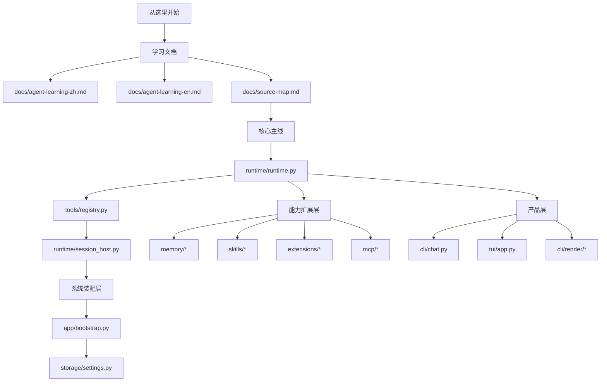
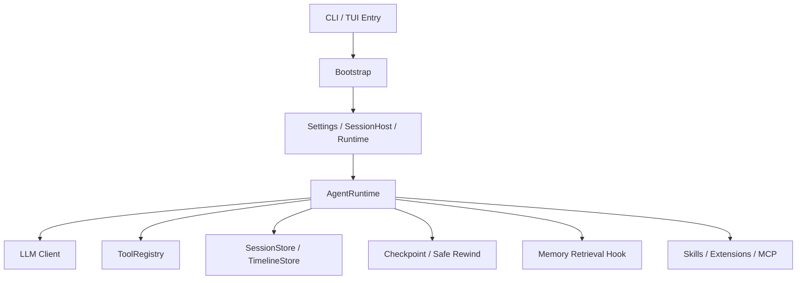

# pp-Echo 学习文档（中文）

这份文档面向刚接触 Agent 系统的开发者，目标不是覆盖所有实现细节，而是帮助你快速建立这几个核心认识：

1. 这个项目是如何从命令行入口启动起来的。
2. 一个“会规划、会调用工具、会审批、会持久化”的 Agent 是怎么组织代码的。
3. 你应该先读哪些模块，再读哪些模块。
4. 如果你想二次开发，应该从哪里切入。

## 1. 项目一句话理解

`pp-Echo` 是一个 CLI-first 的 coding agent。它的特点不是“单纯生成代码”，而是：

- 先规划，再执行。
- 对高风险动作设置审批门。
- 将会话状态、工具调用、时间线、checkpoint 持久化。
- 支持基于 Git 的安全回滚。
- 支持技能、扩展、MCP 和记忆检索。
- 同时提供传统 CLI 和 TUI 两种交互界面。

如果你把它看成一个系统，可以把它理解为：

`CLI/TUI 壳层 + Runtime 主循环 + Tool/Policy 安全层 + Session/Timeline/Checkpoint 存储层 + Skills/Extensions/MCP 能力层 + Memory 检索增强层`

## 2. 快速上手：先怎么跑

### 2.1 基本运行方式

在项目根目录下：

```powershell
set PP_AGENT_API_KEY=your_api_key
set PYTHONPATH=src
python -m pp_agent.cli.main chat
```

如果想启动 TUI：

```powershell
python -m pp_agent.cli.main tui
```

Windows 下一键脚本：

- `start-agent.bat`：默认走 `chat` 文本模式
- `echo-cli.bat`：用于快速启动 TUI

### 2.2 建议的第一轮体验

建议按这个顺序感受项目：

1. 跑 `chat`，体验命令式交互。
2. 跑 `tui`，体验可视化 transcript。
3. 看 `approvals`、`sessions`、`checkpoint` 命令，理解“为什么这个 agent 不是单轮聊天机器人”。

## 3. 建议的阅读顺序

如果你是初学者，推荐按下面顺序读：

1. 入口层
   [src/pp_agent/cli/main.py](/E:/Pycharm%20Project/pp-Echo/src/pp_agent/cli/main.py)
2. 系统装配层
   [src/pp_agent/app/bootstrap.py](/E:/Pycharm%20Project/pp-Echo/src/pp_agent/app/bootstrap.py)
3. Runtime 主循环
   [src/pp_agent/runtime/runtime.py](/E:/Pycharm%20Project/pp-Echo/src/pp_agent/runtime/runtime.py)
4. 工具注册与安全策略
   [src/pp_agent/tools/registry.py](/E:/Pycharm%20Project/pp-Echo/src/pp_agent/tools/registry.py)
   [src/pp_agent/tools/policy.py](/E:/Pycharm%20Project/pp-Echo/src/pp_agent/tools/policy.py)
5. 会话树 / 回滚 / checkpoint
   [src/pp_agent/runtime/session_host.py](/E:/Pycharm%20Project/pp-Echo/src/pp_agent/runtime/session_host.py)
   [src/pp_agent/runtime/git_checkpoint.py](/E:/Pycharm%20Project/pp-Echo/src/pp_agent/runtime/git_checkpoint.py)
   [src/pp_agent/runtime/safe_rewind.py](/E:/Pycharm%20Project/pp-Echo/src/pp_agent/runtime/safe_rewind.py)
6. 配置和持久化
   [src/pp_agent/storage/settings.py](/E:/Pycharm%20Project/pp-Echo/src/pp_agent/storage/settings.py)
   [src/pp_agent/storage/sessions.py](/E:/Pycharm%20Project/pp-Echo/src/pp_agent/storage/sessions.py)
   [src/pp_agent/storage/timeline.py](/E:/Pycharm%20Project/pp-Echo/src/pp_agent/storage/timeline.py)
7. 记忆增强
   [src/pp_agent/memory/retrieval_hook.py](/E:/Pycharm%20Project/pp-Echo/src/pp_agent/memory/retrieval_hook.py)
8. UI 层
   [src/pp_agent/cli/chat.py](/E:/Pycharm%20Project/pp-Echo/src/pp_agent/cli/chat.py)
   [src/pp_agent/tui/app.py](/E:/Pycharm%20Project/pp-Echo/src/pp_agent/tui/app.py)

## 4. 学习路线图

如果你更习惯先看结构，再读源码，可以先看这张路线图：



## 5. 整体架构图



## 6. 核心模块拆解

### 6.1 CLI 入口层

核心文件：
[src/pp_agent/cli/main.py](/E:/Pycharm%20Project/pp-Echo/src/pp_agent/cli/main.py)

它负责做三件事：

- 解析命令行参数。
- 把不同子命令分发给对应模块。
- 在 `typer` 不可用时降级到 `argparse`。

这个文件非常适合初学者，因为你可以快速看清系统“对外暴露了什么能力”：

- `chat`
- `run`
- `tui`
- `sessions`
- `approvals`
- `workflow`
- `config`
- `timeline`
- `checkpoint`
- `capabilities`
- `skills`
- `rewind-safe`

学习重点：

- 这是“产品表面”。
- 你可以先从命令集理解系统边界，再深入内部实现。

### 6.2 Bootstrap 装配层

核心文件：
[src/pp_agent/app/bootstrap.py](/E:/Pycharm%20Project/pp-Echo/src/pp_agent/app/bootstrap.py)

这是整个项目最关键的“组装工厂”之一。它负责：

- 读取配置。
- 创建 SessionStore、TimelineStore、PendingActionStore。
- 创建 ToolRegistry。
- 创建 LLM Client。
- 创建 AgentRuntime。
- 安装 runtime hooks。
- 装配技能、扩展、MCP 和记忆模块。

你可以把这个模块理解为系统依赖注入层。

初学者要重点理解两点：

1. Agent 不是一个单文件类。
   它是很多子系统装配后的结果。
2. 真正的“系统边界”是在这里连起来的。
   CLI、配置、存储、工具、记忆、扩展，都会在这里汇合。

### 6.3 Runtime 主循环

核心文件：
[src/pp_agent/runtime/runtime.py](/E:/Pycharm%20Project/pp-Echo/src/pp_agent/runtime/runtime.py)

这是最值得精读的模块。它定义了 `AgentRuntime`，负责真正的 agent 行为。

它的职责包括：

- 接收用户消息。
- 构建上下文。
- 调用 LLM。
- 解析 assistant 文本和 tool calls。
- 判断是否需要 planner approval。
- 执行工具。
- 处理错误。
- 触发 compaction。
- 持久化状态。
- 广播运行事件。

从学习角度，你可以把一次运行理解成：

1. 用户输入进入 `prompt()`。
2. 进入 `_run_loop()`。
3. 如果有挂起计划，先处理计划恢复。
4. 否则请求模型生成文本或工具调用。
5. 如果工具计划高风险，先进入审批暂停。
6. 如果工具可执行，则进入工具执行和结果回填。
7. 回合结束时触发持久化和事件输出。

这就是一个现代 agent runtime 的基本形态。

### 6.4 ToolRegistry：工具注册与执行入口

核心文件：
[src/pp_agent/tools/registry.py](/E:/Pycharm%20Project/pp-Echo/src/pp_agent/tools/registry.py)

这个模块负责把所有工具统一纳入一个入口。

它解决的问题是：

- 有哪些内置工具？
- 工具的 schema 是什么？
- 工具是否允许模型直接调用？
- 工具是否要审批？
- 工具该怎么执行？
- 动态扩展和 MCP 工具如何接入？

内置工具大致分成：

- 文件类：`read_file`、`write_file`、`edit_file`
- 检索类：`list_files`、`search_text`、`grep_code`
- Git / 仓库类：`git_status`、`git_diff_worktree`
- Shell 类：`run_shell`
- 审批类：`preview_pending_action`、`approve_pending_action`、`reject_pending_action`
- 回滚类：`preview_safe_rewind`、`execute_safe_rewind`

这是学习 Agent 工具系统的关键模块，因为它让你看到：

- 工具不只是一个函数。
- 工具需要 spec、metadata、policy、effect、approval 这些外围结构。

### 6.5 安全策略层

建议结合这些模块一起看：

- [src/pp_agent/tools/policy.py](/E:/Pycharm%20Project/pp-Echo/src/pp_agent/tools/policy.py)
- [src/pp_agent/tools/effects.py](/E:/Pycharm%20Project/pp-Echo/src/pp_agent/tools/effects.py)
- [src/pp_agent/storage/approvals.py](/E:/Pycharm%20Project/pp-Echo/src/pp_agent/storage/approvals.py)

这个项目和很多“直接跑 shell”的 agent 不一样，它非常强调：

- planner approval
- exact-effect approval
- policy gate
- protected path

初学者可以先理解三个层次：

1. Planner 层
   模型先提出计划，必要时暂停审批。
2. Policy 层
   即便计划通过，执行前仍要过政策判断。
3. Host approval 层
   真正高风险动作必须由宿主侧确认。

这代表一个非常重要的 agent 工程观：

“计划安全”和“执行安全”不是一回事。

### 6.6 SessionHost：会话树与版本化对话

核心文件：
[src/pp_agent/runtime/session_host.py](/E:/Pycharm%20Project/pp-Echo/src/pp_agent/runtime/session_host.py)

这不是普通聊天项目里常见的“message list manager”。  
它更像“会话操作系统”。

它支持：

- 创建会话
- 恢复会话
- 切换会话
- fork 会话
- 浏览 session tree
- rewind 会话
- safe rewind
- checkpoint 协同

为什么这很重要？

因为真正的 coding agent 往往不是单线聊天，而是：

- 一个任务做坏了要回退
- 一条思路想分叉
- 某个 turn 想重新走
- 工作区和会话都要一起恢复

这个模块让你看到“会话树”而不是“线性聊天记录”的设计思路。

### 6.7 持久化层

重点文件：

- [src/pp_agent/storage/settings.py](/E:/Pycharm%20Project/pp-Echo/src/pp_agent/storage/settings.py)
- [src/pp_agent/storage/sessions.py](/E:/Pycharm%20Project/pp-Echo/src/pp_agent/storage/sessions.py)
- [src/pp_agent/storage/timeline.py](/E:/Pycharm%20Project/pp-Echo/src/pp_agent/storage/timeline.py)
- [src/pp_agent/storage/checkpoints.py](/E:/Pycharm%20Project/pp-Echo/src/pp_agent/storage/checkpoints.py)

这一层回答的是：

- 配置从哪里来？
- 会话保存在哪里？
- 时间线事件存在哪里？
- checkpoint 元数据存在哪里？

其中 `Settings` 值得特别关注，因为它把配置分成了几类：

- provider / model
- tool_policy
- capabilities
- storage
- memory
- system_prompt

并且支持三层来源：

1. 默认值
2. 环境变量
3. `.pp-agent/config.json`

### 6.8 Git checkpoint 与 safe rewind

重点文件：

- [src/pp_agent/runtime/git_checkpoint.py](/E:/Pycharm%20Project/pp-Echo/src/pp_agent/runtime/git_checkpoint.py)
- [src/pp_agent/runtime/safe_rewind.py](/E:/Pycharm%20Project/pp-Echo/src/pp_agent/runtime/safe_rewind.py)

这是项目很有辨识度的一部分。

它不仅保存对话，还把代码工作区和会话版本关联起来。  
这意味着：

- 你可以在高风险操作前打 checkpoint。
- 你可以预览 rewind 结果。
- 你可以只回滚工作区、只回滚对话，或者两者一起回滚。

这对初学者很有启发：

一个真正可用的 coding agent，必须有“可逆性”设计，而不是只会不断向前改。

### 6.9 Memory：长期记忆与检索增强

建议先看：

- [src/pp_agent/memory/retrieval_hook.py](/E:/Pycharm%20Project/pp-Echo/src/pp_agent/memory/retrieval_hook.py)
- [src/pp_agent/memory/retrieval.py](/E:/Pycharm%20Project/pp-Echo/src/pp_agent/memory/retrieval.py)
- [src/pp_agent/memory/index_pipeline.py](/E:/Pycharm%20Project/pp-Echo/src/pp_agent/memory/index_pipeline.py)

这个子系统让 Agent 不只依赖“当前上下文窗口”，还能从历史里找回相关信息。

`MemoryRetrievalHook` 的核心作用是：

- 读取最新用户问题
- 调用 retriever 检索历史 chunk
- 构建 recall snippet
- 将 recall 结果作为 system message 插回上下文

这是一种很典型的 Agent + RAG 融合方式。

初学者可以重点理解：

- 检索不是替代主上下文，而是增强主上下文。
- 记忆检索最好以 hook 的形式注入 runtime，而不是写死在主循环里。

### 6.10 Skills / Extensions / MCP

重点模块：

- `src/pp_agent/skills/*`
- `src/pp_agent/extensions/*`
- `src/pp_agent/mcp/*`

这三者都在扩展 Agent 能力，但定位不同：

- Skills
  更像“附加知识和工作方法”，偏提示词/上下文增强。
- Extensions
  更像“本地插件机制”，可以扩展命令、资源、工具、生命周期行为。
- MCP
  更像“外部能力协议接入层”，把外部 server 的 tool/resource/prompt 暴露给 agent。

如果你是初学者，可以先把它们想成：

- Skill = 让 agent 更会做事
- Extension = 让系统多新能力
- MCP = 让系统接外部生态

### 6.11 LLM 层

重点模块：

- [src/pp_agent/llm/models.py](/E:/Pycharm%20Project/pp-Echo/src/pp_agent/llm/models.py)
- [src/pp_agent/llm/registry.py](/E:/Pycharm%20Project/pp-Echo/src/pp_agent/llm/registry.py)
- `src/pp_agent/llm/provider/*`

它负责：

- provider 配置
- model 配置
- client 创建
- 对不同 provider 的适配

初学者可以重点看：

- runtime 不直接依赖某个具体厂商 SDK
- 而是通过 registry + provider adapter 做抽象

这是一种很常见、也很实用的 agent 工程模式。

### 6.12 UI 层：CLI 与 TUI

文本聊天入口：
[src/pp_agent/cli/chat.py](/E:/Pycharm%20Project/pp-Echo/src/pp_agent/cli/chat.py)

TUI 入口和实现：

- [src/pp_agent/tui/main.py](/E:/Pycharm%20Project/pp-Echo/src/pp_agent/tui/main.py)
- [src/pp_agent/tui/app.py](/E:/Pycharm%20Project/pp-Echo/src/pp_agent/tui/app.py)
- [src/pp_agent/tui/reducer.py](/E:/Pycharm%20Project/pp-Echo/src/pp_agent/tui/reducer.py)
- [src/pp_agent/tui/state.py](/E:/Pycharm%20Project/pp-Echo/src/pp_agent/tui/state.py)
- [src/pp_agent/tui/view_model.py](/E:/Pycharm%20Project/pp-Echo/src/pp_agent/tui/view_model.py)

CLI 的作用：

- 最稳定
- 最接近原始 runtime 输出
- 便于脚本化和自动化

TUI 的作用：

- 更强的状态可视化
- 把消息、计划、工具、diff、审批组织成 transcript blocks
- 更适合人类长时间盯着 agent 工作过程

如果你是前端或交互背景开发者，TUI 模块很值得读。

## 7. 一次完整请求是怎么流动的

可以用下面这条主线理解：

1. 用户从 CLI/TUI 输入请求
2. 入口命令调用 bootstrap 创建或恢复 runtime
3. runtime 收到用户消息，进入 turn loop
4. runtime 构建上下文，注入系统提示、记忆检索、skills 上下文
5. LLM 返回文本和/或工具调用
6. 如果工具计划高风险，进入审批暂停
7. 如果执行工具，ToolRegistry 先走 policy 判断
8. 工具执行结果返回 runtime
9. runtime 产生 lifecycle events，并写入 timeline / session store
10. CLI/TUI 消费事件并更新界面

这就是一个 agent 请求从“输入”到“系统行为”再到“持久化输出”的完整闭环。

## 8. 初学者最值得掌握的 8 个概念

### 8.1 AgentRuntime

主循环调度器。  
你可以把它看成整个 agent 的“CPU”。

### 8.2 ToolRegistry

工具的总入口。  
你可以把它看成 agent 的“外设总线”。

### 8.3 SessionStore

会话与分支历史的持久化。  
你可以把它看成 agent 的“版本化记忆盘”。

### 8.4 TimelineStore

运行事件日志。  
它比最终消息更底层，更适合观察 agent 行为。

### 8.5 Approval / PendingAction

高风险动作不会立刻执行，而是先 staged。  
这是“可审查的 agent 行为”基础。

### 8.6 Checkpoint / Safe Rewind

让代码和对话都能回滚。  
这是“可逆 agent”的核心。

### 8.7 Memory Retrieval Hook

把历史记忆插回当前上下文。  
这是“上下文增强”的典型做法。

### 8.8 Skills / Extensions / MCP

决定 agent 是不是可扩展，而不是一坨写死逻辑。

## 9. 二次开发建议

### 9.1 想新增一个内置工具

优先看：
[src/pp_agent/tools/registry.py](/E:/Pycharm%20Project/pp-Echo/src/pp_agent/tools/registry.py)

基本路径：

1. 新建工具类
2. 定义 `ToolSpec`
3. 注册到 `ToolRegistry`
4. 补 policy / effect / approval 相关逻辑
5. 补测试

### 9.2 想调整审批逻辑

优先看：

- `runtime.py`
- `tools/policy.py`
- `tools/effects.py`
- `storage/approvals.py`

### 9.3 想改 TUI

优先看：

- [src/pp_agent/tui/app.py](/E:/Pycharm%20Project/pp-Echo/src/pp_agent/tui/app.py)
- [src/pp_agent/tui/reducer.py](/E:/Pycharm%20Project/pp-Echo/src/pp_agent/tui/reducer.py)
- [src/pp_agent/tui/view_model.py](/E:/Pycharm%20Project/pp-Echo/src/pp_agent/tui/view_model.py)

### 9.4 想加入长期记忆能力

优先看：

- `memory/config.py`
- `memory/retrieval.py`
- `memory/retrieval_hook.py`
- `memory/index_pipeline.py`

### 9.5 想接入外部能力

优先看：

- `extensions/*`
- `mcp/*`
- `app/bootstrap.py`

## 10. 推荐的学习路径

如果你完全是 Agent 初学者，我推荐这个路线：

### 第 1 阶段：理解“入口和主循环”

读：

- `cli/main.py`
- `app/bootstrap.py`
- `runtime/runtime.py`

目标：

- 能说清楚用户输入是怎么进入 runtime 的
- 能说清楚为什么 runtime 是项目核心

### 第 2 阶段：理解“工具与安全”

读：

- `tools/registry.py`
- `tools/policy.py`
- `tools/effects.py`

目标：

- 能说清楚 tool call 为什么不能直接乱跑
- 能说清楚审批和 exact-effect 的意义

### 第 3 阶段：理解“状态持久化”

读：

- `storage/settings.py`
- `storage/sessions.py`
- `runtime/session_host.py`

目标：

- 能说清楚为什么 session 不是简单消息列表
- 能说清楚 fork / rewind / tree 的价值

### 第 4 阶段：理解“增强层”

读：

- `memory/*`
- `skills/*`
- `extensions/*`
- `mcp/*`

目标：

- 理解一个 agent 如何从“能回答”进化到“能扩展、能记住、能接生态”

### 第 5 阶段：理解“产品层”

读：

- `cli/chat.py`
- `tui/*`
- `cli/render/*`

目标：

- 理解 runtime 事件如何变成用户可见界面

## 11. 读源码时的几个提醒

### 11.1 不要一上来就盯着 TUI

TUI 很容易吸引注意力，但核心逻辑不在 UI。  
先理解 runtime，再回来看界面，你会轻松很多。

### 11.2 不要把 planner approval 和 tool approval 混为一谈

这是很多初学者最容易混淆的地方。  
项目里明确区分了“计划审批”和“执行审批”。

### 11.3 不要把 Session 当成普通聊天记录

这里的 session 是树，不是线。

### 11.4 不要把 Memory 当成简单历史拼接

这里用的是检索增强，而不是把所有历史直接塞进 prompt。

## 12. 总结

如果只用一句话总结这个项目的学习价值，那就是：

`pp-Echo` 不是一个“聊天机器人项目”，而是一个把规划、安全、持久化、回滚、扩展和界面结合在一起的完整 Agent 工程样本。

对于初学者，最值得学习的不是某一个函数，而是它背后的系统设计：

- 如何把 agent 做成“可监督”的
- 如何把 agent 做成“可回滚”的
- 如何把 agent 做成“可扩展”的
- 如何把 agent 做成“可持续开发”的

如果你读完这份文档后要继续深入，最推荐你下一步精读：

- [src/pp_agent/runtime/runtime.py](/E:/Pycharm%20Project/pp-Echo/src/pp_agent/runtime/runtime.py)
- [src/pp_agent/tools/registry.py](/E:/Pycharm%20Project/pp-Echo/src/pp_agent/tools/registry.py)
- [src/pp_agent/runtime/session_host.py](/E:/Pycharm%20Project/pp-Echo/src/pp_agent/runtime/session_host.py)
