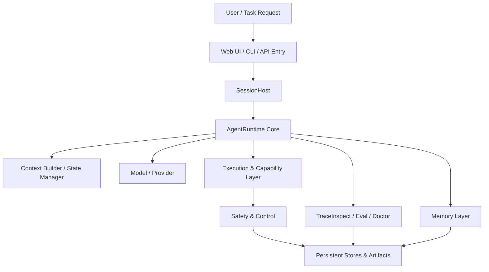

# pp-Echo 总体架构

pp-Echo 是一个教学向本地 Agent Runtime。它的目标不是把某个 LLM API 包一层聊天界面，而是把本地编程 Agent 背后的工程骨架拆开：会话如何进入运行时、上下文如何组装、模型如何规划、工具如何执行、风险动作如何审批、失败后如何回退、记忆如何进入上下文、运行过程如何被 TraceInspect 审计和复盘。

## 0. 这个模块所需掌握的 Agent 知识

理解总体架构前，需要先知道几个 Agent 基础概念：

- **Agent Loop**：Agent 不是只调用一次模型，而是在观察、思考、行动、复盘之间循环。
- **Tool Calling**：模型不直接修改文件或运行命令，而是生成工具调用意图，由系统执行工具。
- **Context Window**：模型每次调用只能看到当前构造出的上下文，包括 system prompt、历史、memory、state 和 tool schema。
- **Human-in-the-loop Approval**：高风险动作不能直接执行，需要人工审批。
- **Checkpoint / Rewind**：本地代码和会话状态需要能回退，避免 Agent 一步改坏工作区。
- **Observability / Trace**：Agent 的每一步需要能被追踪，否则调试只能靠猜。
- **Evaluation**：Agent 工程需要回归测试，证明重构后没有破坏核心能力。

## 1. 这个模块解决什么问题

总体架构文档解决的是“pp-Echo 到底由哪些层组成”这个问题。如果只看 README，读者能知道项目有什么功能；如果直接看源码，又容易迷失在 Runtime、ToolRegistry、Memory、Approval、Trace 等目录中。总体架构文档把这些模块放进同一张系统图中，让读者理解它们的职责边界。

pp-Echo 的核心问题可以概括为：如何让一个本地 Agent 不只是会聊天，而是能在工作区里有控制地做事。为此，它需要：

1. 接收用户请求并建立 session。
2. 构造带 memory、state、tools 的上下文。
3. 调用 Model / Provider 进行推理。
4. 通过 ToolRegistry 路由真实工具。
5. 让 Policy / Approval Gate 控制风险。
6. 通过 Checkpoint / Rewind 保证可恢复。
7. 通过 TraceInspect 让运行过程可审计。
8. 通过 Eval / Doctor / Onboarding 保证稳定和易用。

## 2. 它在 pp-Echo 架构中的位置

总体架构可以分为八层：

| 架构层 | 作用 |
|---|---|
| Interface Layer | Web UI、CLI、API 入口，负责接收用户请求 |
| Session Host | 管理 session 的创建、恢复、路由和运行时实例 |
| Agent Runtime Core | 负责任务主循环、上下文构造、状态推进和模型调用 |
| Memory Layer | 管理 Session History、长期记忆和检索注入 |
| Execution & Capability Layer | ToolRegistry、SKILL、MCP、Browser 和内置工具 |
| Safety & Control Layer | Policy、Approval、Effect Constraints、Checkpoint、Rewind |
| Observability & Developer Support | TraceInspect、Eval、Onboarding、Doctor、Runtime Reports |
| Persistent Stores & Artifacts | Workspace、TraceStore、ApprovalRecords、Artifacts、Checkpoints |

架构可以用下面的 Mermaid 图概括：

## 3. 核心流程

一次典型 pp-Echo 任务会经历下面的过程：

1. 用户通过 Web UI、CLI 或 API 提交任务。
2. SessionHost 找到或创建当前 session，并准备 Runtime。
3. AgentRuntime 把用户输入写入 session state。
4. Context Builder 组装 system prompt、历史消息、memory、state、workspace observation 和 tool schema。
5. Model / Provider 生成 assistant message 或 tool call。
6. 如果模型需要调用工具，Runtime 将 tool call 交给 ToolRegistry。
7. ToolRegistry 根据工具名、schema、metadata 路由到具体工具。
8. Safety & Control 检查是否涉及高风险动作，例如 shell、文件修改、Git 操作。
9. 需要人工确认时，Approval Gate 生成 pending action，等待用户审批。
10. 执行前后通过 Checkpoint / Rewind 保护代码和状态。
11. 工具结果作为 observation 回到下一轮 Turn Loop。
12. TraceInspect 记录 context、llm、tool、approval、memory、checkpoint 等 span。
13. Eval / Doctor / Runtime Reports 用这些记录做回归和诊断。

## 4. 关键数据结构

| 数据结构 | 位置 | 作用 |
|---|---|---|
| `AgentState` | `src/pp_agent/runtime/state.py` | 保存消息、turn 状态、pending tool calls、queued messages 等运行状态 |
| `ChatMessage` / `ToolCall` | `src/pp_agent/domain.py` | 表示对话消息和模型生成的工具调用 |
| `SessionRecord` | `src/pp_agent/storage/sessions.py` | 表示持久化会话记录和会话分支 |
| `ToolExecutionResult` | `src/pp_agent/tools/base.py` | 表示工具执行结果、错误、详情和 artifact |
| `TraceRun` / `TraceSpan` / `TraceEvent` | `src/pp_agent/observability/schema.py` | 表示一次运行、一个步骤和一个轻量事件 |
| `PendingAction` | `src/pp_agent/storage/approvals.py` | 表示待审批动作和审批记录 |

这些数据结构串起了 pp-Echo 的主线：用户输入变成 `ChatMessage`，Runtime 更新 `AgentState`，模型生成 `ToolCall`，工具返回 `ToolExecutionResult`，审批动作进入 `PendingActionStore`，运行过程被记录成 `TraceSpan`。

## 5. 关键源码入口

- `src/pp_agent/runtime/session_host.py`：session 创建、恢复、运行时实例管理。
- `src/pp_agent/runtime/runtime.py`：AgentRuntime 主流程，用户输入、模型调用、工具调用、状态持久化和 trace 入口。
- `src/pp_agent/runtime/turn_loop.py`：Turn Loop 控制逻辑，决定一轮执行的阶段推进。
- `src/pp_agent/tools/registry.py`：工具注册、路由、执行和 ToolRegistry middleware trace。
- `src/pp_agent/tools/policy.py`：风险策略和工具调用前检查。
- `src/pp_agent/tools/effects.py`：效果记录、effect constraints 和 protected path 判断。
- `src/pp_agent/runtime/git_checkpoint.py`：Git-backed checkpoint。
- `src/pp_agent/runtime/safe_rewind.py`：安全回退流程。
- `src/pp_agent/memory/`：Memory provider、检索和上下文注入。
- `src/pp_agent/observability/`：Trace schema、recorder、store、summary 和 diagnosis。
- `src/pp_agent/evaluation/`：Eval case、runner、score 和 report。

## 6. 和其他模块的关系

| 模块 | 关系 |
|---|---|
| SessionHost | Runtime 的上游，负责创建和恢复会话 |
| AgentRuntime | 核心调度者，连接 model、tools、memory、approval、trace |
| Turn Loop | Runtime 的执行节奏，决定 observe / think / act / reflect |
| Memory | 给 Context Builder 提供长期和短期上下文 |
| ToolRegistry | 执行动作的统一出口 |
| Safety & Approval | 对 ToolRegistry 的高风险动作进行拦截和确认 |
| Checkpoint / Rewind | 为工具执行和文件修改提供可恢复性 |
| TraceInspect | 记录 Runtime 每一步，让调试和审计可视化 |
| Eval / Doctor | 验证系统是否稳定、环境是否可运行 |

## 7. TraceInspect 中怎么看它

总体架构中的每一层都会在 TraceInspect 中留下痕迹：

- Interface / Session：通常体现为一次 `TraceRun` 的 `session_id`、`turn_id`、`entrypoint`。
- Runtime Core：体现为 `agent.turn`、`context.build`、`llm.call`、`final.answer` 等 span。
- Memory Layer：体现为 `memory.recall` span。
- Execution Layer：体现为 `tool.call` span，包含 `tool_name`、`tool_call_id`、参数摘要和输出摘要。
- Safety Layer：体现为 `policy.decision`、`approval.decision`、`checkpoint.create`、`checkpoint.execute_rewind` 等 span。
- Observability Layer：通过 TraceInspect 页面、summary、diagnosis 展示。
- Storage Layer：trace 文件、approval records、checkpoint artifacts 会被 TraceInspect 或相关 API 读取。

## 8. 常见问题

**Q1：pp-Echo 是一个 Agent 框架吗？**
它更准确地说是教学向本地 Agent Runtime 工程。它不是大一统框架，而是把本地 Agent 需要的关键机制用可读源码实现出来。

**Q2：为什么架构里同时有 AgentRuntime 和 Turn Loop？**
AgentRuntime 是运行时总控，Turn Loop 是一轮执行的节奏控制。Runtime 负责连接外部模块，Turn Loop 负责控制 observe / think / act / reflect 的推进。

**Q3：为什么工具执行不直接交给模型？**
模型只产生工具调用意图，真实执行必须由 ToolRegistry 和 Safety 层控制。这样才能做 schema 校验、审批、trace、回退和错误处理。

**Q4：TraceInspect 是不是普通日志？**
不是。TraceInspect 记录的是结构化 TraceRun、TraceSpan 和 TraceEvent，可以按 run、span、tool_call_id、payload_digest、checkpoint_id 等维度审计。

**Q5：pp-Echo 是安全沙箱吗？**
不是完整系统级 sandbox。它提供 policy、approval、checkpoint、rewind 和 trace 审计，但仍需要用户理解风险边界。

## 9. 细读源码指导顺序

建议按下面顺序读：

1. `README.md`：先理解项目定位和核心模块导览。
2. `src/pp_agent/runtime/session_host.py`：看 session 如何创建、恢复和驱动 runtime。
3. `src/pp_agent/runtime/runtime.py`：看用户输入如何进入主循环。
4. `src/pp_agent/runtime/turn_loop.py`：看一轮执行如何推进。
5. `src/pp_agent/tools/registry.py`：看工具如何统一执行。
6. `src/pp_agent/tools/policy.py` 与 `src/pp_agent/tools/effects.py`：看安全策略和 effect 记录。
7. `src/pp_agent/observability/`：看 trace 如何记录和展示。
8. `src/pp_agent/evaluation/`：看工程能力如何被回归评测。

读源码时不要一开始陷入 Web UI 细节。先读 Runtime、Tools、Safety、Observability 四条主线，再回头看 Web 页面如何调用这些 API。

## 10. 后续优化方向

### 短期优化

- 在 README 中加入正式架构图和 Architecture Guide 入口。
- 把 TraceInspect、Startup Guide、Usage Center 的截图纳入文档。
- 给核心模块补更多小型示例任务。

### 中期优化

- 将 Eval 和 Trace summary 进一步打通，支持 trace-based regression。
- 给 ToolRegistry、Memory、Approval 建立更系统的模块级测试。
- 强化 Usage Center，对接本地 trace token/cost 聚合和 provider 官方账单入口。

### 长期优化

- 抽象更清晰的 Plugin / Skill Package 协议。
- 引入更强隔离的 sandbox 执行层。
- 支持更多 provider、更多 MCP server 和更多可观测 exporter。
