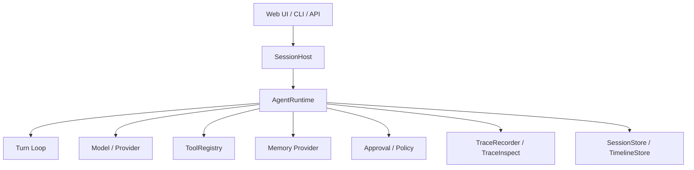

# AgentRuntime / SessionHost：pp-Echo 的运行时核心

AgentRuntime 和 SessionHost 是 pp-Echo 的主干。SessionHost 负责管理“哪个会话要运行”，AgentRuntime 负责“这次运行具体怎么推进”。如果把 pp-Echo 看成一个本地 Agent 操作系统，SessionHost 更像进程管理器，AgentRuntime 更像正在执行的进程内核。

## 0. 这个模块所需掌握的 Agent 知识

理解 Runtime Core 前，需要掌握几个概念：

- **Session**：Agent 不是一次性脚本，而是一个可继续、可分支、可恢复的会话。
- **Runtime State**：运行时需要保存消息、pending tool calls、pending approvals、queued messages 和当前 turn 阶段。
- **Lifecycle Event**：Agent 执行过程中的关键节点会被事件化，例如 CONTEXT_BUILT、PROVIDER_RESPONSE、TOOL_START、TOOL_END。
- **Hook / Middleware**：Runtime 不应该把所有能力写死，而是通过 hooks、lifecycle 和 observability 连接外部模块。
- **Persistence**：Agent 每一步都可能影响会话状态，因此需要及时持久化。

## 1. 这个模块解决什么问题

没有 Runtime Core，Agent 就只是一堆工具和一个模型调用函数。真正的问题是：用户输入来了之后，系统如何把它变成一轮可控、可恢复、可审计的执行？AgentRuntime 解决的是这个编排问题。

它负责：

1. 接收用户 prompt 或 continue 请求。
2. 把用户输入写入 `AgentState`。
3. 启动 Turn Loop。
4. 构造上下文并调用模型。
5. 接收模型返回的 assistant message 或 tool call。
6. 调用 ToolRegistry 执行工具。
7. 处理 pending approval、queued message、compaction、checkpoint、memory 等副流程。
8. 把生命周期事件广播给 Web、Timeline、TraceInspect 和测试系统。
9. 将状态写回 SessionStore。

SessionHost 解决的是另外一个问题：多个会话和多个 runtime 如何组织。它负责恢复 session、创建 runtime、切换 active head、处理分支和会话级动作。

## 2. 它在 pp-Echo 架构中的位置

AgentRuntime 位于架构图的 **Agent Runtime Core** 中，是核心调度器。它上接 SessionHost，下接 Turn Loop、Model Provider、ToolRegistry、Memory、Approval、Checkpoint、TraceInspect。

Runtime Core 是所有关键模块的汇合点。Memory 不直接驱动工具，ToolRegistry 不直接管理会话，TraceInspect 不直接改变运行结果，它们都通过 Runtime 连接起来。

## 3. 核心流程

一次 `prompt()` 的核心流程可以概括为：

1. Runtime 清理取消标记。
2. 将用户文本包装为 `ChatMessage(role="user")`。
3. 追加到 `self.state.messages`。
4. 构造 `_TurnPersistContext`，记录新消息起点、turn_id 和开始时间。
5. 调用 `observability.start_run()`，创建一次 TraceRun。
6. 进入 `_run_loop()`。
7. `_run_loop()` 刷新配置，发出 `AGENT_START`、`TURN_START` 等 lifecycle event。
8. 若没有 pending tool calls，则构造上下文并请求 provider。
9. Provider 返回后，Runtime 根据是否包含 tool calls 决定继续输出、执行工具或等待审批。
10. 工具执行结果被追加为 tool message，成为下一轮 observation。
11. turn 结束后 Runtime 持久化 session，并通过 observability 结束 run。

`continue_()` 流程类似，但它会先检查 pending tool calls、pending planner token 和 queued messages。也就是说 pp-Echo 可以从“等待审批”“等待工具继续”“队列有后续消息”的中间状态恢复，而不是每次从空白开始。

## 4. 关键数据结构

| 数据结构 | 所在文件 | 作用 |
|---|---|---|
| `AgentRuntime` | `src/pp_agent/runtime/runtime.py` | 运行时核心，持有 llm_client、tool_registry、session_store、state、hooks、observability |
| `_TurnPersistContext` | `src/pp_agent/runtime/runtime.py` | 记录本轮新增消息起点、turn_id、turn_started_at，用于持久化和 trace |
| `AgentState` | `src/pp_agent/runtime/state.py` | 保存消息列表、turn 状态、pending tool calls、queued messages、错误状态 |
| `SessionRecord` | `src/pp_agent/storage/sessions.py` | 持久化会话树、active head、branch messages |
| `RuntimeHooks` | `src/pp_agent/runtime/hooks.py` | Runtime 扩展点，包括 context transform、tool call 前后、tool error、lifecycle event |
| `LifecycleEmitter` | `src/pp_agent/runtime/emitter.py` | 广播 lifecycle event，被 Web、Trace、Timeline 等订阅 |
| `AgentEvent` | `src/pp_agent/runtime/state.py` 或相关 domain 文件 | Runtime 对外发出的事件对象 |

## 5. 关键源码入口

- `src/pp_agent/runtime/runtime.py`：最重要的入口，包含 `AgentRuntime.__init__()`、`prompt()`、`continue_()`、`_run_loop()`、approval、queue、persist 和 observability 接入。
- `src/pp_agent/runtime/session_host.py`：会话层入口，负责创建、恢复和调度 runtime。
- `src/pp_agent/runtime/turn_loop.py`：TurnController 相关逻辑，决定 turn 状态和阶段推进。
- `src/pp_agent/runtime/lifecycle.py`：生命周期事件常量，例如 `CONTEXT_BUILT`、`TOOL_START`、`PROVIDER_RESPONSE`。
- `src/pp_agent/runtime/emitter.py`：事件发射与订阅机制。
- `src/pp_agent/storage/sessions.py`：SessionRecord、SessionStore、branch messages。
- `src/pp_agent/storage/timeline.py`：TimelineStore，保存可见运行历史。

## 6. 和其他模块的关系

| 关联模块 | 关系 |
|---|---|
| SessionHost | Runtime 的上游。SessionHost 管理 session，Runtime 执行具体 turn。 |
| Turn Loop | Runtime 调用 TurnController 决定当前阶段和是否继续执行。 |
| Model Provider | Runtime 构造上下文后调用 LLM provider。 |
| ToolRegistry | Runtime 将模型生成的 tool calls 交给 ToolRegistry 执行。 |
| Memory | Runtime 在上下文构造阶段读取 memory provider 结果。 |
| Approval Gate | Runtime 处理 pending plan、pending action 和外部审批结果。 |
| Checkpoint / Rewind | Runtime 触发或响应 checkpoint、restore、safe rewind。 |
| TraceInspect | Runtime 通过 ObservabilityHooks 和 lifecycle event 生成 TraceRun / TraceSpan。 |
| Eval | Eval 通过运行 runtime 或模拟 runtime 事件验证工程能力。 |

## 7. TraceInspect 中怎么看它

AgentRuntime 在 TraceInspect 中主要体现为一次 `TraceRun` 和多个核心 span：

- `agent.turn`：表示一轮运行。
- `context.build`：表示上下文构造。
- `llm.call`：表示调用模型。
- `tool.call`：表示工具执行。
- `final.answer`：表示最终输出。
- `policy.decision` / `approval.decision`：表示安全与审批。
- `checkpoint.create` / `checkpoint.execute_rewind`：表示状态保护和回退。

如果 Runtime 出现异常，TraceInspect 中通常会看到 `status=error` 的 span，并且 `diagnosis` 会指出首个失败步骤。排查 Runtime 问题时，建议先看：Run Summary → Timeline → 第一个 error span → Raw JSON。

## 8. 常见问题

**Q1：SessionHost 和 AgentRuntime 的区别是什么？**
SessionHost 管理“会话和运行时实例”，AgentRuntime 管理“一次会话内部怎么执行”。前者偏外层调度，后者偏执行内核。

**Q2：为什么 Runtime 里要有 lifecycle event？**
因为 Web UI、TraceInspect、Eval、Timeline 都需要观察运行过程。直接让这些模块侵入 Runtime 会很混乱，事件机制让 Runtime 保持统一出口。

**Q3：Runtime 为什么要支持 continue？**
因为本地 Agent 经常会卡在审批、工具挂起、用户 follow-up 或队列消息上。continue 允许从中间状态恢复执行。

**Q4：Runtime 是否直接执行危险动作？**
不应该。Runtime 只调度工具和审批逻辑，真正高风险动作必须经过 ToolRegistry、Policy、Effect 和 Approval Gate。

**Q5：读 Runtime 源码时最容易迷路在哪里？**
容易被配置刷新、compaction、learning、queue、approval 等副流程打断。建议先抓住 prompt → run_loop → provider → tool → persist 这条主线。

## 9. 细读源码指导顺序

建议按下面顺序读：

1. `src/pp_agent/runtime/session_host.py`
   先看 session 如何创建、恢复、绑定 runtime。不要一开始纠结 Web API。

2. `src/pp_agent/runtime/runtime.py` 的 `__init__()`
   看 Runtime 拿到了哪些依赖：LLM、ToolRegistry、SessionStore、MemoryProvider、ObservabilityHooks。

3. `prompt()` 和 `continue_()`
   看用户输入如何进入 state，TraceRun 如何开始。

4. `_run_loop()`
   只抓主线：start turn、构造上下文、调用模型、处理工具、持久化。

5. `_wire_lifecycle()` / lifecycle 相关方法
   看 Runtime 事件如何被 Web、Trace、Timeline 消费。

6. approval、queue、safe rewind 相关方法
   最后再读这些分支流程。

## 10. 后续优化方向

### 短期优化

- 给 Runtime 主流程补更清晰的源码注释和时序图。
- 在 TraceInspect 中增强 Runtime phase 的聚合展示。
- 给 prompt / continue / approval resume 各写一个最小示例。

### 中期优化

- 将 Runtime 副流程拆得更清楚，例如 queue、approval、compaction、learning 各自形成子模块。
- 增加更多 session branch / rewind 的回归测试。
- 将 runtime event schema 进一步稳定化，减少 Web 和 Trace 对 event details 的猜测。

### 长期优化

- 支持更清晰的 multi-runtime / multi-workspace 生命周期管理。
- 将 Runtime hooks 插件化，便于第三方扩展。
- 将 Runtime Trace 与 Eval 完整打通，形成过程级回归测试。
