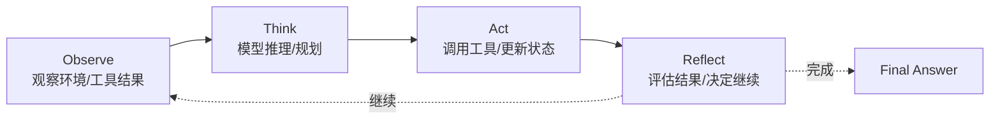

# Turn Loop：Observe → Think → Act → Reflect

Turn Loop 是 Agent 的执行节奏。传统聊天机器人通常是“用户输入 → 模型回复”一次调用；而本地 Agent 需要观察工作区、推理下一步、调用工具、读取工具结果、再继续下一轮。因此 pp-Echo 把执行过程抽象为 Observe → Think → Act → Reflect 的循环。

## 0. 这个模块所需掌握的 Agent 知识

理解 Turn Loop 需要掌握：

- **Observation**：Agent 看到的环境状态，包括用户输入、文件内容、工具输出、错误信息、审批结果。
- **Reasoning / Planning**：模型根据上下文决定下一步做什么。
- **Action**：通过 ToolRegistry 调用工具，执行文件、shell、browser、MCP 等动作。
- **Reflection**：根据工具结果判断任务是否完成、是否需要修正计划、是否需要继续。
- **Stop Condition**：Agent 必须知道什么时候结束，否则会无限循环。

## 1. 这个模块解决什么问题

Turn Loop 解决的是“Agent 如何多步完成任务”的问题。没有 Turn Loop，模型只能一次性给答案，无法先读文件、再分析、再修改、再测试、再根据失败继续修复。

在 pp-Echo 中，Turn Loop 让 Agent 具备以下能力：

1. 从当前 session state 中读取上下文。
2. 判断本轮是新请求、继续执行、等待审批还是处理 pending tool call。
3. 调用模型生成下一步动作。
4. 执行工具，并把工具结果写回 observation。
5. 根据结果继续下一轮或结束。
6. 在每个阶段发出 lifecycle event，供 TraceInspect 和 Web 观察。

## 2. 它在 pp-Echo 架构中的位置

Turn Loop 位于 Agent Runtime Core 内部，由 AgentRuntime 调用。它不直接负责工具实现，也不直接负责 memory 存储，而是负责阶段推进。

Turn Loop 的上游是 AgentRuntime，输入是当前 AgentState 和上下文；下游是 Model Provider 和 ToolRegistry。

## 3. 核心流程

一个典型 Turn Loop 可以拆成：

1. **Turn Start**：Runtime 发出 `TURN_START`，TurnController 更新当前阶段。
2. **Observe**：读取当前 messages、pending tool results、memory recall、workspace observation。
3. **Think**：构造上下文，调用 Model / Provider。
4. **Act**：如果模型生成 tool call，则交给 ToolRegistry 执行。
5. **Reflect**：工具结果写回为 tool message，Runtime 判断是否继续调用模型或结束。
6. **Turn End**：Runtime 发出 `TURN_END`，保存 session 状态，必要时压缩上下文。

如果中途遇到审批，loop 不会继续直接执行，而是进入 pending 状态。用户审批后，通过 `continue_()` 或外部 approval result 恢复。

## 4. 关键数据结构

| 数据结构 | 作用 |
|---|---|
| `TurnController` | 控制 turn 开始、continue 请求和 phase 变化 |
| `TurnDecision` | 表示下一步动作，例如继续当前流程、注入 queued message、等待 pending |
| `AgentState.turn` | 保存当前 turn_id、phase、reason 等运行状态 |
| `ToolCall` | 模型决定执行的动作 |
| `ToolExecutionResult` | 工具执行结果，会作为下一轮 observation |
| `AgentEvent` | 记录 TURN_START、TURN_END、TURN_PHASE_CHANGED、TOOL_START 等事件 |

如果源码中某些数据结构较轻量，也要理解它们在流程中的语义：Turn Loop 本质上是在不断把“状态 + 观察”转成“下一步动作”。

## 5. 关键源码入口

- `src/pp_agent/runtime/turn_loop.py`：TurnController 和 TurnDecision 的核心位置。
- `src/pp_agent/runtime/runtime.py`：`_run_loop()` 是 Turn Loop 的主执行入口。
- `src/pp_agent/runtime/lifecycle.py`：定义 TURN_START、TURN_END、TURN_PHASE_CHANGED、TURN_STATE 等事件。
- `src/pp_agent/runtime/state.py`：AgentState 中的 turn 状态。
- `src/pp_agent/tools/registry.py`：Act 阶段实际调用工具的下游入口。

## 6. 和其他模块的关系

| 关联模块 | 关系 |
|---|---|
| AgentRuntime | Turn Loop 被 Runtime 驱动，Runtime 负责上下游依赖。 |
| Context Builder | Think 阶段前需要构造模型上下文。 |
| Model Provider | Think 阶段调用 LLM 生成回复或工具调用。 |
| ToolRegistry | Act 阶段执行工具调用。 |
| Memory | Observe / Context 阶段提供历史和长期记忆。 |
| Approval Gate | Act 阶段可能被审批中断。 |
| TraceInspect | 通过 turn、llm、tool、approval 等 span 观察 loop。 |
| Eval | 评估 loop 是否正确选择工具、处理安全动作和完成任务。 |

## 7. TraceInspect 中怎么看它

Turn Loop 在 TraceInspect 中不是一个单独的孤立页面，而是由多个 span 共同体现：

- `agent.turn`：本轮 loop 的外层容器。
- `context.build`：Observe / Think 之间的上下文构造。
- `llm.call`：Think 阶段调用模型。
- `tool.call`：Act 阶段执行工具。
- `policy.decision` / `approval.decision`：Act 阶段被安全层拦截。
- `final.answer`：Reflect 后决定结束并输出。

如果 Agent 卡住，应先看 Timeline 中最后一个 span：如果停在 approval，说明等待人工确认；如果停在 tool error，说明 Act 阶段失败；如果 llm.call 多次重复，可能是 loop 停止条件或工具结果反馈不足。

## 8. 常见问题

**Q1：Turn Loop 和 AgentRuntime 是同一个东西吗？**
不是。Runtime 是调度总控，Turn Loop 是执行节奏。Runtime 负责依赖和持久化，Turn Loop 负责阶段推进。

**Q2：为什么要有 Reflect？**
因为工具执行后不一定成功。Reflect 阶段让 Agent 根据结果决定继续、修正、停止或请求用户帮助。

**Q3：pp-Echo 怎么避免无限循环？**
通常通过 turn 控制、pending 状态、工具结果、停止条件、配置限制和 Eval 回归共同约束。后续可以进一步显式化 max turns 和 loop diagnostics。

**Q4：工具错误会让 loop 崩掉吗？**
设计上工具错误应尽量转成 observation，让模型看到失败原因并继续处理；真正不可恢复异常才会让 run error。

**Q5：Turn Loop 和 Eval 有什么关系？**
Eval 不只看最终答案，还可以检查 loop 中是否选择了正确工具、是否触发审批、是否安全终止。

## 9. 细读源码指导顺序

1. `src/pp_agent/runtime/turn_loop.py`
   先看 TurnController 的决策模型，理解 turn phase 和 continue request。

2. `src/pp_agent/runtime/runtime.py` 的 `_run_loop()`
   看 Runtime 如何把 TurnController 的决策落实到模型调用和工具执行。

3. `src/pp_agent/runtime/lifecycle.py`
   对照 `_run_loop()` 看每个阶段会发出什么事件。

4. `src/pp_agent/tools/registry.py`
   看 Act 阶段最终如何进入工具层。

5. `src/pp_agent/observability/summary.py`
   看 trace summary 如何从这些 span 中统计工具次数、错误、latency 和 token。

阅读时建议画一张自己的状态图，把 pending tool calls、pending plan token、queued messages 标出来。

## 10. 后续优化方向

### 短期优化

- 在文档和 TraceInspect 中更明确展示 Observe / Think / Act / Reflect 阶段。
- 为典型循环场景补测试：只读任务、工具失败、审批等待、审批恢复。
- 给 loop 卡住的情况增加 diagnosis。

### 中期优化

- 把 stop condition、max turns、retry policy 做成更显式的配置。
- 在 Eval 中加入 loop 级别指标，例如重复工具调用次数、无效 llm.call 次数。
- 给 Reflect 阶段增加更明确的结果评估结构。

### 长期优化

- 支持更细粒度的 planner / reviewer / executor 分工。
- 将 loop 策略插件化，支持不同 Agent 模式。
- 引入基于 trace 的自动 loop health analysis。
