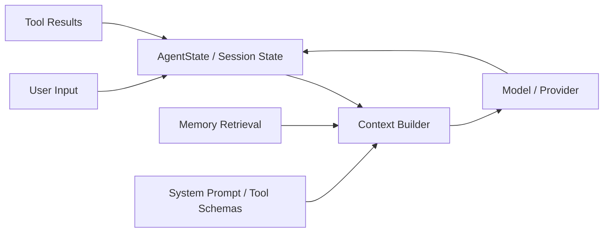

# Context & State：Agent 如何知道自己在做什么

Context 和 State 是 pp-Echo 能持续工作的基础。模型每次调用只看到当前构造出的上下文，而 Agent 真正的运行状态则保存在 Runtime、SessionStore、Memory、PendingAction、Trace 等不同位置。理解这个模块，才能理解为什么 Agent 不是简单把聊天历史拼起来。

## 0. 这个模块所需掌握的 Agent 知识

- **Context Window**：模型每次请求能看到的消息和工具 schema 有长度限制。
- **System Prompt**：定义角色、行为边界、工具使用规则和安全约束。
- **State**：Agent 运行过程中的中间变量，例如 turn_id、pending tool calls、queued messages。
- **Goal / Success Criteria**：任务目标和完成标准，决定 Agent 什么时候停止。
- **Context Injection**：把 memory、workspace observation、tool results 注入 prompt。
- **Compaction**：历史过长时，需要压缩对话上下文。

## 1. 这个模块解决什么问题

本地 Agent 要解决的不是“回复一句话”，而是“在一个持续变化的工作区里完成任务”。它必须知道：用户要什么、现在到哪一步、读过哪些文件、工具返回了什么、有没有待审批动作、任务是否完成。Context & State 模块就是为了解决这些问题。

没有它会出现几个问题：

1. 模型不知道历史上下文，只能重复问用户。
2. 工具执行结果不能进入下一轮推理。
3. 长期记忆不能参与决策。
4. pending approval 或 pending tool call 无法恢复。
5. 上下文无限增长，最终超过模型上下文窗口。
6. TraceInspect 无法解释“这一轮模型到底看到了什么”。

## 2. 它在 pp-Echo 架构中的位置

Context & State 位于 Agent Runtime Core 中，连接 Memory、Model Provider、ToolRegistry 和 SessionStore。

它的上游包括用户输入、session history、memory、tool output、workspace observation；下游是 model provider 和 trace。

## 3. 核心流程

典型流程如下：

1. 用户输入被包装为 `ChatMessage(role="user")`。
2. Runtime 将消息追加到 `AgentState.messages`。
3. Context Builder 读取 system prompt、最近消息、compaction summary、memory recall、tool schema 和 workspace observation。
4. 如果历史过长，ConversationCompactor 可能生成摘要，减少上下文长度。
5. 构造出的 messages 和 tools 被传给 LLM provider。
6. Provider 返回 assistant message 或 tool calls。
7. 如果有 tool result，它会以 tool message 形式进入 `AgentState.messages`。
8. Runtime 持久化 state 到 SessionStore。
9. TraceInspect 记录 `context.build` span，展示 message_count、tool_count、memory_count、估算 tokens 等信息。

异常分支包括：上下文过大、memory 召回为空、工具 schema 太多、compaction 失败。这些都应该在 TraceInspect 或 Runtime event 中能看到。

## 4. 关键数据结构

| 数据结构 | 所在文件 | 作用 |
|---|---|---|
| `AgentState` | `src/pp_agent/runtime/state.py` | Runtime 当前状态，包含 messages、turn、pending tool calls、queued messages、error_message 等 |
| `ChatMessage` | `src/pp_agent/domain.py` | 用户、assistant、tool 消息的统一结构 |
| `ToolCall` / `ToolCallPart` | `src/pp_agent/domain.py` | 模型生成的工具调用结构 |
| `ConversationCompactor` | `src/pp_agent/runtime/compaction.py` | 对长对话进行压缩，保留近期消息 |
| `ContextHookEntry` | `src/pp_agent/runtime/hooks.py` | 上下文构造阶段的扩展点 |
| `SessionRecord` | `src/pp_agent/storage/sessions.py` | 持久化 session tree 和 branch messages |
| `TraceSpan(context.build)` | `src/pp_agent/observability/schema.py` | 记录上下文构造过程和统计信息 |

## 5. 关键源码入口

- `src/pp_agent/runtime/runtime.py`：默认上下文转换、prompt/continue、compaction、provider request 入口。
- `src/pp_agent/runtime/state.py`：AgentState、AgentEvent 等运行状态结构。
- `src/pp_agent/runtime/compaction.py`：对话压缩逻辑。
- `src/pp_agent/runtime/hooks.py`：ContextHookEntry 与 RuntimeHooks。
- `src/pp_agent/storage/sessions.py`：会话分支和消息持久化。
- `src/pp_agent/memory/`：memory 检索和注入来源。
- `src/pp_agent/observability/summary.py`：上下文和 token 统计在 Trace summary 中的聚合。

## 6. 和其他模块的关系

| 关联模块 | 关系 |
|---|---|
| AgentRuntime | Runtime 创建和更新 state，驱动 context build。 |
| Memory | memory recall 的结果会被注入上下文。 |
| ToolRegistry | 工具 schema 会进入模型上下文，工具结果会回写 state。 |
| Model Provider | Provider 消费 context 并返回下一步消息或工具调用。 |
| Approval Gate | pending approval 状态会影响下一轮 context 和执行。 |
| TraceInspect | context.build span 展示上下文构造统计。 |
| Eval | 可检查上下文是否正确包含必要信息。 |

## 7. TraceInspect 中怎么看它

Context & State 主要对应 `context.build` span。建议关注：

- `message_count`：传给模型的消息数量。
- `tool_count`：暴露给模型的工具数量。
- `memory_count` / `injected_count`：是否注入了 memory。
- `estimated_tokens`：上下文是否膨胀。
- `session_id` / `turn_id`：对应哪一轮。
- `warnings`：是否出现压缩、跳过、召回为空等问题。

如果某一轮模型行为异常，首先看它当时是否拿到了正确上下文。TraceInspect 能帮助定位“模型没做对”到底是模型问题、上下文缺失，还是 memory 召回污染。

## 8. 常见问题

**Q1：Context 和 State 有什么区别？**
State 是系统内部保存的完整运行状态；Context 是从 state、memory、工具 schema 等材料中选取出来、实际发送给模型的一次请求上下文。

**Q2：为什么不能把全部历史都发给模型？**
上下文窗口有限，全部历史会导致 token 成本高、延迟高，也可能让模型被无关信息干扰。

**Q3：Tool schema 为什么属于上下文？**
模型只有看到工具名称、参数和说明，才能生成合法 tool call。因此 tool schema 是模型上下文的一部分。

**Q4：Memory 注入越多越好吗？**
不是。过多或低相关 memory 会污染上下文。需要 retrieval、ranking 和 injection 阈值。

**Q5：如何判断上下文构造有问题？**
看 TraceInspect 的 `context.build`、`memory.recall` 和 `llm.call`。如果 memory 为空、tool_count 异常、estimated_tokens 很大，就可能是问题源。

## 9. 细读源码指导顺序

1. `src/pp_agent/runtime/state.py`
   先看 AgentState 到底保存哪些字段。

2. `src/pp_agent/domain.py`
   看 ChatMessage、ToolCall、TextPart、ToolCallPart 的表达方式。

3. `src/pp_agent/runtime/runtime.py`
   看 `_default_transform_context`、provider request 前的消息构造和 compaction 调用。

4. `src/pp_agent/runtime/hooks.py`
   看 context transform 如何被扩展。

5. `src/pp_agent/memory/`
   看 memory recall 如何变成 context material。

6. `src/pp_agent/observability/`
   看 context.build 如何被 trace 记录。

## 10. 后续优化方向

### 短期优化

- 在 TraceInspect 中更清楚展示 Context Breakdown：system、history、memory、tools、workspace。
- 给 context.build 增加更稳定的 token 估算字段。
- 增加 memory 注入过多的 diagnosis。

### 中期优化

- 将 Context Builder 从 Runtime 中进一步模块化。
- 支持 context budget 分配，例如 memory/token/tool schema 各自预算。
- 为不同任务类型提供上下文模板。

### 长期优化

- 引入更智能的上下文压缩和重排序。
- 支持多模型上下文策略，例如 planner model 和 executor model 看到不同上下文。
- 建立 context-quality eval，评估上下文是否包含必要信息且不含干扰。
