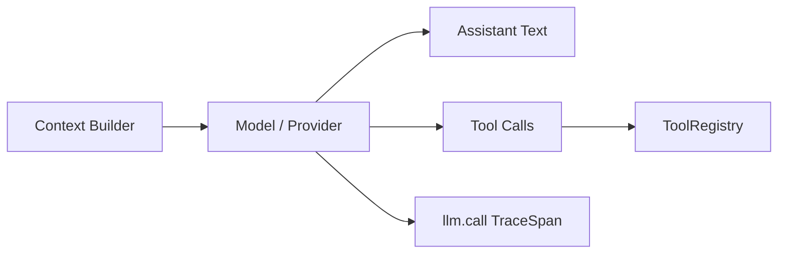

# Model / Provider / Usage：Agent 的推理引擎

Model / Provider 是 pp-Echo 的“脑子”。它负责把上下文转成下一步回复或工具调用。pp-Echo 并不把 Agent 能力直接等同于模型能力，而是把模型放进 Runtime、ToolRegistry、Memory、Approval 和 TraceInspect 的工程体系中，让模型负责推理，系统负责执行和控制。

## 0. 这个模块所需掌握的 Agent 知识

- **LLM Provider**：模型服务提供者，例如 OpenAI-compatible、阿里百炼等。
- **Chat Completion**：一次模型对话请求，输入 messages 和 tools，输出 assistant message 或 tool call。
- **Tool Call**：模型声明想调用哪个工具以及参数。
- **Usage**：模型调用的 input tokens、output tokens、total tokens、latency、retry、cost。
- **Streaming**：模型可能以 delta 形式返回，需要聚合成完整消息。
- **Provider Error**：网络、鉴权、限流、模型错误都需要被 Runtime 观测。

## 1. 这个模块解决什么问题

Model / Provider 模块解决“pp-Echo 如何调用模型并标准化结果”的问题。没有这一层，Runtime 会直接依赖某个厂商 API，后续难以切换模型，也难以统计 token、latency、cost 和 retry。

它的职责包括：

1. 将 pp-Echo 构造的 messages 和 tools 发送给模型。
2. 兼容 OpenAI-compatible 风格 response。
3. 把模型返回解析为 assistant text 或 tool calls。
4. 把 provider usage 标准化为内部 usage 结构。
5. 将 input/output/total tokens、latency、retry 和 cost 写入 trace。
6. 将 provider error 转成可观察的 runtime event 或 trace error。

## 2. 它在 pp-Echo 架构中的位置

Model / Provider 位于 Agent Runtime Core 内部，和 Turn Loop 双向交互：Think 阶段调用模型，模型输出决定 Act 阶段是否调用工具。

它的上游是 Context Builder，下游是 Runtime 的消息处理和 ToolRegistry。

## 3. 核心流程

一次模型调用通常是：

1. Runtime 构造 messages、tool schema 和 provider 参数。
2. 发出 `BEFORE_PROVIDER_REQUEST` lifecycle event。
3. LLMClient 调用 provider。
4. Provider 返回 response 或 streaming deltas。
5. Runtime 聚合文本、tool call 和 usage。
6. 发出 `PROVIDER_RESPONSE` 或 `PROVIDER_ERROR`。
7. Observability 将该事件记录成 `llm.call` span。
8. 如果 response 有 tool call，Runtime 进入 Act 阶段。
9. 如果 response 是最终文本，Runtime 写入 assistant message 并结束或继续。

## 4. 关键数据结构

| 数据结构 | 所在文件 | 作用 |
|---|---|---|
| `LLMClient` | `src/pp_agent/llm/provider/openai_compatible.py` 或 `src/pp_agent/llm/` | 负责与 OpenAI-compatible provider 通信 |
| `LLMUsageStats` | `src/pp_agent/llm/usage.py` | 标准化 token、latency、retry、cost 等 usage 字段 |
| `ModelPricing` | `src/pp_agent/llm/usage.py` | 描述模型输入/输出 token 价格，用于可选 cost 估算 |
| `ChatMessage` | `src/pp_agent/domain.py` | 发送给模型或接收模型返回的消息结构 |
| `ToolCall` | `src/pp_agent/domain.py` | 模型请求工具调用的结构 |
| `TraceSpan(llm.call)` | `src/pp_agent/observability/schema.py` | 记录一次模型调用的 trace span |

## 5. 关键源码入口

- `src/pp_agent/llm/`：模型调用抽象和 provider 目录。
- `src/pp_agent/llm/usage.py`：usage 归一化、cost 估算、token 字段兼容。
- `src/pp_agent/runtime/runtime.py`：provider 调用前后的 lifecycle event 和响应处理。
- `src/pp_agent/runtime/lifecycle.py`：`BEFORE_PROVIDER_REQUEST`、`PROVIDER_RESPONSE`、`PROVIDER_ERROR`。
- `src/pp_agent/observability/summary.py`：聚合 llm span 中的 token、cost、latency、retry。
- `web/src/features/traces/`：前端 TraceInspect 中展示 llm.call 的位置。

## 6. 和其他模块的关系

| 关联模块 | 关系 |
|---|---|
| Context Builder | Provider 消费构造好的 messages 和 tool schema。 |
| Turn Loop | Think 阶段调用 Provider，返回结果决定 Act 或 Final。 |
| ToolRegistry | 模型输出 tool calls 后由 ToolRegistry 执行。 |
| TraceInspect | Provider usage 被记录到 `llm.call` span。 |
| Usage Center | 未来可以基于 llm.call 聚合本地 token/cost。 |
| Eval | deterministic eval 可绕过真实 provider，live eval 可验证真实模型效果。 |

## 7. TraceInspect 中怎么看它

Model / Provider 对应 `llm.call` span。重点看：

- `provider`：使用哪个 provider。
- `model`：具体模型名。
- `input_tokens`、`output_tokens`、`total_tokens`。
- `cost_usd`：如果配置价格或 provider 返回可估算成本。
- `latency_ms`：本地测得调用耗时。
- `provider_latency_ms`：provider 返回的耗时，如果有。
- `retry_count`：本次调用内部重试次数。
- `tool_call_count`：模型是否选择调用工具。
- `finish_reason`：模型结束原因。

如果成本显示 N/A，不代表免费，而是说明缺少价格配置或 provider 没返回可计算信息。

## 8. 常见问题

**Q1：pp-Echo 是否绑定某个模型？**
设计上不应该绑定。它通过 provider 抽象接入模型，当前使用 OpenAI-compatible 风格比较自然，也方便接阿里百炼等平台。

**Q2：为什么要标准化 usage？**
不同 provider usage 字段命名不同。标准化后，TraceInspect 和 summary 不需要关心原始字段差异。

**Q3：cost_usd 为什么可能为空？**
成本估算需要明确价格表或官方 usage。如果价格未知，显示未知比显示 0 更安全。

**Q4：模型生成 tool call 后工具会立即执行吗？**
不一定。Runtime 会先交给 ToolRegistry 和 Safety 层，高风险动作可能进入 approval。

**Q5：Provider 出错时怎么看？**
TraceInspect 中 `llm.call` span 会标记 error，Runtime 也会发出 provider error event。

## 9. 细读源码指导顺序

1. `src/pp_agent/llm/usage.py`
   先看 usage 字段如何统一，理解 token/cost 的来源。

2. `src/pp_agent/llm/`
   看 LLMClient 和 provider 实现，不要一开始纠结具体 HTTP 细节。

3. `src/pp_agent/runtime/runtime.py`
   搜索 `PROVIDER_RESPONSE`、`BEFORE_PROVIDER_REQUEST`、`PROVIDER_ERROR`，看 Runtime 如何接入模型。

4. `src/pp_agent/domain.py`
   看模型返回如何表达为 ChatMessage 和 ToolCall。

5. `src/pp_agent/observability/summary.py`
   看 llm span 如何聚合为总 token、平均 latency 和 retry。

## 10. 后续优化方向

### 短期优化

- 补充 provider-specific usage 字段兼容。
- 在 TraceInspect 中更清楚展示 token/cost/latency。
- 在 README 中说明 cost 是本地估算，不等于官方账单。

### 中期优化

- 增加 Usage Center，按日期、session、model 聚合本地 usage。
- 支持用户配置模型价格。
- 支持阿里百炼官方控制台入口和可选账单同步。

### 长期优化

- 支持多 provider 路由和 fallback。
- 支持 planner/executor/reviewer 多模型分工。
- 支持 provider health monitoring 和自动降级策略。
