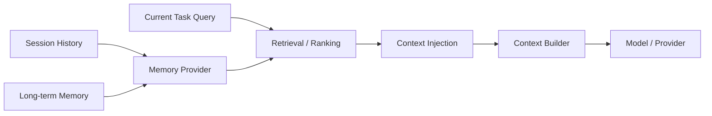

# Memory：Session 历史、长期记忆与检索注入

Memory 让 pp-Echo 不只活在当前一轮对话里。它负责保存和召回会话历史、项目知识、偏好、调试经验和长期上下文，并在合适时机注入给模型。Memory 的目标不是无限塞上下文，而是让 Agent 在需要时记起真正相关的信息。

## 0. 这个模块所需掌握的 Agent 知识

- **Short-term Memory**：当前 session 的近期消息和工具结果。
- **Long-term Memory**：跨 session 或跨任务保留的项目知识、偏好、决策和 debug 经验。
- **Retrieval**：根据当前任务从 memory 中搜索相关内容。
- **Injection**：把检索结果注入当前模型上下文。
- **Memory Pollution**：错误、过期或低相关 memory 干扰模型判断。
- **Ranking / Top-k**：召回结果需要排序和筛选。

## 1. 这个模块解决什么问题

没有 Memory，Agent 每次运行都只能依赖当前输入和短期聊天记录。对于本地项目 Agent，这会带来几个问题：

1. 记不住项目约定、目录结构和历史决策。
2. 不能复用上次 debug 经验。
3. 会反复读取同样文件，效率低。
4. 多轮任务中容易丢失长期目标。
5. 无法根据用户偏好调整行为。

pp-Echo 的 Memory 模块解决的是“如何把长期经验和当前任务连接起来”。它通常包括 session history、长期文档、检索索引和上下文注入逻辑。

## 2. 它在 pp-Echo 架构中的位置

Memory 位于架构图左侧，是 Agent Runtime Core 的外部知识层。它不直接执行工具，而是在 Context Builder 阶段向 Runtime 提供材料。

Memory 的输出最终进入模型上下文，因此它和 Context & State 的关系非常紧密。

## 3. 核心流程

典型 memory 流程：

1. Runtime 准备构造上下文。
2. 根据当前用户输入、session 状态或任务摘要生成 retrieval query。
3. MemoryProvider 搜索 session history、workspace memory、长期 memory 或索引。
4. 检索结果经过 ranking、去重、截断和过滤。
5. 选中的 memory items 被注入 context。
6. Runtime 记录 `memory.recall` 或 `context.build` trace。
7. 模型看到 memory 后参与推理。
8. 任务结束后，learning/runtime 可能抽取新的候选记忆。

失败分支包括：没有召回结果、召回低相关、memory 文件损坏、索引过期、注入 token 过多。

## 4. 关键数据结构

| 数据结构 | 作用 |
|---|---|
| `MemoryProvider` | Memory 检索抽象，Runtime 通过它获取可注入内容 |
| `NoopMemoryProvider` | 默认空实现，保证未配置 memory 时 Runtime 仍可运行 |
| memory hit / retrieval item | 表示一次召回结果，通常包含 path、score、snippet、source scope |
| `AutoIndexScheduler` | 自动索引调度，避免每次都同步重建索引 |
| learning candidates | 从对话或工具结果中提取的长期记忆候选 |
| `TraceSpan(memory.recall)` | 记录 query、returned_count、hits、injected_tokens 等 |

具体类名需要以 `src/pp_agent/memory/` 和 `src/pp_agent/learning/` 中真实实现为准。

## 5. 关键源码入口

- `src/pp_agent/memory/`：MemoryProvider、检索、索引、召回和注入逻辑。
- `src/pp_agent/memory/provider.py`：MemoryProvider / NoopMemoryProvider 等抽象入口。
- `src/pp_agent/memory/auto_index.py`：自动索引调度相关逻辑。
- `src/pp_agent/learning/`：从运行过程抽取长期记忆候选。
- `src/pp_agent/runtime/runtime.py`：Runtime 如何接入 memory_provider。
- `src/pp_agent/observability/`：memory recall 如何进入 trace。

## 6. 和其他模块的关系

| 关联模块 | 关系 |
|---|---|
| Context Builder | Memory 的召回结果会注入 context。 |
| AgentRuntime | Runtime 持有 memory_provider 并在构造上下文时调用。 |
| Turn Loop | 每轮 Think 前可能触发 memory recall。 |
| Model Provider | 模型消费 memory 注入内容。 |
| TraceInspect | 通过 `memory.recall` 和 `context.build` 查看 memory 使用情况。 |
| Learning | 任务结束后可能生成新的长期记忆候选。 |
| Storage | Memory 文件、索引、session history 需要落盘。 |

## 7. TraceInspect 中怎么看它

Memory 在 TraceInspect 中主要看两类信息：

1. `memory.recall` span：
   - `query_preview`
   - `top_k`
   - `returned_count`
   - `injected_count`
   - `injected_tokens`
   - hits 的 path、score、snippet_preview

2. `context.build` span：
   - memory_count
   - estimated_tokens
   - context 中 memory 占比

如果 Agent 回答引用了过期信息，先看 `memory.recall` 是否召回了旧文件或低分结果。如果模型完全没用历史知识，看是否 memory 返回为空或没有注入。

## 8. 常见问题

**Q1：Memory 和普通聊天历史有什么区别？**
聊天历史只属于当前 session 的短期上下文；Memory 可以跨 session，保存长期项目知识、偏好和经验。

**Q2：Memory 会不会污染模型？**
会。召回低相关或过期记忆会误导模型，所以需要 ranking、过滤、TraceInspect 观察和后续 eval。

**Q3：为什么需要 NoopMemoryProvider？**
因为 memory 是增强能力，不应该成为 Runtime 启动的硬依赖。无 memory 时系统仍应可运行。

**Q4：Memory 是否自动写入？**
取决于 learning runtime 和配置。教学项目中应谨慎处理自动写入，避免把临时错误长期化。

**Q5：怎么看 memory 是否真的生效？**
运行任务后打开 TraceInspect，看是否有 `memory.recall`，以及 hits 是否被注入 context。

## 9. 细读源码指导顺序

1. `src/pp_agent/memory/provider.py`
   先看 MemoryProvider 的接口和 Noop 实现。

2. `src/pp_agent/runtime/runtime.py`
   搜索 `memory_provider`，看 Runtime 什么时候持有和调用 memory。

3. `src/pp_agent/memory/` 其他文件
   看检索、索引和注入实现。

4. `src/pp_agent/learning/`
   看长期记忆候选如何生成。

5. `src/pp_agent/observability/`
   看 memory recall 如何记录成 trace。

6. `tests/` 中 memory 相关测试
   对照测试理解预期行为。

## 10. 后续优化方向

### 短期优化

- 在 TraceInspect 中增强 memory hit 展示，例如 score、source、used_in_context。
- 给 memory recall 空结果和低相关结果增加 diagnosis。
- 文档中补充 memory 文件结构和配置示例。

### 中期优化

- 引入更稳定的 hybrid retrieval 策略。
- 支持 memory freshness、scope 和优先级。
- 将 memory injection budget 化，避免占用过多上下文。

### 长期优化

- 支持可审计的 memory 写入审批。
- 支持项目级、用户级、任务级 memory 的清晰隔离。
- 建立 memory eval，评估召回是否相关、是否污染上下文。
