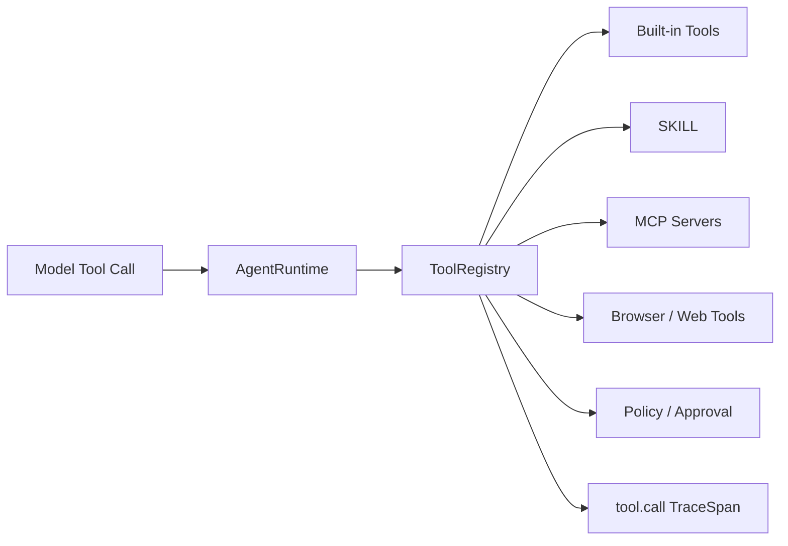

# Tool System：ToolRegistry / SKILL / MCP / Browser

Tool System 是 pp-Echo 从“会说”变成“会做”的关键。模型本身不能直接读文件、跑 shell、改代码、访问网页或调用外部服务，它只能生成工具调用意图。ToolRegistry、SKILL、MCP、Browser 和内置工具共同构成 pp-Echo 的执行能力层。

## 0. 这个模块所需掌握的 Agent 知识

- **Tool Calling**：模型输出工具名和参数，系统执行真实动作。
- **Tool Schema**：告诉模型工具能做什么、参数是什么。
- **Tool Registry**：统一注册、查找、路由和执行工具。
- **MCP**：Model Context Protocol，用于连接外部工具和服务。
- **SKILL**：可复用的高阶流程模板或能力包。
- **Tool Middleware**：工具执行入口处的统一拦截、trace、脱敏、错误处理。

## 1. 这个模块解决什么问题

没有工具系统，Agent 只能生成建议，不能在本地工作区真正执行任务。更糟糕的是，如果每个工具都是散落函数，就无法统一做 schema、审批、trace、错误处理和扩展。

Tool System 解决的是：

1. 工具如何统一注册。
2. 模型如何知道有哪些工具可用。
3. 工具调用参数如何校验和脱敏。
4. 高风险工具如何进入审批。
5. MCP / Browser / SKILL 如何作为能力扩展接入。
6. 所有工具调用如何进入 TraceInspect。

## 2. 它在 pp-Echo 架构中的位置

Tool System 位于 **Execution & Capability Layer**。它由 Runtime 的 Act 阶段调用，并受到 Safety & Control 层治理。

## 3. 核心流程

1. 工具在启动时注册到 ToolRegistry。
2. Runtime 构造上下文时，把工具 schema 暴露给模型。
3. 模型生成 tool call，包括 tool name 和 arguments。
4. Runtime 将 tool call 交给 ToolRegistry。
5. ToolRegistry 查找工具定义和 metadata。
6. ToolRegistry middleware 创建 `tool.call` trace span。
7. 参数经过脱敏和必要校验。
8. Safety / Policy 判断是否需要审批。
9. 工具执行，返回 `ToolExecutionResult`。
10. 结果写入 Runtime state，成为下一轮 observation。
11. TraceInspect 展示工具名、tool_call_id、输入摘要、输出摘要、错误和 changed_paths。

## 4. 关键数据结构

| 数据结构 | 作用 |
|---|---|
| `ToolRegistry` | 统一注册、查找和执行工具 |
| `ToolSpec` / tool schema | 暴露给模型的工具定义和参数结构 |
| `ToolExecutionResult` | 工具执行结果，包含 content、details、is_error 等 |
| tool metadata | 工具来源、类别、是否需要确认、权限域等信息 |
| `tool_call_id` | 关联模型 tool call、ToolRegistry span、approval 和结果 |
| `TraceSpan(tool.call)` | 记录一次工具调用的审计数据 |

## 5. 关键源码入口

- `src/pp_agent/tools/registry.py`：ToolRegistry 核心，工具注册、路由、执行和 middleware trace。
- `src/pp_agent/tools/base.py`：工具基础结构和 ToolExecutionResult。
- `src/pp_agent/tools/file_tools.py`：文件读写相关工具。
- `src/pp_agent/tools/repo_tools.py`：Git / repo 操作工具。
- `src/pp_agent/tools/shell_tool.py`：shell 执行工具。
- `src/pp_agent/tools/subagent_tool.py`：SubAgent 工具入口。
- `src/pp_agent/mcp/`：MCP 工具发现和调用。
- `src/pp_agent/browser/`、`src/pp_agent/web_tools/`：Browser 和 Web 工具。
- `skills/`：SKILL 能力包示例。

## 6. 和其他模块的关系

| 关联模块 | 关系 |
|---|---|
| Model Provider | 模型生成 tool call，但不直接执行。 |
| AgentRuntime | Runtime 将 tool call 分发给 ToolRegistry。 |
| Safety / Policy | 工具调用前后可能被风险策略拦截。 |
| Approval Gate | 高风险工具可能生成 pending action。 |
| Checkpoint / Rewind | 文件或 shell 操作前后可创建 checkpoint。 |
| TraceInspect | `tool.call` span 展示所有工具执行细节。 |
| Eval | 检查工具选择是否正确、是否遵守审批和安全约束。 |

## 7. TraceInspect 中怎么看它

Tool System 对应 `tool.call` span。重点字段：

- `tool_name`
- `tool_call_id`
- `tool_origin` / `tool_family` / `tool_category`
- `source`：例如 `tool_registry_middleware` 或 `runtime_lifecycle_event`
- `arguments`：脱敏后的输入参数
- `content_preview`：输出摘要
- `is_error`
- `changed_paths`
- `approval_token` / `artifact_token`
- `duration_ms`

如果某个工具调用重复出现，summary 会按 `tool_call_id` 去重，并优先选择 ToolRegistry middleware 产生的 span。

## 8. 常见问题

**Q1：ToolRegistry 和普通工具函数有什么区别？**
ToolRegistry 是统一执行边界，负责注册、路由、metadata、trace、错误处理和扩展；普通工具函数只负责具体动作。

**Q2：为什么需要 tool_call_id？**
它用于关联模型生成的工具意图、真实执行、approval、artifact 和 trace，避免审计链断裂。

**Q3：SKILL 和 Tool 有什么区别？**
Tool 通常是一个具体动作；SKILL 更像可复用流程模板或高阶能力包，可以组合多个工具和约束。

**Q4：MCP 是不是和 ToolRegistry 平级？**
不是。MCP 是外部工具来源之一，最终仍应通过 ToolRegistry 或等价执行边界进入系统。

**Q5：工具失败后模型还能继续吗？**
设计上工具失败会变成 observation，让下一轮模型看到失败原因，而不是直接让整个 Agent 崩溃。

## 9. 细读源码指导顺序

1. `src/pp_agent/tools/base.py`
   先看工具结果和基础抽象。

2. `src/pp_agent/tools/registry.py`
   看工具如何注册、查找、执行，特别是 middleware trace。

3. `src/pp_agent/runtime/runtime.py`
   搜索 tool call 处理逻辑，理解 Runtime 如何调用 ToolRegistry。

4. `src/pp_agent/tools/policy.py` 和 `effects.py`
   看工具调用如何进入安全策略和 effect 记录。

5. `src/pp_agent/mcp/`、`browser/`、`web_tools/`
   看外部能力如何接入工具系统。

6. `tests/observability/test_tool_registry_trace.py`
   看 ToolRegistry middleware trace 的预期行为。

## 10. 后续优化方向

### 短期优化

- 补全每类工具的 metadata 字段。
- 在 TraceInspect 中增强 ToolCallsPanel 的筛选和合并展示。
- 给高风险工具增加更多 golden tests。

### 中期优化

- 定义标准 SKILL package 结构，例如 `SKILL.md`、`skill.json`、examples、tests。
- 让 MCP 工具、Browser 工具和内置工具的 trace schema 更一致。
- 支持工具权限 profile，例如 read-only、workspace-write、network-enabled。

### 长期优化

- 建立工具插件市场或本地技能 registry。
- 引入更强 sandbox，隔离 shell 和文件写操作。
- 支持基于 Eval 的工具选择质量评估。
