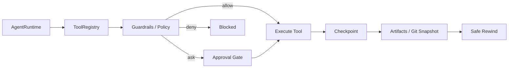

# Safety & Control：Approval / Policy / Checkpoint / Rewind

Safety & Control 是 pp-Echo 的核心差异化之一。本地 Agent 不只是回答问题，它可能读写文件、运行 shell、修改 Git 仓库、调用外部服务。如果没有安全控制，Agent 很容易误删文件、执行危险命令或污染工作区。pp-Echo 的目标不是做完整系统级 sandbox，而是通过 Policy、Approval、Effect Constraints、Checkpoint 和 Rewind 构建可见、可审、可回退的执行链路。

## 0. 这个模块所需掌握的 Agent 知识

- **Risk Classification**：判断工具调用是否安全、是否需要用户确认。
- **Approval Gate**：高风险动作先预览，再人工确认，再执行。
- **Effect Record**：记录即将发生的效果，例如写哪些文件、执行什么命令。
- **Exact-effect Approval**：审批绑定的是具体 effect，而不是泛泛批准“可以执行”。
- **Checkpoint**：执行前创建 Git 快照或状态快照。
- **Rewind**：失败或用户不满意时恢复到之前状态。

## 1. 这个模块解决什么问题

本地 Agent 的风险主要来自“真实执行”。模型输出一段文本风险较低，但工具一旦能写文件、跑 shell、访问网络，就需要安全边界。Safety & Control 解决下面的问题：

1. 哪些工具调用可以直接执行？
2. 哪些动作必须人工审批？
3. 用户批准的是不是原始那个 effect？
4. 执行前有没有 checkpoint？
5. 执行失败后能不能回退？
6. 这些安全决策是否能在 TraceInspect 中被审计？

## 2. 它在 pp-Echo 架构中的位置

Safety & Control 位于 Runtime Core 和 Execution Layer 之间，也连接 Persistent Stores。

这层不是替代 ToolRegistry，而是治理 ToolRegistry 的风险动作。

## 3. 核心流程

一个高风险动作的典型流程：

1. 模型生成 tool call。
2. Runtime 将 tool call 交给 ToolRegistry。
3. ToolRegistry 或工具内部生成 effect 信息。
4. Policy 判断动作风险，返回 allow / ask / deny。
5. 如果 allow，继续执行，并记录 trace。
6. 如果 ask，创建 pending action，进入 Approval Gate。
7. 用户在 Web 或 CLI 中查看 effect preview。
8. 用户 approve 或 reject。
9. approve 时，系统检查 payload_digest 是否匹配。
10. 匹配后执行真实动作。
11. 执行前后创建 checkpoint / artifacts。
12. 如果需要恢复，通过 safe rewind 回到指定快照。

如果 reject，则 Runtime 写入 rejected observation，不应该偷偷继续执行。

## 4. 关键数据结构

| 数据结构 | 作用 |
|---|---|
| Policy decision | allow / ask / deny 的安全判断结果 |
| Effect record | 描述即将发生的真实动作及其 digest |
| payload_digest | exact-effect approval 的核心绑定字段 |
| PendingAction | 等待用户确认的动作记录 |
| Approval record | 审批人、审批结果、时间戳、decision、details |
| Checkpoint record | Git 快照、head id、changed paths、rollback point |
| TraceSpan(policy/approval/checkpoint) | 安全链路的审计记录 |

## 5. 关键源码入口

- `src/pp_agent/tools/policy.py`：风险策略判断。
- `src/pp_agent/tools/effects.py`：effect record、protected path、payload digest 等。
- `src/pp_agent/storage/approvals.py`：pending action 和 approval records。
- `src/pp_agent/runtime/runtime.py`：pending plan、external approval result、approval resume。
- `src/pp_agent/runtime/git_checkpoint.py`：Git-backed checkpoint。
- `src/pp_agent/runtime/safe_rewind.py`：安全回退。
- `docs/safety.md`：安全边界和设计说明。
- `web/src/features/` 中 approvals 相关页面：用户审批入口。

## 6. 和其他模块的关系

| 关联模块 | 关系 |
|---|---|
| ToolRegistry | 高风险工具调用必须经过 Policy / Approval。 |
| AgentRuntime | Runtime 保存 pending 状态并在审批后恢复执行。 |
| Storage | Approval records、checkpoint、artifacts 需要落盘。 |
| TraceInspect | 展示 policy、approval、checkpoint、rewind 过程。 |
| Eval | 验证高风险动作是否被正确拦截和审批。 |
| Web UI | 用户通过 Web 查看和批准 pending actions。 |

## 7. TraceInspect 中怎么看它

安全链路对应多个 span：

- `policy.decision`：看 risk_class、decision、reason。
- `approval.decision`：看 approved/rejected、approval_token、payload_digest。
- `tool.call`：看工具是否 pending approval、是否 is_error。
- `checkpoint.create`：看 checkpoint_id、changed_paths。
- `checkpoint.preview_rewind` / `checkpoint.execute_rewind`：看回退目标和结果。

重点字段包括：

- `payload_digest`
- `risk_class`
- `action_type`
- `source_tool_name`
- `tool_call_id`
- `digest_matched_before_execute`
- `writes_workspace_files`
- `touches_external_paths`
- `requests_network`
- `destructive_hint`

如果 TraceInspect 中出现 digest mismatch，应视为严重审计问题。

## 8. 常见问题

**Q1：pp-Echo 是完整安全沙箱吗？**
不是。它是策略门、审批流、effect 约束、checkpoint 和 trace 审计的组合，不等于系统级 sandbox。

**Q2：为什么审批要绑定 payload_digest？**
因为用户批准的是某个具体 effect。如果审批后命令或文件变化被替换，digest 应不匹配，系统不应执行。

**Q3：Approval 和 Policy 的区别是什么？**
Policy 是系统判断风险；Approval 是用户对需要确认的风险动作做决定。

**Q4：Checkpoint 是否能恢复所有东西？**
主要用于 Git/workspace 和相关状态恢复。外部服务副作用、网络请求、第三方 API 状态不一定能完全回滚。

**Q5：高风险动作被拒绝后 Agent 怎么办？**
拒绝结果应作为 observation 写回，让 Agent 修改计划或向用户说明无法继续。

## 9. 细读源码指导顺序

1. `docs/safety.md`
   先读设计边界，避免误解为完整 sandbox。

2. `src/pp_agent/tools/policy.py`
   看 risk 如何分类，allow/ask/deny 如何产生。

3. `src/pp_agent/tools/effects.py`
   看 effect record、payload_digest 和 protected path。

4. `src/pp_agent/storage/approvals.py`
   看 pending action 和 approval records 如何保存。

5. `src/pp_agent/runtime/runtime.py`
   搜索 approval、pending_plan、external_approval_result，看 Runtime 如何恢复执行。

6. `src/pp_agent/runtime/git_checkpoint.py` 与 `safe_rewind.py`
   看 checkpoint 和 rewind 如何实现。

7. `tests/` 中 approval、safety、checkpoint 相关 case
   用测试理解预期行为。

## 10. 后续优化方向

### 短期优化

- 将 approval stage、decision、execute、digest check 拆成更清晰的 trace span。
- 补充安全链路的 golden tests。
- 在 Web 中突出 digest match / mismatch。

### 中期优化

- 引入更细粒度权限 profile，例如 read-only、workspace-write、network。
- 对 shell command 做更强静态分析。
- 支持审批规则模板和项目级安全策略。

### 长期优化

- 接入真正的 sandbox / container / worktree 隔离执行。
- 支持外部服务副作用的补偿记录。
- 将安全策略和 Eval 打通，形成 safety regression suite。
