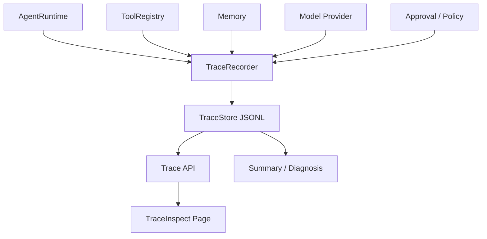

# TraceInspect / Observability：让 Agent 的每一步都可追踪

TraceInspect 是 pp-Echo 最近版本中最重要的工程能力之一。它让 Agent 的运行过程从“黑盒输出”变成“可解释、可审计、可复盘的结构化 Trace”。对于本地 Agent 来说，可观测性不是附加功能，而是稳定性、安全性和调试体验的基础。

## 0. 这个模块所需掌握的 Agent 知识

- **Trace**：一次完整运行的可追踪记录。
- **Span**：运行中的一个有开始和结束的步骤，例如 llm.call、tool.call、memory.recall。
- **Event**：运行中的轻量事件，例如状态变化、审批结果、诊断提示。
- **Context Propagation**：在嵌套调用中维护 run_id、span_id、parent_span_id。
- **Redaction**：对 API key、token、私钥、长输出进行脱敏和裁剪。
- **Diagnosis**：根据 trace 自动判断可能问题。

## 1. 这个模块解决什么问题

Agent 出错时，如果只有最终回答，很难知道问题在哪里。可能是上下文没构造对、memory 召回污染、模型没生成 tool call、工具参数错了、approval 卡住、shell 执行失败，或 checkpoint 没创建。TraceInspect 解决的是“如何定位 Agent 运行过程中的真实问题”。

它提供：

1. 每次运行的 TraceRun。
2. 结构化 TraceSpan：context、llm、tool、approval、memory、checkpoint。
3. 本地 JSONL TraceStore。
4. Web TraceInspect 页面。
5. Summary 聚合：token、cost、latency、tool_count、error_count。
6. Diagnosis：自动指出失败、pending、digest mismatch、memory 空召回等问题。

## 2. 它在 pp-Echo 架构中的位置

TraceInspect 位于 Observability & Developer Support Layer，但它横跨所有模块。

TraceInspect 不改变业务流程，它只观察和记录。

## 3. 核心流程

1. Runtime 在 `prompt()` 或 `continue_()` 时调用 `observability.start_run()`。
2. 每个关键阶段创建 span，例如 `context.build`、`llm.call`、`tool.call`。
3. ToolRegistry middleware 兜底记录所有工具执行。
4. Provider response 中的 token、latency、retry、cost 被写入 `llm.call`。
5. Approval、policy、checkpoint、memory 也生成对应 span。
6. TraceRecorder 对 input/output 做 redaction 和 preview。
7. TraceStore 将记录追加写入 `.pp-agent/traces/` JSONL。
8. Trace API 读取 run detail、summary、spans、events、diagnosis。
9. Web TraceInspect 展示运行列表、timeline、span inspector、tool calls、approval、memory、raw json。

## 4. 关键数据结构

| 数据结构 | 所在文件 | 作用 |
|---|---|---|
| `TraceRun` | `src/pp_agent/observability/schema.py` | 一次完整运行，包含 run_id、session_id、status、duration |
| `TraceSpan` | `src/pp_agent/observability/schema.py` | 一个可审计步骤，包含 span_type、input、output、attributes、error |
| `TraceEvent` | `src/pp_agent/observability/schema.py` | 轻量事件记录 |
| `TraceStore` | `src/pp_agent/observability/store.py` | JSONL 持久化与读取 |
| `TraceRecorder` | `src/pp_agent/observability/recorder.py` | 创建 run/span/event，维护上下文，写入 store |
| `ObservabilityHooks` | `src/pp_agent/observability/hooks.py` | Runtime 和工具层依赖的抽象接口 |
| `NoopObservabilityHooks` | `src/pp_agent/observability/noop.py` | 关闭 trace 时的空实现 |
| `TraceDiagnosis` | `src/pp_agent/observability/diagnosis.py` | 自动诊断结果 |

## 5. 关键源码入口

- `src/pp_agent/observability/schema.py`：Trace 数据结构。
- `src/pp_agent/observability/recorder.py`：TraceRecorder 和 span context manager。
- `src/pp_agent/observability/store.py`：TraceStore JSONL 读写。
- `src/pp_agent/observability/summary.py`：token、cost、tool、error、risk 聚合。
- `src/pp_agent/observability/diagnosis.py`：自动诊断。
- `src/pp_agent/observability/redaction.py`：脱敏和 preview。
- `src/pp_agent/server/routes/traces.py`：Trace API。
- `web/src/features/traces/`：TraceInspect 前端页面。
- `src/pp_agent/runtime/runtime.py`：Runtime event-to-trace。
- `src/pp_agent/tools/registry.py`：ToolRegistry middleware trace。

## 6. 和其他模块的关系

| 关联模块 | 关系 |
|---|---|
| AgentRuntime | 开始和结束 TraceRun，转发 lifecycle event。 |
| Model Provider | `llm.call` 记录 token、latency、retry、cost。 |
| ToolRegistry | `tool.call` 记录工具执行和错误。 |
| Memory | `memory.recall` 记录召回结果。 |
| Approval / Policy | 记录安全决策、审批状态和 digest。 |
| Checkpoint / Rewind | 记录 checkpoint 创建和回退。 |
| Eval | 后续可消费 trace summary 做过程级评测。 |
| Web UI | TraceInspect 页面展示 trace。 |

## 7. TraceInspect 中怎么看它

TraceInspect 页面通常包含：

- Run List：最近运行记录。
- Summary Cards：状态、耗时、LLM 次数、tool 次数、token、cost、error。
- Timeline：按时间排列的 span。
- Span Inspector：查看 input、output、attributes、error。
- Tool Calls Panel：工具调用汇总。
- Approval Panel：审批和 payload_digest。
- Memory Panel：memory recall hits。
- Checkpoint Panel：checkpoint 和 rewind。
- Diagnosis Panel：自动诊断。
- Raw JSON：完整结构化记录。

常见排查路径：先看 Summary 是否 error，再看 Diagnosis，再看 Timeline 第一个 error span，最后看 Raw JSON。

## 8. 常见问题

**Q1：TraceInspect 是日志系统吗？**
不是普通日志。它是结构化 trace，包含 run、span、event、summary、diagnosis，可以做审计和回归分析。

**Q2：Trace 会不会泄露 API key？**
设计上 redaction 会隐藏 api_key、token、authorization、secret、private_key 等字段，并限制大字段长度。但新增模块时仍要谨慎接入。

**Q3：为什么需要 ToolRegistry middleware trace？**
只依赖 lifecycle event 可能漏掉某些工具。middleware 在统一执行入口兜底，保证工具调用可见。

**Q4：cost_usd 能不能当官方账单？**
不能。它是本地估算或 provider usage 统计，官方账单以 provider 控制台为准。

**Q5：Trace 文件会不会越来越大？**
会。因此后续需要保留策略、压缩、归档和清理命令。

## 9. 细读源码指导顺序

1. `src/pp_agent/observability/schema.py`
   先理解 TraceRun、TraceSpan、TraceDetail。

2. `src/pp_agent/observability/recorder.py`
   看 run/span 如何开始和结束。

3. `src/pp_agent/observability/store.py`
   看 JSONL 如何写入和读取。

4. `src/pp_agent/runtime/runtime.py`
   搜索 `_observe_runtime_event`，看 lifecycle event 如何变成 trace。

5. `src/pp_agent/tools/registry.py`
   看 ToolRegistry middleware 如何直接创建 tool span。

6. `src/pp_agent/observability/summary.py` 和 `diagnosis.py`
   看 summary 和自动诊断逻辑。

7. `web/src/features/traces/`
   看前端如何展示 trace。

## 10. 后续优化方向

### 短期优化

- 增强 Approval digest 链路展示。
- 在 TraceInspect 中补充 context breakdown。
- 增加 trace 清理和导出命令。

### 中期优化

- Eval 消费 trace summary，支持过程级回归。
- Usage Center 基于 llm.call 聚合 token/cost。
- 支持 OpenTelemetry / Opik / Langfuse exporter。

### 长期优化

- 支持跨 session trace 搜索。
- 支持失败 trace 一键转 eval case。
- 建立完整的 Agent observability schema 文档和兼容性测试。
