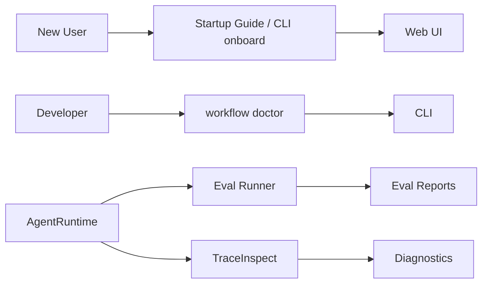

# Developer Support：Eval / Onboarding / Doctor

Eval、Onboarding 和 Doctor 是 pp-Echo 面向开发者体验和工程稳定性的支撑层。一个 Agent 项目如果只能“演示一次成功”，还不能算成熟；它需要让新用户快速跑起来，让开发者知道环境是否健康，让重构者证明改动没有破坏核心能力。

## 0. 这个模块所需掌握的 Agent 知识

- **Agent Eval**：不仅评估最终答案，还评估工具选择、安全约束、审批和状态变化。
- **Deterministic Eval**：不依赖真实模型，适合 CI 和重构回归。
- **Live Eval**：调用真实模型，适合观察真实效果但不稳定。
- **Onboarding**：首次启动引导，帮助用户检查环境和下一步操作。
- **Doctor**：环境和运行时健康检查，面向开发者诊断。
- **Regression**：工程项目每次改动都需要证明没有把旧能力改坏。

## 1. 这个模块解决什么问题

Agent 工程不是只要能跑一个 demo。pp-Echo 需要解决三类开发者问题：

1. **新用户问题**：clone 后不知道该装什么、配什么、先点哪里。
2. **环境问题**：API key、Python、Node、Git、TraceStore、Memory、Eval 资产是否正常。
3. **稳定性问题**：改完 Runtime、ToolRegistry、Trace 后，如何证明 approval、checkpoint、memory、safety 等能力仍然正常。

Eval、Onboarding、Doctor 分别对应这三个问题：Eval 证明能力，Onboarding 降低启动门槛，Doctor 定位环境和配置问题。

## 2. 它在 pp-Echo 架构中的位置

它们位于 Observability & Developer Support Layer，与 Runtime Core、TraceStore、Web UI 和 CLI 都相连。

## 3. 核心流程

### Onboarding 流程

1. 用户打开 Web UI，点击左上角 pp-Echo。
2. Startup Guide 请求 `/api/onboarding/status`。
3. 后端 OnboardingService 检查 Python、Node、npm、API key、workspace、Git、TraceStore、Memory、Eval 等。
4. 前端展示 checklist、命令提示和下一步建议。
5. CLI 用户可以运行 `python -m pp_agent.cli.main onboard`。

### Doctor 流程

1. 用户运行 `workflow doctor --json`。
2. 系统检查配置、pending runtime actions、artifacts、config effects、环境状态。
3. 输出 JSON 或人类可读诊断。

### Eval 流程

1. 选择 suite，例如 `pp_echo_core`。
2. 每个 case 在隔离 workspace 中运行。
3. deterministic 模式用脚本化用户和确定性路径验证工程行为。
4. scorer 根据最终状态、工具轨迹、审批、安全约束等评分。
5. 生成 JSON、Markdown、SVG 或其他报告。

## 4. 关键数据结构

| 数据结构 | 作用 |
|---|---|
| `OnboardingCheck` | 单个启动检查项，包含 status、summary、action_command |
| `OnboardingStatus` | Web Startup Guide 和 CLI onboard 共用的状态快照 |
| `OnboardingService` | 聚合各项环境检查 |
| Eval Case | 描述一个待评测任务、初始环境和成功标准 |
| Eval Report | 汇总成功率、分类结果和失败细节 |
| Runtime Doctor Report | 描述环境、配置和运行时健康状态 |
| Trace Summary | 可作为 Eval 或 Doctor 的诊断依据 |

## 5. 关键源码入口

- `src/pp_agent/onboarding/`：Onboarding schema、checks、service。
- `src/pp_agent/server/routes/onboarding.py`：Web Startup Guide API。
- `web/src/features/onboarding/`：Startup Guide 前端页面。
- `src/pp_agent/cli/`：CLI onboard 和 workflow doctor 入口。
- `src/pp_agent/evaluation/`：Eval 模型、runner、scorer、report。
- `evals/`：评测 suite 和 case 数据。
- `src/pp_agent/observability/summary.py`：后续 Eval 可消费的 trace summary。
- `README.md`：快速开始、onboard、doctor、eval 命令说明。

## 6. 和其他模块的关系

| 关联模块 | 关系 |
|---|---|
| Web UI | Startup Guide 通过 Web 入口帮助新用户启动。 |
| CLI | onboard、workflow doctor、eval 命令面向命令行用户。 |
| AgentRuntime | Eval 运行或模拟 Runtime 行为，Doctor 检查 Runtime 状态。 |
| TraceInspect | Trace summary 和 diagnosis 可以作为调试和评测依据。 |
| ToolRegistry / Approval / Memory | Eval case 覆盖这些核心能力。 |
| Storage | Eval reports、trace store、配置和 artifacts 需要持久化。 |

## 7. TraceInspect 中怎么看它

Eval、Onboarding、Doctor 本身不一定都直接产生业务 trace，但它们和 TraceInspect 有强关联：

- Eval 可以记录或读取 trace，检查过程指标。
- Doctor 可以提示 trace store、pending actions、config effects 等状态。
- Onboarding 会检查 TraceStore 是否可写，并引导用户运行任务后打开 TraceInspect。
- Runtime Reports / Diagnostics 可以从 trace summary 中统计错误、token、latency 和工具行为。

如果一个 eval case 失败，理想路径是：打开对应 run 的 TraceInspect，查看第一个 error span、tool call、approval 和 final answer。

## 8. 常见问题

**Q1：deterministic eval 和 live eval 有什么区别？**
deterministic 不依赖真实 LLM，适合 CI；live 调用真实模型，更接近真实效果但会受模型波动影响。

**Q2：Startup Guide 会自动写 API key 吗？**
不应该。它只检查环境和提示用户命令，不能泄露或保存密钥。

**Q3：workflow doctor 和 onboard 有什么区别？**
onboard 面向新用户首次启动，doctor 面向开发者诊断现有环境和运行状态。

**Q4：Eval 结果是不是模型能力分数？**
不是。pp-Echo 的 deterministic eval 更像工程能力回归基线，不等同于模型智能水平。

**Q5：为什么要把 Eval 和 Trace 结合？**
只看最终结果不够。过程指标能检查是否绕过审批、是否工具错误后假装成功、是否 memory 召回异常。

## 9. 细读源码指导顺序

1. `src/pp_agent/onboarding/schema.py` 和 `checks.py`
   先看启动指引检查项如何表达。

2. `src/pp_agent/onboarding/service.py`
   看 Web 和 CLI 如何共用检查逻辑。

3. `src/pp_agent/server/routes/onboarding.py`
   看 Web Startup Guide API。

4. `web/src/features/onboarding/`
   看前端 checklist 和 action cards。

5. `src/pp_agent/cli/`
   看 onboard 和 doctor 命令如何注册。

6. `src/pp_agent/evaluation/` 和 `evals/`
   看 case、score、report、deterministic suite。

7. `tests/onboarding/` 和 eval 相关测试
   通过测试理解预期行为。

## 10. 后续优化方向

### 短期优化

- 在 README 中加入 Startup Guide 截图。
- 给 onboard 增加更多环境检查解释。
- Eval 失败报告链接到 TraceInspect run。

### 中期优化

- 将 trace summary 接入 Eval scoring。
- 支持一键把失败 trace 转成 eval case。
- 给 Doctor 增加 Usage、TraceStore size、pending action 清理建议。

### 长期优化

- 建立 CI workflow，自动跑 observability、onboarding、eval 和 web build。
- 支持插件自带 eval cases 和 doctor checks。
- 支持可视化 Eval Dashboard。
