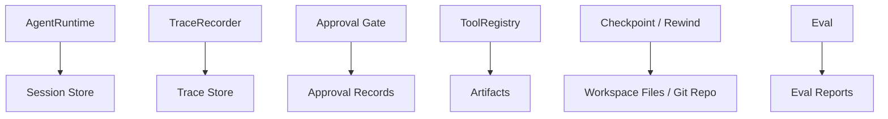

# Storage & Artifacts：TraceStore、ApprovalRecords 与运行产物

pp-Echo 是本地 Agent Runtime，它的很多能力都依赖持久化：session 要能恢复，审批要能审计，trace 要能复盘，checkpoint 要能回退，artifact 要能追踪来源。Storage & Artifacts 模块说明 pp-Echo 中哪些东西会落盘，以及这些持久化数据如何服务可恢复性和可审计性。

## 0. 这个模块所需掌握的 Agent 知识

- **Session Persistence**：会话消息和状态需要跨进程保存。
- **Trace Store**：结构化运行记录需要落盘，支持后续查看。
- **Approval Record**：高风险动作的审批历史需要审计。
- **Artifact**：工具输出、patch、报告、checkpoint 都是运行产物。
- **Git-backed State**：本地代码状态通常通过 Git 快照保护。
- **Data Redaction**：落盘数据不能包含真实密钥和隐藏推理链。

## 1. 这个模块解决什么问题

如果 Agent 运行过程不落盘，会出现：

1. Web 刷新后找不到会话。
2. 审批记录不可追溯。
3. 工具执行失败无法复盘。
4. 文件改坏后无法回退。
5. Eval 不能生成可复现报告。
6. TraceInspect 无法显示历史运行。

Storage & Artifacts 解决的是“让 Agent 的过程和结果可持久、可查询、可复盘”。

## 2. 它在 pp-Echo 架构中的位置

它位于架构图底部，是所有运行层的持久化支撑。

## 3. 核心流程

### Session 落盘

1. 用户输入和 assistant/tool 消息进入 `AgentState`。
2. Runtime 在关键节点调用 persist。
3. SessionStore 保存 session record、active head、branch messages。

### Trace 落盘

1. Runtime 或 ToolRegistry 创建 span。
2. TraceRecorder 脱敏 input/output。
3. TraceStore 追加写入 `.pp-agent/traces/YYYY-MM-DD/<run_id>.jsonl`。
4. index 保存 run summary。
5. Trace API 读取 run detail 给 Web。

### Approval 落盘

1. Policy 判断需要审批。
2. PendingActionStore 保存 pending action。
3. 用户 approve/reject 后写入 approval record。
4. TraceInspect 和 Web Approvals 面板可查看。

### Checkpoint / Artifact 落盘

1. 执行高风险动作前创建 checkpoint。
2. 工具输出、patch、报告、模型结果等可能成为 artifact。
3. Rewind 根据 checkpoint 恢复状态。

## 4. 关键数据结构

| 数据结构 | 作用 |
|---|---|
| `SessionStore` | 会话和分支消息持久化 |
| `SessionRecord` | 单个会话的持久化结构 |
| `TraceStore` | Trace JSONL 和 index 管理 |
| `TraceDetail` | Trace API 返回的完整运行详情 |
| `PendingActionStore` | 待审批动作和审批记录 |
| checkpoint record | Git head、changed paths、rollback point 等 |
| artifact details | 工具输出、patch、文件路径、报告路径等 |

## 5. 关键源码入口

- `src/pp_agent/storage/`：session、timeline、approval 等存储模块。
- `src/pp_agent/storage/sessions.py`：会话持久化和 branch messages。
- `src/pp_agent/storage/approvals.py`：PendingActionStore 和 approval records。
- `src/pp_agent/observability/store.py`：TraceStore JSONL。
- `src/pp_agent/runtime/git_checkpoint.py`：Git checkpoint。
- `src/pp_agent/runtime/safe_rewind.py`：安全回退。
- `src/pp_agent/tools/effects.py`：effect 和 artifact 相关结构。
- `evals/reports/`：Eval 报告输出位置。

## 6. 和其他模块的关系

| 关联模块 | 关系 |
|---|---|
| AgentRuntime | 写入 session state 和 timeline。 |
| TraceInspect | 读取 TraceStore 展示运行审计。 |
| Approval Gate | 依赖 PendingActionStore 保存审批状态。 |
| Checkpoint / Rewind | 依赖 Git 和 artifact 记录恢复状态。 |
| Eval | 产出 report，并可读取 trace / artifacts 做分析。 |
| Onboarding / Doctor | 检查 trace store、workspace、Git、eval assets 是否可用。 |

## 7. TraceInspect 中怎么看它

Storage & Artifacts 在 TraceInspect 中主要体现为：

- `Trace Store`：TraceInspect 本身读取的来源。
- `checkpoint.create`：查看 checkpoint_id、changed_paths、reason。
- `approval.decision`：查看 approval record 和 payload_digest。
- `tool.call`：查看 artifact_token、changed_paths、content_preview。
- `final.answer`：查看最终输出是否与工具结果一致。

如果 TraceInspect 无法打开某个 run，可能是 TraceStore 文件损坏、index 丢失或 run_id 不存在。如果 rewind 不生效，要检查 checkpoint 和 workspace git 状态。

## 8. 常见问题

**Q1：为什么不用数据库而用 JSONL trace？**
JSONL 简单、可读、适合教学和本地复盘。后续 trace 量大时可以加 SQLite 索引。

**Q2：哪些数据不能落盘？**
API key、token、Authorization、cookie、私钥、完整 `.env`、隐藏推理链都不应该落盘。

**Q3：Approval Records 有什么价值？**
它证明高风险动作是否经过人工确认，以及用户批准的是哪个 effect。

**Q4：Checkpoint 能替代备份吗？**
不能。Checkpoint 是本地运行保护机制，不等于完整备份系统。

**Q5：TraceStore 会不会影响性能？**
通常 append-only 写入成本较低，但长期运行需要清理和归档策略。

## 9. 细读源码指导顺序

1. `src/pp_agent/storage/sessions.py`
   看 session 如何落盘和恢复。

2. `src/pp_agent/storage/approvals.py`
   看 pending action 和 approval records。

3. `src/pp_agent/observability/store.py`
   看 trace JSONL 写入和读取。

4. `src/pp_agent/runtime/git_checkpoint.py`
   看 checkpoint 如何创建。

5. `src/pp_agent/runtime/safe_rewind.py`
   看 rewind 如何恢复。

6. `src/pp_agent/tools/effects.py`
   看 effect details 和 artifacts 如何描述。

7. `src/pp_agent/server/routes/traces.py`
   看 Web 如何读取 trace。

## 10. 后续优化方向

### 短期优化

- 给 `.pp-agent/traces` 增加清理命令。
- 在 Doctor 中提示 trace store 大小。
- 文档化各类落盘路径和敏感信息边界。

### 中期优化

- 为 TraceStore 增加 SQLite index，加快查询。
- 支持 artifacts manifest，统一管理工具输出。
- 将 approval records 和 trace span 做更强关联。

### 长期优化

- 支持跨 workspace 的 trace 搜索和归档。
- 支持加密存储敏感本地状态。
- 支持失败 case 的 artifact bundle，便于复现和分享。
