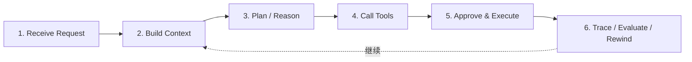

# Typical Workflow：一次 pp-Echo 任务是怎么跑完的

这篇文档把前面所有模块串起来，解释一次 pp-Echo 任务从用户输入到最终复盘的完整链路。理解这篇后，再回头读 AgentRuntime、ToolRegistry、Approval、TraceInspect，会更容易建立整体感。

## 0. 这个模块所需掌握的 Agent 知识

- **端到端 Agent 流程**：用户请求不是直接变成结果，而是经过上下文、推理、工具、审批、执行和复盘。
- **Read-only vs Write Task**：只读任务通常不需要审批，写入或 shell 任务通常需要更强控制。
- **Tool Result as Observation**：工具结果会回到下一轮模型输入。
- **Trace-driven Debugging**：通过 TraceInspect 看每一步是否符合预期。
- **Rewindable Execution**：本地 Agent 要能在失败时恢复。

## 1. 这个模块解决什么问题

单独看每个模块时，读者容易知道“这个模块做什么”，但不知道“它们怎么一起跑”。Typical Workflow 解决的是端到端理解问题：一次任务到底经过哪些阶段，每个阶段对应哪些源码和 TraceInspect span。

它也帮助新手区分：

- 一个只读总结任务如何运行。
- 一个涉及测试、修复、写文件的高风险任务如何运行。
- TraceInspect 中看到的 span 如何映射到底层模块。

## 2. 它在 pp-Echo 架构中的位置

Typical Workflow 不是一个独立模块，而是贯穿整个架构的路径。



对应架构层：Interface → SessionHost → Runtime Core → Execution Layer → Safety Layer → Observability / Storage。

## 3. 核心流程

### Step 1：接收需求

用户通过 Web、CLI 或 API 输入任务。例如：

```text
请阅读 README，总结 pp-Echo 的核心模块，不要修改文件。
```

Web / CLI 将请求交给 SessionHost。SessionHost 找到当前 session 或创建新 session，并调用 AgentRuntime。

### Step 2：构造上下文

Runtime 将用户输入写入 `AgentState.messages`。Context Builder 组装：

- system prompt
- 用户输入
- 最近消息
- memory recall
- tool schemas
- workspace observation
- state / goal 信息

TraceInspect 中会出现 `context.build`。

### Step 3：推理规划

Runtime 调用 Model / Provider。模型根据上下文生成：

- 直接回答；或
- 工具调用，例如 read_file、grep_code、git_status；或
- 多步计划。

TraceInspect 中会出现 `llm.call`，可看到 token、latency、retry、tool_call_count。

### Step 4：调用工具

如果模型生成 tool call，Runtime 调用 ToolRegistry。ToolRegistry 查找工具、记录 `tool.call` span，并调用具体工具。

只读任务可能调用 read_file、search_text、grep_code。写入任务可能调用 edit_file、run_shell、git_status 等。

### Step 5：审批与执行

如果工具是高风险动作，例如写文件、运行 shell、修改 Git 状态，Safety & Control 层会介入：

1. Policy 判断 risk。
2. Effect record 记录具体动作。
3. Approval Gate 生成 pending action。
4. 用户确认后执行。
5. 必要时创建 checkpoint。

TraceInspect 中可以看到 `policy.decision`、`approval.decision`、`checkpoint.create`。

### Step 6：追踪与复盘

任务完成或失败后，TraceInspect 展示完整 Timeline。Eval 可以使用运行结果做回归，Rewind 可以恢复到之前 checkpoint。

如果工具失败，模型可以看到失败 observation 并继续；如果用户拒绝审批，Agent 应调整计划或说明无法继续。

## 4. 关键数据结构

| 阶段 | 数据结构 |
|---|---|
| Receive Request | `ChatMessage(role="user")`、`SessionRecord` |
| Build Context | `AgentState`、context messages、memory hits、tool specs |
| Plan / Reason | `ChatMessage(role="assistant")`、`ToolCall`、usage stats |
| Call Tools | `ToolExecutionResult`、`tool_call_id` |
| Approve & Execute | `PendingAction`、effect record、payload_digest、checkpoint record |
| Trace / Evaluate | `TraceRun`、`TraceSpan`、Eval CaseScore、Report |

## 5. 关键源码入口

- `src/pp_agent/runtime/session_host.py`：接收 session 级请求。
- `src/pp_agent/runtime/runtime.py`：端到端执行主线。
- `src/pp_agent/runtime/turn_loop.py`：阶段推进。
- `src/pp_agent/llm/`：模型调用。
- `src/pp_agent/tools/registry.py`：工具执行。
- `src/pp_agent/tools/policy.py`、`effects.py`：风险和 effect。
- `src/pp_agent/storage/approvals.py`：审批状态。
- `src/pp_agent/runtime/git_checkpoint.py`、`safe_rewind.py`：checkpoint 和 rewind。
- `src/pp_agent/observability/`：TraceInspect 数据来源。
- `src/pp_agent/evaluation/`：Eval 回归。

## 6. 和其他模块的关系

| 工作流阶段 | 关联模块 |
|---|---|
| 接收需求 | Web UI、CLI、SessionHost |
| 构造上下文 | AgentRuntime、Context Builder、Memory、State |
| 推理规划 | Model / Provider、Turn Loop |
| 调用工具 | ToolRegistry、SKILL、MCP、Browser、Built-in Tools |
| 审批执行 | Policy、Approval Gate、Checkpoint、Rewind |
| 追踪复盘 | TraceInspect、Eval、Doctor、Storage |

## 7. TraceInspect 中怎么看它

一次任务的典型 TraceInspect Timeline：

```text
agent.turn
  context.build
  memory.recall
  llm.call
  tool.call
  policy.decision
  approval.decision
  checkpoint.create
  tool.call
  final.answer
```

只读任务一般不会出现 approval 和 checkpoint；写入任务通常会出现。排查时可以按照 workflow 阶段逐个看：

- 没理解用户需求：看 user input 和 context.build。
- 没调用工具：看 llm.call 的 tool_call_count。
- 工具没执行：看 tool.call 是否 pending 或 error。
- 被卡住：看 approval 是否 pending。
- 改坏文件：看 checkpoint 和 changed_paths。
- 回答不可信：看是否有 tool error 后仍 final answer。

## 8. 常见问题

**Q1：只读任务也会经过完整流程吗？**
会经过 Runtime、Context、Model 和 Trace，但可能不会经过 Approval 和 Checkpoint。

**Q2：高风险任务一定会被审批吗？**
取决于 Policy 和工具 effect。设计目标是高风险动作先预览和确认。

**Q3：为什么工具结果要回到下一轮模型？**
因为模型需要看到真实执行结果，才能继续判断下一步或总结结果。

**Q4：TraceInspect 和 Eval 谁更重要？**
TraceInspect 用于单次运行诊断，Eval 用于批量回归。两者互补。

**Q5：如果任务失败，应该先看哪里？**
先看 TraceInspect 的 Diagnosis，再看第一个 error span，最后看 tool output 和 approval/checkpoint。

## 9. 细读源码指导顺序

1. 从 `README.md` 的快速开始跑一个只读任务。
2. 打开 TraceInspect，观察实际生成的 spans。
3. 读 `src/pp_agent/runtime/runtime.py` 中 `prompt()` 和 `_run_loop()`。
4. 读 `src/pp_agent/llm/`，看模型调用如何产生 tool call。
5. 读 `src/pp_agent/tools/registry.py`，看工具如何执行。
6. 读 `src/pp_agent/tools/policy.py` 和 `effects.py`，看风险动作如何被拦截。
7. 读 `src/pp_agent/observability/`，看刚才看到的 TraceInspect 数据如何产生。
8. 最后读 `src/pp_agent/evaluation/`，看如何把流程变成可回归测试。

## 10. 后续优化方向

### 短期优化

- 在文档中加入一个真实 TraceInspect 截图和对应 workflow 标注。
- 给只读任务、高风险写入任务、失败恢复任务各写一个完整示例。
- 在 Web Startup Guide 中加入“运行第一个安全任务”的按钮或复制 prompt。

### 中期优化

- 将 workflow 中的每一步和 TraceInspect span 做可点击关联。
- Eval 报告中加入每个 case 的 workflow 阶段通过情况。
- Usage Center 中按 workflow 聚合 token 和工具耗时。

### 长期优化

- 支持任务级 workflow 模板。
- 支持自动生成 run report，把一次任务的 trace、diff、approval、checkpoint 打包成报告。
- 支持失败 workflow 的自动复盘和改进建议。
