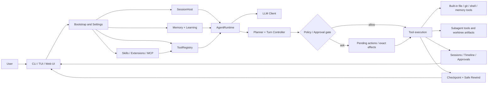

> 说明：本文档保留为历史参考，不再作为新手主入口。新读者请优先阅读 [../../README.md](../../README.md)、[../../tutorials/README.md](../../tutorials/README.md)、[../source-reading-roadmap.md](../source-reading-roadmap.md) 和 [../source-map.md](../source-map.md)。

# pp-Echo

<p align="center">
  
</p>

<p align="center">
  <strong>一个 Windows-first、CLI-first 的本地编程 Agent。</strong><br />
  先规划，再执行；高风险操作先审批；代码状态和会话历史都能安全回退。
</p>

<p align="center">
  <a href="#快速开始"></a>
  <a href="#技术亮点"></a>
  <a href="#架构概览"></a>
  <a href="#文档导航"></a>
  <a href="README_en.md"></a>
</p>

<p align="center">
  
</p>

<p align="center">
  <code>可见规划</code> | <code>审批优先</code> | <code>Git-backed rewind</code> | <code>分层记忆</code> | <code>受控子 Agent</code> | <code>CLI + TUI + Web UI</code>
</p>

pp-Echo 是一个面向真实仓库工作的本地编程 Agent，也是一个适合学习 Agent 工程的参考项目。它不是停留在 Prompt 层的聊天 Demo，而是把运行时循环、工具注册、策略审批、会话持久化、Checkpoint、安全回退、记忆检索、能力扩展、Web UI 和受控子 Agent 编排串成了一个可运行、可阅读、可扩展的工程系统。

当前最准确的定位是：**Windows-first**。Windows 是最清晰、最推荐的使用路径；Linux 和 macOS 更适合作为后续兼容方向，而不是当前同等支持的平台。

## 为什么值得看

- **它真的会做事**：文件读写、仓库检索、Git 状态、PowerShell、浏览器、记忆、MCP、扩展和子 Agent 都接入了统一工具边界。
- **它把信任放在第一层**：计划先出现，敏感操作要审批，执行效果会被绑定，仓库与会话都支持回退。
- **它适合拆开学习**：核心路径集中在 `AgentRuntime`、`ToolRegistry` 和 `SessionHost`，不是一团难以追踪的黑箱。
- **它有多种入口**：你可以用 CLI 快速对话，用 TUI 长时间工作，也可以用 Web UI 查看会话树、审批、运行状态和 checkpoint。
- **它对能力扩展认真建模**：Skills、Extensions、MCP、动态工具声明和子 Agent 都有明确的加载、发现与边界设计。
- **它诚实描述边界**：pp-Echo 已经可用、可演示、可扩展，但不会把受控本地协作包装成无限自治的 Agent 团队平台。

## 当前状态

- Runtime、审批、会话树、checkpoint / rewind、文件记忆和 Web UI 已经可以实际使用。
- `@subagent` 与 `orchestrate_agents` 已实现，但定位是受控的本地编排层，而不是成熟的自治多 Agent 平台。
- 安全模型以策略门、精确效果审批、受保护路径和 shell 效果审查为核心，但它还不是完整 shell sandbox。
- 项目适合本地试用、源码学习、二次扩展和公开演示；发布准备以 `doctor/report` 与相关文档为准。

## 技术亮点

| 模块 | 当前能力 | 关键路径 |
| --- | --- | --- |
| Runtime 核心 | Turn-based 运行循环、上下文构建、工具调用、生命周期事件、队列消息、压缩与持久化 | `src/pp_agent/runtime/runtime.py` |
| 会话编排 | 会话创建、恢复、分支、树导航、checkpoint 集成和 safe rewind 协调 | `src/pp_agent/runtime/session_host.py` |
| 工具边界 | 统一注册、元数据、策略评估、内置工具、动态工具和子 Agent 工具白名单 | `src/pp_agent/tools/registry.py` |
| 安全与审批 | 规划审批、执行期策略门、受保护路径、精确效果审批和 shell 风险摘要 | `src/pp_agent/tools/policy.py`, `src/pp_agent/tools/effects.py` |
| 文件 / Git / Shell | 文件读写编辑、搜索、Git status / diff、PowerShell 执行和高风险操作预览 | `src/pp_agent/tools/file_tools.py`, `src/pp_agent/tools/repo_tools.py`, `src/pp_agent/tools/shell_tool.py` |
| 浏览器与网页工具 | 统一 `browser` 工具、页面快照、标签页控制、保守浏览器策略、静态 `web.search` / `web.fetch` | `src/pp_agent/browser/*`, `src/pp_agent/web_tools/*` |
| Checkpoint 与回退 | 快照创建、恢复预览、工作区恢复、会话回退和组合式 safe rewind | `src/pp_agent/runtime/git_checkpoint.py`, `src/pp_agent/runtime/safe_rewind.py` |
| 记忆系统 | Bootstrap memory、文件记忆检索、SQLite 历史、可选向量召回、reranking 和自动索引 | `src/pp_agent/memory/*`, `src/pp_agent/learning/*` |
| 能力扩展 | Skills、可执行扩展、MCP server 集成、资源 manifest 和能力发现目录 | `src/pp_agent/app/bootstrap.py`, `src/pp_agent/mcp/*`, `src/pp_agent/extensions/*`, `src/pp_agent/skills/*` |
| 子 Agent 编排 | 显式 `@subagent` handoff、受控 fan-out、子能力画像和 patch artifact 暂存 | `src/pp_agent/tools/subagent_tool.py`, `src/pp_agent/subagents/*` |
| 多界面 | CLI chat、Textual TUI、FastAPI + React Web UI、审批流、项目切换和运行状态 | `src/pp_agent/cli/*`, `src/pp_agent/tui/*`, `src/pp_agent/web/*`, `web/*` |
| 评测与诊断 | τ-style eval、确定性 benchmark、runtime doctor/report 和能力检查 | `evals/*`, `tests/benchmarks/*`, `src/pp_agent/cli/commands/*` |

## 架构概览



这张图比传统的 “CLI -> Runtime -> Tools” 更接近当前项目真实形态：pp-Echo 已经包含能力发现、分层记忆、审批流、Web UI 状态、checkpoint 和受控子 Agent 编排。

## 快速开始

pp-Echo 需要 Python `3.9+`，推荐先在 Windows 上体验。

### 最快启动 CLI

```powershell
set PP_AGENT_API_KEY=your_api_key
.\start-agent.bat
```

### 启动 Web UI

```powershell
set PP_AGENT_API_KEY=your_api_key
.\start-web.bat
```

默认访问：

```text
http://127.0.0.1:8765
```

Web UI 支持项目切换、运行时状态、审批、checkpoint 和 patch artifact 工作流。

### 启动 TUI

```powershell
set PP_AGENT_API_KEY=your_api_key
.\echo-cli.bat
```

### 从源码运行

```powershell
git clone https://github.com/CHEN2003-CHIP/pp-Echo.git
cd pp-Echo
set PP_AGENT_API_KEY=your_api_key
set PYTHONPATH=src
python -m pp_agent.cli.main chat
```

常用诊断：

```powershell
set PYTHONPATH=src
python -m pp_agent.cli.main workflow doctor --json
python -m pp_agent.cli.main memory search "project conventions" --scope workspace
python -m pp_agent.cli.main config show --workspace .
```

## Demo / 截图


| 交互式对话 | Checkpoint + Rewind |
| --- | --- |
|  |  |


## 评测快照

pp-Echo 按工程 Agent 来评测，而不只是看 Prompt 效果。

| 评测层 | 规模 | 证明什么 | 入口 |
| --- | ---: | --- | --- |
| Live interview demo | 12 cases | 直接回答、仓库理解、工具调用、安全审批和显式子 Agent handoff | [docs/evaluation-demo.md](../evaluation-demo.md) |
| Tau-style agent eval | `pp_echo_core` | 环境终态、沟通奖励、动作约束和安全约束 | [docs/evaluation-demo.md](../evaluation-demo.md) |
| Deterministic benchmark | 15 tasks | planner gating、rewind、MCP lazy activation 和 compaction 的确定性验证 | [docs/benchmarks/latest.md](../benchmarks/latest.md) |

仓库文档中最近记录的本地 live demo 结果：

| Run | Cases | Pass rate | Tool calls | Approval gates | Expected policy blocks |
| --- | ---: | ---: | ---: | ---: | ---: |
| `20260512-234612-6fb26ca4` | 12 | 100% | 14 | 2 | 1 |

## 文档导航

### 理解运行主链路

如果你想知道一个用户请求如何变成计划、工具调用、审批、持久化状态和可回退历史，先看：

- [docs/source-map.md](../source-map.md)
- [docs/agent-learning-zh.md](../agent-learning-zh.md)
- [docs/agent-learning-en.md](../agent-learning-en.md)
- `src/pp_agent/runtime/runtime.py`
- `src/pp_agent/tools/registry.py`
- `src/pp_agent/runtime/session_host.py`

### 理解安全与审批

安全边界不只依赖模型“承诺不乱做”，而是落在策略门、受保护路径、精确效果审批、shell 风险摘要和 pending action 绑定上。

- [docs/safety.md](../safety.md)
- [docs/effect-analysis.md](../effect-analysis.md)
- [docs/dynamic-tool-declarations.md](../dynamic-tool-declarations.md)

### 理解子 Agent

当前子 Agent 的关键词是受控：显式 handoff、限制工具、限制轮次、隔离子会话 / worktree，并生成可审查 artifact。

- [docs/multi_agent_demo.md](../multi_agent_demo.md)
- [docs/subagent-validation.md](../subagent-validation.md)
- `src/pp_agent/tools/subagent_tool.py`
- `src/pp_agent/subagents/*`

### 理解记忆系统

记忆不是单一数据库，而是由 `MEMORY.md`、daily notes、workspace memory、SQLite history、BM25 和可选向量召回组成的分层系统。

- [MEMORY.md](../../MEMORY.md)
- [docs/source-map.md](../source-map.md)
- `src/pp_agent/memory/*`
- `src/pp_agent/learning/*`

### 配置模型、工具和 MCP

- [docs/configuration.md](../configuration.md)
- [docs/mcp-fetch-integration.md](../mcp-fetch-integration.md)
- [example-config.jsonc](../../example-config.jsonc)
- [example-mcp.jsonc](../../example-mcp.jsonc)

## 核心命令

```powershell
python -m pp_agent.cli.main chat
python -m pp_agent.cli.main run "Audit this repo and summarize risky commands"
python -m pp_agent.cli.main web
python -m pp_agent.cli.main sessions tree
python -m pp_agent.cli.main approvals summary
python -m pp_agent.cli.main checkpoint list
python -m pp_agent.cli.main rewind-safe --session <session_id> --turns 2
python -m pp_agent.cli.main doctor --workspace .
```

## 项目边界

- pp-Echo 当前是 **Windows-first**，不是跨平台完全等价支持。
- 它有审批、策略门和精确效果绑定，但还不是完整 shell sandbox。
- 子 Agent 是受控本地 worker，不是无限自治的多 Agent 团队。
- 动态工具声明已经形式化；当语义不稳定或无法 stage 时，执行会 fail closed。

## 贡献

欢迎围绕运行时行为、文档、Demo 素材、测试、扩展和发布打磨贡献改进。建议先读 [CONTRIBUTING.md](../../CONTRIBUTING.md)，并尽量保持改动聚焦：一个 PR 解决一个用户可感知问题，或一个清晰的内部改进点。

## Release

- 当前 release notes: [releases/v0.2.0.md](../../releases/v0.2.0.md)
- GitHub Releases: [github.com/CHEN2003-CHIP/pp-Echo/releases](https://github.com/CHEN2003-CHIP/pp-Echo/releases)

发布前建议运行：

```powershell
pytest -q tests/architecture
python -m pp_agent.cli.main workflow doctor --json --workspace .
python -m pytest tests/benchmarks/test_runner.py
```

## License

本项目基于 MIT License 发布，详见 [LICENSE](../../LICENSE)。
