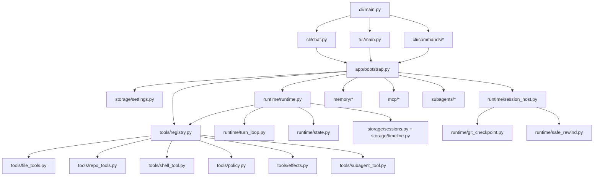

# pp-Echo 源码地图

如果你第一次阅读完整工程，建议先看 [source-reading-roadmap.md](source-reading-roadmap.md)，再用本文定位具体模块。

本文回答两个问题：

1. 每个核心模块负责什么。
2. 一次 agent 任务运行时主要调用链如何流动。

pp-Echo 当前是 Windows-first 的教学向本地 Agent Runtime。runtime、approval、rewind、session、memory、tool registry、MCP、subagent、TraceInspect 都是真实实现，但它不是生产级安全沙箱，也不是 Claude Code / Cursor 的替代品。

## 总体模块图

## 入口与装配

优先阅读：

- `src/pp_agent/cli/main.py`
- `src/pp_agent/app/bootstrap.py`
- `src/pp_agent/storage/settings.py`

这些文件说明 CLI 命令如何进入系统，以及 runtime、tools、stores、memory、skills、extensions、MCP 如何被装配。

## Runtime 主链路

优先阅读：

- `src/pp_agent/runtime/runtime.py`
- `src/pp_agent/runtime/turn_loop.py`
- `src/pp_agent/runtime/state.py`
- `src/pp_agent/runtime/session_host.py`

这些文件定义 turn loop、runtime state、事件生命周期、session 创建/恢复、分支和回放。

## 工具与安全

优先阅读：

- `src/pp_agent/tools/registry.py`
- `src/pp_agent/tools/policy.py`
- `src/pp_agent/tools/effects.py`
- `src/pp_agent/tools/file_tools.py`
- `src/pp_agent/tools/shell_tool.py`

这里可以看到工具如何注册、schema 如何暴露、权限如何判断、风险动作如何进入 staged approval。

## Checkpoint 与 Rewind

优先阅读：

- `src/pp_agent/runtime/git_checkpoint.py`
- `src/pp_agent/runtime/safe_rewind.py`
- `src/pp_agent/storage/sessions.py`

这些模块解释 Git-backed checkpoint、workspace restore、conversation rewind 与 session tree 如何协作。

## Memory、MCP 与 SubAgent

优先阅读：

- `src/pp_agent/memory/*`
- `src/pp_agent/mcp/*`
- `src/pp_agent/subagents/*`
- `src/pp_agent/tools/subagent_tool.py`

这些模块负责长期记忆、外部 MCP server、受控子 agent 编排和 staged artifact 边界。

## Web、Trace 与诊断

优先阅读：

- `src/pp_agent/web/*`
- `src/pp_agent/server/routes/*`
- `src/pp_agent/tracing/*`
- `web/src/*`

这些模块连接 Web UI、Startup Guide、TraceInspect、approval panel 和运行时诊断。

## 配合阅读

- [agent-learning-zh.md](agent-learning-zh.md)
- [source-reading-roadmap.md](source-reading-roadmap.md)
- [architecture/README.md](architecture/README.md)
