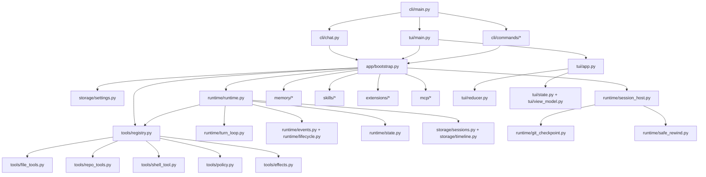
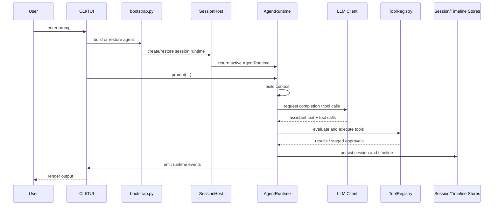
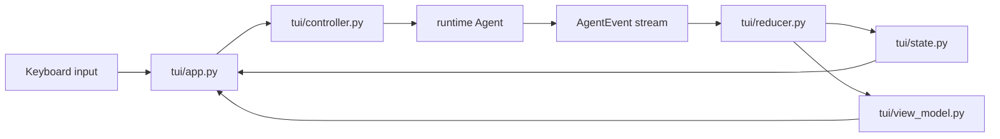
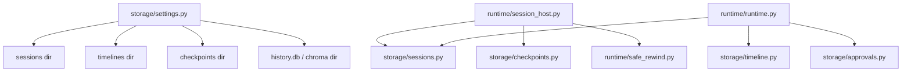

# pp-Echo Source Map

This document is a practical source-code reading map for the `pp-Echo` project.  
It is designed for developers who want to answer two questions quickly:

1. Which module is responsible for what?
2. What is the main call chain when the agent runs?

It complements the learning guides:

- Chinese guide: [agent-learning-zh.md](/E:/Pycharm%20Project/pp-Echo/docs/agent-learning-zh.md)
- English guide: [agent-learning-en.md](/E:/Pycharm%20Project/pp-Echo/docs/agent-learning-en.md)

## 1. High-Level Module Map

## 2. The Most Important Files

If you only have time to understand a handful of files, start here:

### Entry and system assembly

- [src/pp_agent/cli/main.py](/E:/Pycharm%20Project/pp-Echo/src/pp_agent/cli/main.py)
- [src/pp_agent/app/bootstrap.py](/E:/Pycharm%20Project/pp-Echo/src/pp_agent/app/bootstrap.py)

These files show:

- what commands exist,
- how the system is started,
- and how runtime, tools, stores, memory, skills, extensions, and MCP are wired together.

### Runtime core

- [src/pp_agent/runtime/runtime.py](/E:/Pycharm%20Project/pp-Echo/src/pp_agent/runtime/runtime.py)
- [src/pp_agent/runtime/turn_loop.py](/E:/Pycharm%20Project/pp-Echo/src/pp_agent/runtime/turn_loop.py)
- [src/pp_agent/runtime/state.py](/E:/Pycharm%20Project/pp-Echo/src/pp_agent/runtime/state.py)

These files define:

- the agent loop,
- turn decisions,
- runtime state,
- and the event-driven behavior of the system.

### Tooling and safety

- [src/pp_agent/tools/registry.py](/E:/Pycharm%20Project/pp-Echo/src/pp_agent/tools/registry.py)
- [src/pp_agent/tools/policy.py](/E:/Pycharm%20Project/pp-Echo/src/pp_agent/tools/policy.py)
- [src/pp_agent/tools/effects.py](/E:/Pycharm%20Project/pp-Echo/src/pp_agent/tools/effects.py)

These files explain:

- how tools are registered,
- how permissions are evaluated,
- and how risky actions are staged for approval.

### Sessions and rewind

- [src/pp_agent/runtime/session_host.py](/E:/Pycharm%20Project/pp-Echo/src/pp_agent/runtime/session_host.py)
- [src/pp_agent/runtime/git_checkpoint.py](/E:/Pycharm%20Project/pp-Echo/src/pp_agent/runtime/git_checkpoint.py)
- [src/pp_agent/runtime/safe_rewind.py](/E:/Pycharm%20Project/pp-Echo/src/pp_agent/runtime/safe_rewind.py)

These files explain:

- how sessions are created and restored,
- how session trees work,
- how checkpoints are created,
- and how workspace + conversation rewind is coordinated.

### Persistence and configuration

- [src/pp_agent/storage/settings.py](/E:/Pycharm%20Project/pp-Echo/src/pp_agent/storage/settings.py)
- [src/pp_agent/storage/sessions.py](/E:/Pycharm%20Project/pp-Echo/src/pp_agent/storage/sessions.py)
- [src/pp_agent/storage/timeline.py](/E:/Pycharm%20Project/pp-Echo/src/pp_agent/storage/timeline.py)
- [src/pp_agent/storage/checkpoints.py](/E:/Pycharm%20Project/pp-Echo/src/pp_agent/storage/checkpoints.py)

### Memory and capability extension

- [src/pp_agent/memory/retrieval_hook.py](/E:/Pycharm%20Project/pp-Echo/src/pp_agent/memory/retrieval_hook.py)
- [src/pp_agent/skills/loader.py](/E:/Pycharm%20Project/pp-Echo/src/pp_agent/skills/loader.py)
- [src/pp_agent/extensions/loader.py](/E:/Pycharm%20Project/pp-Echo/src/pp_agent/extensions/loader.py)
- [src/pp_agent/mcp/manager.py](/E:/Pycharm%20Project/pp-Echo/src/pp_agent/mcp/manager.py)

### UI layers

- [src/pp_agent/cli/chat.py](/E:/Pycharm%20Project/pp-Echo/src/pp_agent/cli/chat.py)
- [src/pp_agent/tui/app.py](/E:/Pycharm%20Project/pp-Echo/src/pp_agent/tui/app.py)
- [src/pp_agent/tui/reducer.py](/E:/Pycharm%20Project/pp-Echo/src/pp_agent/tui/reducer.py)
- [src/pp_agent/tui/state.py](/E:/Pycharm%20Project/pp-Echo/src/pp_agent/tui/state.py)
- [src/pp_agent/tui/view_model.py](/E:/Pycharm%20Project/pp-Echo/src/pp_agent/tui/view_model.py)

## 3. Main Runtime Call Chain

The most useful end-to-end path to understand is:

In code terms, the main flow is usually:

1. `cli/main.py`
2. `cli/chat.py` or `tui/main.py`
3. `app/bootstrap.py`
4. `runtime/session_host.py`
5. `runtime/runtime.py`
6. `tools/registry.py`
7. `storage/*`

## 4. TUI-Specific Flow

The TUI has its own UI state layer, but it still reuses the same runtime and event model.

The important takeaway is:

- the TUI does not invent business logic,
- it consumes runtime events,
- reduces them into UI state,
- and renders transcript blocks.

## 5. Capability Expansion Flow

One strong design feature of this repo is that new capabilities do not have to be added only as built-ins.

There are several extension paths:

### Built-in tools

Add or change code under:

- `src/pp_agent/tools/*`
- `src/pp_agent/tools/registry.py`

### Skills

Add or discover skills under:

- `src/pp_agent/skills/*`
- project or user skill directories loaded by settings

### Extensions

Add extensions under:

- `src/pp_agent/extensions/*`

### MCP

Expose remote tools/resources/prompts through:

- `src/pp_agent/mcp/*`

This layered design is important because it separates:

- core runtime behavior,
- local tool behavior,
- contextual augmentation,
- and external capability integration.

## 6. Session and Persistence Map

This map is helpful when you want to answer:

- where state is stored,
- what is session state vs runtime event state,
- and where rewind/approval metadata lives.

## 7. If You Want to Learn by Task

Use this table as a shortcut.

### “I want to understand how prompts become tool calls”

Read:

- [src/pp_agent/runtime/runtime.py](/E:/Pycharm%20Project/pp-Echo/src/pp_agent/runtime/runtime.py)
- [src/pp_agent/runtime/turn_loop.py](/E:/Pycharm%20Project/pp-Echo/src/pp_agent/runtime/turn_loop.py)

### “I want to understand how tool approval works”

Read:

- [src/pp_agent/tools/registry.py](/E:/Pycharm%20Project/pp-Echo/src/pp_agent/tools/registry.py)
- [src/pp_agent/tools/policy.py](/E:/Pycharm%20Project/pp-Echo/src/pp_agent/tools/policy.py)
- [src/pp_agent/storage/approvals.py](/E:/Pycharm%20Project/pp-Echo/src/pp_agent/storage/approvals.py)

### “I want to understand rewind and checkpoints”

Read:

- [src/pp_agent/runtime/session_host.py](/E:/Pycharm%20Project/pp-Echo/src/pp_agent/runtime/session_host.py)
- [src/pp_agent/runtime/git_checkpoint.py](/E:/Pycharm%20Project/pp-Echo/src/pp_agent/runtime/git_checkpoint.py)
- [src/pp_agent/runtime/safe_rewind.py](/E:/Pycharm%20Project/pp-Echo/src/pp_agent/runtime/safe_rewind.py)

### “I want to understand memory retrieval”

Read:

- [src/pp_agent/memory/retrieval_hook.py](/E:/Pycharm%20Project/pp-Echo/src/pp_agent/memory/retrieval_hook.py)
- [src/pp_agent/memory/retrieval.py](/E:/Pycharm%20Project/pp-Echo/src/pp_agent/memory/retrieval.py)

### “I want to understand the TUI”

Read:

- [src/pp_agent/tui/app.py](/E:/Pycharm%20Project/pp-Echo/src/pp_agent/tui/app.py)
- [src/pp_agent/tui/reducer.py](/E:/Pycharm%20Project/pp-Echo/src/pp_agent/tui/reducer.py)
- [src/pp_agent/tui/state.py](/E:/Pycharm%20Project/pp-Echo/src/pp_agent/tui/state.py)
- [src/pp_agent/tui/view_model.py](/E:/Pycharm%20Project/pp-Echo/src/pp_agent/tui/view_model.py)

## 8. Best “Three Files First” Shortcut

If you want the shortest possible path into the architecture, start here:

1. [runtime.py](/E:/Pycharm%20Project/pp-Echo/src/pp_agent/runtime/runtime.py)
2. [registry.py](/E:/Pycharm%20Project/pp-Echo/src/pp_agent/tools/registry.py)
3. [session_host.py](/E:/Pycharm%20Project/pp-Echo/src/pp_agent/runtime/session_host.py)

These three files together explain:

- how the agent thinks in turns,
- how it acts through tools safely,
- and how it persists and rewinds its work over time.
