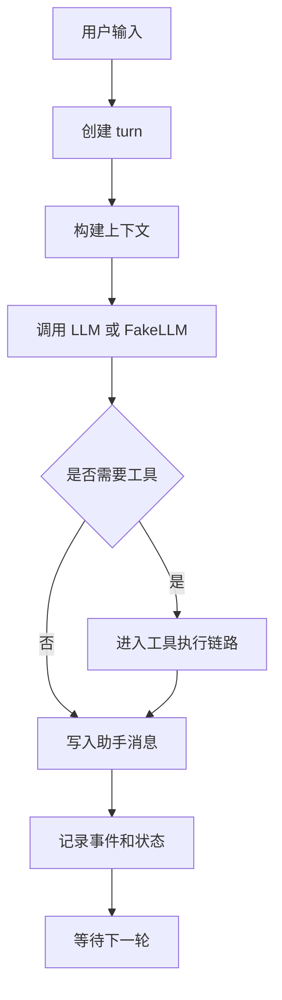

# Day 1：Agent Loop 是怎么跑起来的

## 1. 这一天解决什么问题

今天只解决一个问题：用户输入一句话后，Agent 为什么不是简单调用一次 LLM 就结束，而是需要一个可记录、可恢复、可扩展的运行循环。

你要把 Agent Loop 看成四件事：

- 接收用户输入。
- 构建上下文。
- 让模型做决定。
- 记录消息和事件，准备下一轮。

真实工程里的 `AgentRuntime` 还会处理工具调用、审批、压缩、持久化和生命周期事件。Day 1 先不追全部细节，只抓住“loop 是系统中枢”。

## 2. 先运行 mini 示例

```powershell
python mini-pp-echo/01_loop.py
```

运行后重点看两块输出：

- `transcript`：系统、用户、助手消息如何累积。
- `events`：一轮 turn 如何开始、构建上下文、完成模型响应、结束。

这个例子里的 `FakeLLM` 不是重点，重点是 `MiniAgent.run_turn()` 如何组织一轮对话。

## 3. 看完整工程源码

建议按这个顺序读：

- `src/pp_agent/runtime/runtime.py`：完整运行时入口。
- `src/pp_agent/runtime/turn_loop.py`：turn 级别的执行流程。
- `src/pp_agent/runtime/events.py`：运行时事件如何表达。
- `src/pp_agent/runtime/state.py`：运行状态和事件数据结构。

阅读时先找这些问题：

- 用户输入在哪里进入 runtime？
- 消息列表什么时候更新？
- 工具调用结果怎样回到下一步上下文？
- 事件为什么要独立记录，而不是只存在聊天文本里？

## 4. 画一张流程图



今天只要理解主干：每一轮都要留下可追踪的消息和事件。

## 5. 常见误区

- 误区一：Agent 就是一个 while 循环。  
  真实 Agent Loop 还要处理状态、事件、错误恢复、工具结果和持久化。

- 误区二：把所有历史都直接塞回 prompt。  
  完整工程会做上下文构建、压缩和记忆检索，不是无脑拼接。

- 误区三：模型输出就是最终行为。  
  模型只是提出下一步，runtime 才负责把下一步变成可控执行。

## 6. 小作业

修改 `mini-pp-echo/01_loop.py`：

- 给 `Event` 增加 `turn_id` 字段。
- 在每个事件里记录当前 turn。
- 运行脚本，观察事件流是不是更容易追踪。
