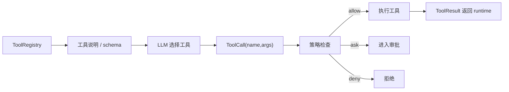

# Day 2：Tool Registry 与工具调用

## 1. 这一天解决什么问题

今天解决的问题是：为什么 Agent 不能让模型直接调用任意函数，而要先把能力注册成工具。

Tool Registry 的价值是把“模型想做什么”和“系统允许做什么”隔开：

- 模型看到的是工具名、描述和参数。
- runtime 看到的是工具实现、元数据和策略。
- 安全层看到的是工具类别、权限和效果。

这就是本地编程 Agent 能受控调用文件、Git、Shell、Browser、MCP、SubAgent 的基础。

## 2. 先运行 mini 示例

```powershell
python mini-pp-echo/02_tool_call.py
```

观察三件事：

- `ToolRegistry.register()` 如何注册工具。
- `FakeLLM.decide()` 如何选择工具名和参数。
- `ToolRegistry.execute()` 如何把工具调用转成真实函数执行。

这个例子故意很小：它只保留注册、描述、调用三个动作。

## 3. 看完整工程源码

建议按这个顺序读：

- `src/pp_agent/tools/registry.py`：工具注册和执行中枢。
- `src/pp_agent/tools/base.py`：工具基类和结果格式。
- `src/pp_agent/tools/metadata.py`：工具元数据。
- `src/pp_agent/runtime/tool_surface.py`：运行时暴露给模型的工具表面。

可以辅助运行：

```powershell
set PYTHONPATH=src
python -m pp_agent.cli.main capabilities legacy-hints --json --workspace .
```

阅读时重点找：

- 真实工具名是什么？
- 哪些工具是写操作？
- SubAgent 的工具 allowlist 如何限制可用工具？
- 动态工具和内置工具如何进入同一个注册表？

## 4. 画一张流程图



关键点：工具注册表不是“函数字典”这么简单，它也是安全边界的一部分。

## 5. 常见误区

- 误区一：工具越多越好。  
  工具越多，模型选择空间越大，策略和审计压力也越大。

- 误区二：工具描述只是给模型看的文案。  
  描述、参数、元数据会影响模型选择，也会影响安全策略和 UI 展示。

- 误区三：allowlist 可以随便写。  
  allowlist 必须绑定真实工具名。写错名字等于策略失效或工具不可用。

## 6. 小作业

修改 `mini-pp-echo/02_tool_call.py`：

- 新增一个 `count_lines` 工具。
- 让 `FakeLLM` 在用户说“统计行数”时调用它。
- 打印工具调用前后的参数和结果。
