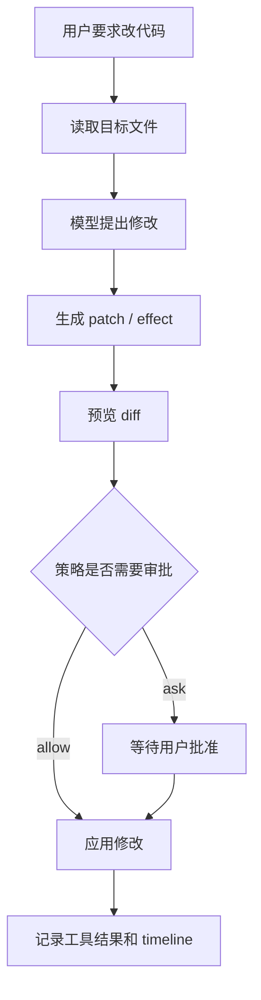

# Day 3：文件读写、Patch 与代码修改

## 1. 这一天解决什么问题

今天解决的问题是：本地编程 Agent 如何安全地改文件。

一个可靠的代码修改链路通常不是“模型生成完整文件然后覆盖”，而是：

- 先读文件，理解当前内容。
- 再生成局部修改或 patch。
- 预览差异。
- 经过策略或审批后应用。
- 把修改结果记录到 timeline 或 checkpoint 链路。

Day 3 先看最小 patch 思路，再读完整工程的 file tools 和 effect analysis。

## 2. 先运行 mini 示例

```powershell
python mini-pp-echo/03_file_edit.py
```

这个脚本会创建临时 workspace：

- 写入一个 `task.txt`。
- 让 `FakeLLM` 选择替换内容。
- 生成 unified diff。
- 应用 patch。

重点看 `Patch.diff()` 和 `FileEditor.build_replace_patch()`。

## 3. 看完整工程源码

建议按这个顺序读：

- `src/pp_agent/tools/file_tools.py`：文件读写编辑工具。
- `src/pp_agent/tools/pending_edits.py`：待处理编辑。
- `src/pp_agent/tools/effects.py`：效果摘要和风险分析。
- `src/pp_agent/runtime/runtime.py`：工具结果如何回到 runtime。

可以运行一个只读示例：

```powershell
set PYTHONPATH=src
python -m pp_agent.cli.main run "read README.md and summarize the first section"
```

阅读时重点找：

- 工具如何限制 workspace 路径？
- 写文件和编辑文件如何表达结果？
- effect digest 为什么能帮助审批绑定？

## 4. 画一张流程图



关键点：patch 是让修改可审查、可记录、可回退的中间层。

## 5. 常见误区

- 误区一：直接覆盖文件最简单。  
  覆盖确实简单，但不利于审查、审批和回退。

- 误区二：diff 只是给用户看的。  
  diff 也是系统理解“这次动作会造成什么效果”的依据。

- 误区三：读写工具只要能操作文件就够了。  
  真实工程还要处理路径边界、编码、错误、受保护文件和审计记录。

## 6. 小作业

修改 `mini-pp-echo/03_file_edit.py`：

- 在应用 patch 前增加一次确认提示。
- 如果用户输入 `n`，不写文件。
- 打印“取消后文件内容未变化”的证明。
