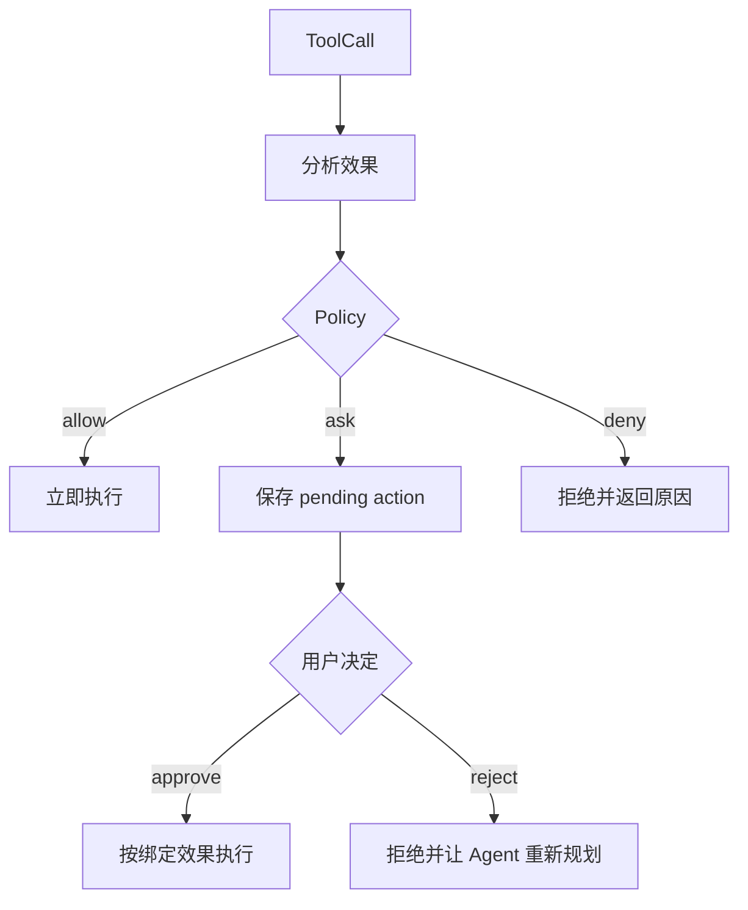

# Day 4：Approval Gate 与安全策略

## 1. 这一天解决什么问题

今天解决的问题是：Agent 为什么需要 Approval Gate。

本地编程 Agent 会接触文件、Git、Shell、Browser 等高影响能力。如果所有动作都由模型直接执行，用户很难建立信任。

Approval Gate 做三件事：

- 判断动作是 allow、ask 还是 deny。
- 对 ask 动作生成 pending action。
- 用户批准后，只执行被批准的那一个精确动作。

## 2. 先运行 mini 示例

```powershell
python mini-pp-echo/04_approval.py
```

你会看到三种结果：

- `read_file` 直接允许。
- `run_shell` 生成 pending action。
- 包含 `Remove-Item` 的危险命令被拒绝。

重点看 `Policy.decide()`、`PendingActionStore.create()`、`approve_and_run()`。

## 3. 看完整工程源码

建议按这个顺序读：

- `src/pp_agent/tools/policy.py`：allow / ask / deny 策略。
- `src/pp_agent/tools/effects.py`：工具效果分析。
- `src/pp_agent/storage/approvals.py`：pending action 存储。
- `src/pp_agent/tools/pending_actions.py`：审批相关工具。
- `src/pp_agent/cli/commands/approvals.py`：CLI 如何展示审批。

可以运行：

```powershell
set PYTHONPATH=src
python -m pp_agent.cli.main approvals summary
```

阅读时重点找：

- 哪些工具默认属于高风险？
- pending action 如何绑定具体效果？
- 用户拒绝后，runtime 如何继续对话？

## 4. 画一张流程图



关键点：审批不是“问一句可以吗”，而是绑定具体工具、参数和效果。

## 5. 常见误区

- 误区一：只要 prompt 里写“不要危险操作”就安全。  
  Prompt 是软约束，Approval Gate 是工程约束。

- 误区二：用户批准工具名就够了。  
  用户应该批准具体效果，而不是批准某个工具无限执行。

- 误区三：deny 后对话就结束。  
  更好的做法是把拒绝结果返回给 Agent，让它寻找低风险替代路径。

## 6. 小作业

修改 `mini-pp-echo/04_approval.py`：

- 让 `write_file` 只有写入 `.txt` 文件时 ask。
- 写入 `.env` 时直接 deny。
- 打印 deny 的原因。
