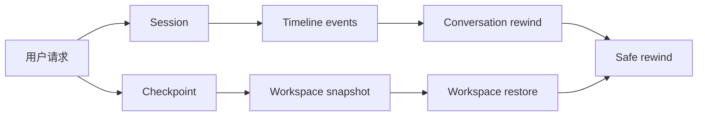

# Day 5：Session、Timeline 与 Checkpoint

## 1. 这一天解决什么问题

今天解决的问题是：Agent 的“历史”到底是什么。

一个本地编程 Agent 的历史不只是聊天消息，还包括：

- 当前会话和分支。
- 每一轮工具调用和事件。
- 工作区代码状态。
- 可恢复的 checkpoint。
- 用户审批和拒绝记录。

Session、Timeline 和 Checkpoint 分别记录不同层次的历史，它们组合起来才支持 safe rewind。

## 2. 先运行 mini 示例

```powershell
python mini-pp-echo/06_checkpoint.py
```

这个脚本演示：

- 修改前创建 checkpoint。
- 写入一个坏版本。
- 预览恢复会影响哪些文件。
- 恢复到稳定状态。

重点看 `CheckpointManager.create()`、`preview_restore()`、`restore()`。

## 3. 看完整工程源码

建议按这个顺序读：

- `src/pp_agent/runtime/session_host.py`：会话创建、恢复、切换、分支。
- `src/pp_agent/storage/sessions.py`：会话持久化。
- `src/pp_agent/storage/timeline.py`：timeline 记录。
- `src/pp_agent/runtime/git_checkpoint.py`：Git-backed checkpoint。
- `src/pp_agent/runtime/safe_rewind.py`：组合式安全回退。

可以运行：

```powershell
set PYTHONPATH=src
python -m pp_agent.cli.main sessions tree
python -m pp_agent.cli.main checkpoint list
```

阅读时重点找：

- `SessionHost` 为什么是会话层入口？
- checkpoint 和 session record 分别保存什么？
- safe rewind 为什么不能等同于 `git reset`？

## 4. 画一张流程图



关键点：会话回退和代码回退是两条链路，safe rewind 负责把它们协调起来。

## 5. 常见误区

- 误区一：保存聊天记录就等于保存会话。  
  会话还包括 active head、分支关系、模型设置、工具状态等。

- 误区二：checkpoint 就是复制文件夹。  
  完整工程使用 Git-backed 思路，并要考虑预览、恢复和失败处理。

- 误区三：回退就是撤销最后一条消息。  
  编程 Agent 的回退还要处理已经写入工作区的文件变化。

## 6. 小作业

修改 `mini-pp-echo/06_checkpoint.py`：

- 创建两个 checkpoint。
- 在第二次修改后分别预览恢复到第一个和第二个 checkpoint。
- 比较两次预览的差异。
