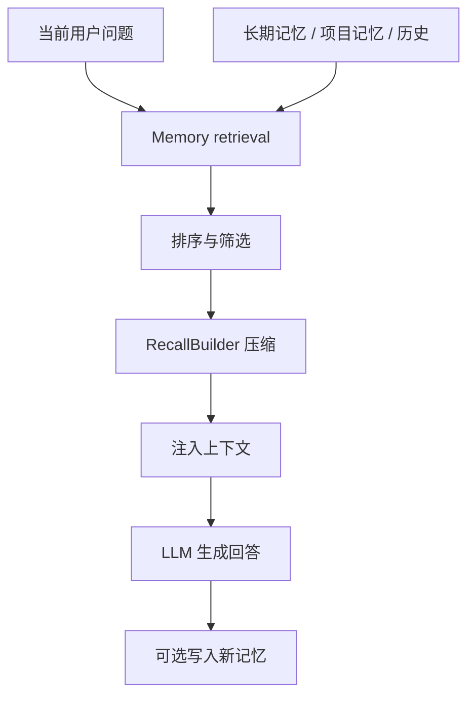

# Day 6：Memory 检索与上下文注入

## 1. 这一天解决什么问题

今天解决的问题是：Agent 如何记住有用信息，同时不把上下文撑爆。

Memory 不是把所有历史塞进 prompt。更合理的链路是：

- 写入值得保存的事实、偏好、经验或项目约定。
- 根据当前问题检索相关记忆。
- 对结果排序和压缩。
- 把少量高相关内容注入上下文。

Day 6 先看最小检索，再读完整工程的 memory 和 learning 模块。

## 2. 先运行 mini 示例

```powershell
python mini-pp-echo/05_memory.py
```

这个脚本演示：

- `MemoryStore.add()` 写入记忆。
- `MemoryStore.search()` 用简单词重叠打分。
- `RecallBuilder.build()` 生成可注入上下文。
- `FakeLLM.answer()` 使用 recall context 回答。

重点不是打分算法，而是“检索后再注入”的结构。

## 3. 看完整工程源码

建议按这个顺序读：

- `MEMORY.md`：仓库级长期记忆入口。
- `src/pp_agent/memory/retrieval.py`：记忆检索。
- `src/pp_agent/memory/recall_builder.py`：召回上下文构建。
- `src/pp_agent/memory/file_memory_store.py`：文件记忆存储。
- `src/pp_agent/learning/context.py`：学习上下文。
- `src/pp_agent/learning/runtime.py`：学习运行时。

可以运行：

```powershell
set PYTHONPATH=src
python -m pp_agent.cli.main memory search "AgentRuntime" --scope workspace
```

阅读时重点找：

- 记忆来源有哪些？
- 检索结果在哪里进入 prompt？
- 哪些信息应该被排除或降权？

## 4. 画一张流程图



关键点：记忆系统的目标不是“记得多”，而是“在正确时候带入正确内容”。

## 5. 常见误区

- 误区一：所有历史都值得长期保存。  
  临时状态、重复信息和低价值闲聊会污染检索。

- 误区二：向量检索等于记忆系统。  
  记忆还包括写入策略、权限、压缩、注入位置和遗忘机制。

- 误区三：检索越多越好。  
  太多记忆会挤占任务上下文，让模型偏离当前目标。

## 6. 小作业

修改 `mini-pp-echo/05_memory.py`：

- 给 `Memory` 增加 `priority` 字段。
- 搜索时让高优先级记忆加分。
- 比较加权前后的排序变化。
