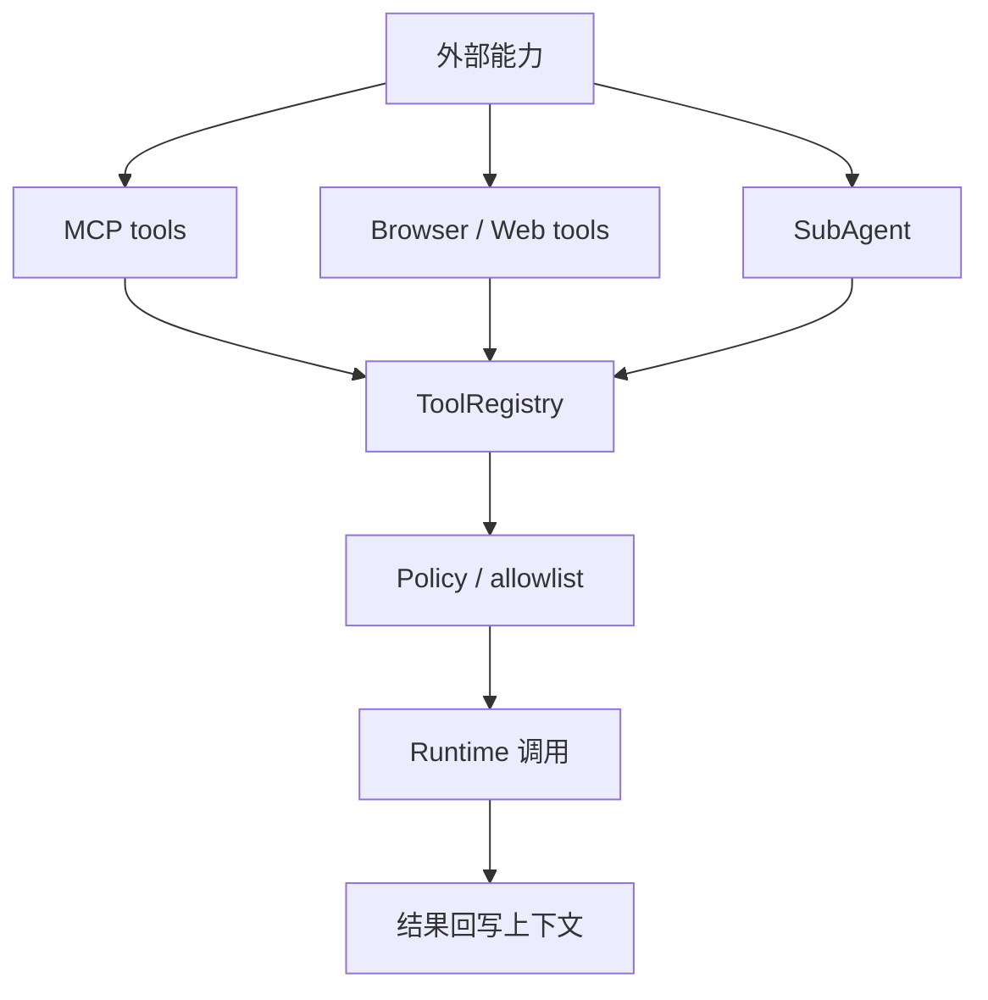

# Day 7：MCP、Browser 与 SubAgent 扩展

## 1. 这一天解决什么问题

今天解决的问题是：Agent 如何扩展能力，同时不失控。

pp-Echo 的扩展能力可以分成三类：

- MCP：接入外部工具服务。
- Browser / Web tools：让 Agent 能观察和操作网页。
- SubAgent：把任务拆给受控子 Agent。

这三类看起来不同，但都要回到同一个原则：先发现能力，再描述能力，再经过策略边界调用能力。

## 2. 先运行 mini 示例

```powershell
python mini-pp-echo/07_mcp_mock.py
```

这个脚本演示：

- `FakeMcpServer.list_tools()` 暴露工具清单。
- `McpAdapter.discover()` 把外部工具转成内部 qualified name。
- `McpAdapter.call()` 按工具名调用外部服务。

重点看 `demo.weather` 这样的命名方式：它让工具来源更清晰，也方便 allowlist。

## 3. 看完整工程源码

建议按这个顺序读：

- `src/pp_agent/mcp/*`：MCP 配置、发现、会话、适配。
- `src/pp_agent/browser/*`：浏览器运行时、策略、控制器。
- `src/pp_agent/web_tools/*`：静态 web search / fetch 工具。
- `src/pp_agent/tools/subagent_tool.py`：SubAgent 工具入口。
- `src/pp_agent/subagents/*`：SubAgent 编排、能力、worktree、调度。

可以运行：

```powershell
set PYTHONPATH=src
python -m pp_agent.cli.main config show --workspace .
```

阅读时重点找：

- MCP server 的工具如何被发现？
- Browser 工具为什么需要独立 policy？
- SubAgent 的能力画像如何限制工具、轮次和工作区？

## 4. 画一张流程图



关键点：扩展能力不是绕过 runtime，而是进入统一工具边界。

## 5. 常见误区

- 误区一：MCP 接上以后就是安全的。  
  外部工具仍然需要 server allowlist、tool allowlist、超时和结果处理。

- 误区二：Browser 工具只是 HTTP fetch。  
  浏览器会涉及页面状态、点击、输入、截图和可能的高风险动作。

- 误区三：SubAgent 越自治越强。  
  对本地编程 Agent 来说，SubAgent 更重要的是受控分工和可审查产物。

## 6. 小作业

修改 `mini-pp-echo/07_mcp_mock.py`：

- 新增一个 `demo.time` 工具。
- 让 `FakeLLM` 在用户说“现在几点”时调用它。
- 给 `McpAdapter` 增加一个 allowlist，只允许调用 `demo.weather` 和 `demo.time`。
